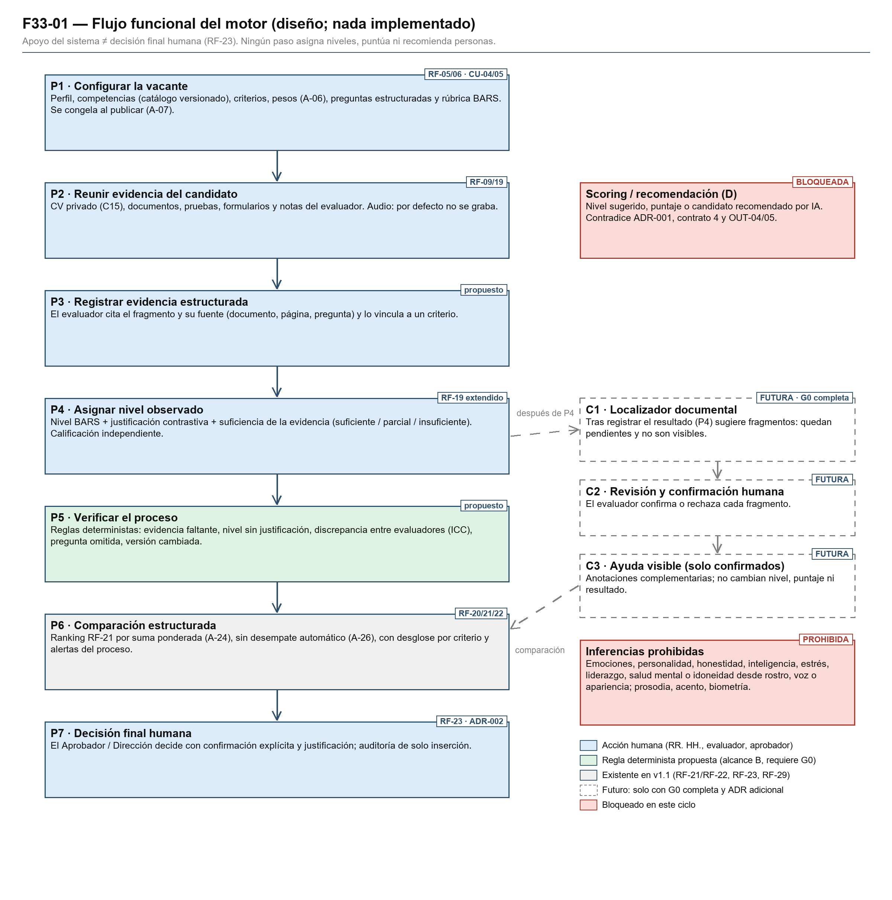
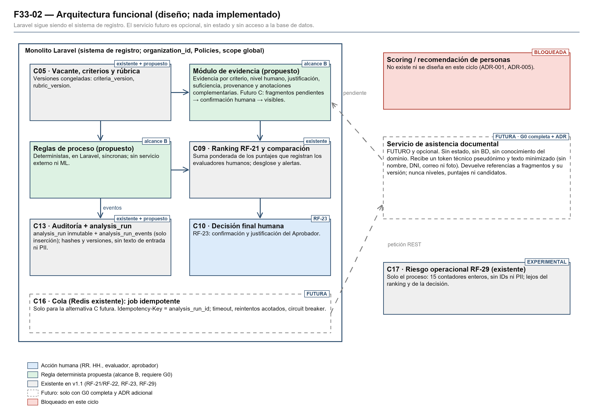

# F33 — Diseño funcional del motor inteligente de reclutamiento

> Fase F33, versión 1 (04/10/2026), **pendiente de auditoría**. Es diseño funcional: **no hay código, endpoints, migraciones, UI, modelos ni integración**. Todo lo marcado como «propuesto» o «futuro» no existe en el sistema. La decisión de alcance está en [ADR-005](F33_ADR_005_G0.md); **G0 = NO APROBADA**.

## 1. Principio central

**RECOMENDACIÓN / APOYO DEL SISTEMA ≠ DECISIÓN FINAL HUMANA.**

- **RF-23 sigue siendo exclusivamente humana.** El Aprobador / Dirección decide con confirmación explícita y justificación (ADR-002).
- **El sistema no asigna niveles, no puntúa, no ordena por criterio propio, no recomienda, no filtra y no descarta personas** (ADR-001). El único ordenamiento es RF-21, que suma con pesos los puntajes que registran evaluadores humanos.
- **«Inteligencia» en este diseño significa estructura, verificación y trazabilidad:**
  - rúbricas versionadas;
  - evidencia con procedencia;
  - reglas deterministas sobre el **proceso**;
  - explicaciones verificables.
- **Prohibido sin excepción:** inferir desde rostro, voz o apariencia:
  - personalidad;
  - honestidad;
  - inteligencia;
  - estrés;
  - estabilidad emocional;
  - liderazgo;
  - salud mental;
  - idoneidad laboral.

  Tampoco se evalúan prosodia, acento, emociones ni biometría.

## 2. Alcance y estado

| Elemento | Estado | Referencia |
|---|---|---|
| Alcance B (reglas, rúbricas, procedencia) | Diseñado; implementable solo con G0 CON RESTRICCIONES | ADR-005 §6 |
| Alcance E (ML del proceso, RF-29) | Existente y experimental; sin cambios | ADR-001, ADR-004 |
| Alcance C (asistencia documental) | FUTURO; requiere G0 APROBADA y un ADR adicional | ADR-005 §6.4 |
| Alcance D (scoring o recomendación) | BLOQUEADO | ADR-005 §6.5 |

**Frontera B/C.** El alcance **B** no usa dependencias nuevas ni extrae automáticamente texto de PDF o DOCX: trabaja solo con texto y evidencia **registrados o introducidos por una persona**, y puede buscar o localizar de forma determinista dentro de ese texto. Pertenece al alcance **C** cualquier parsing o extracción automática de PDF o DOCX, el OCR, la extracción automática de CV o documentos, las dependencias nuevas de comprensión documental y la búsqueda semántica o con embeddings.

**Regla de datos.** F34 trabaja **solo con datos sintéticos**. F33 y G0 **no autorizan datos reales de candidatos**, y el consentimiento por sí solo **no** levanta el contrato 7 ni las restricciones vigentes. Cualquier uso futuro de datos reales exige: (1) autorización explícita del equipo; (2) revisión contractual (contrato 7); (3) revisión jurídica; (4) análisis de privacidad y datos personales; y (5) una aprobación específica posterior, distinta de G0.

La capacidad por capacidad está en la [matriz](F33_Matriz_Capacidades_y_Restricciones.md) y los flujos, en [F33_Flujos_Funcionales.md](F33_Flujos_Funcionales.md).



*Figura 1. Flujo funcional. Diagrama reproducible con `docs/academico/tools/f33/diagramas.py`.*

## 3. Actores

| Actor | Rol en el motor | Base actual |
|---|---|---|
| RR. HH. | Configura la vacante, las competencias, los criterios, los pesos, las preguntas y la rúbrica; asigna evaluadores | RF-05, RF-06, RF-16, RF-18 |
| Evaluador | Reúne y registra la evidencia, asigna el nivel con justificación y revisa las alertas de proceso | RF-19, A-19 |
| Aprobador / Dirección | Revisa la comparación y decide (RF-23) | RF-22, RF-23 |
| Postulante | Aporta el CV y los documentos; conoce los criterios y el procedimiento antes de ser evaluado | RF-09, RF-10 |
| Sistema (reglas deterministas) | Valida configuraciones, verifica el proceso, calcula RF-21 y registra la procedencia y la auditoría | RF-20, RF-21, RF-27 |
| Servicio de asistencia documental | **FUTURO** (alcance C): localiza fragmentos y no evalúa | ADR-005 §6.4 |
| Auditor o docente | Revisa versiones, procedencia y registros | RF-27 |

## 4. Entidades conceptuales (propuestas)

Todas llevan `organization_id`, scope global y Policy que compara rol **y** organización (contrato 5).

| Entidad | Contenido | Regla clave |
|---|---|---|
| Competencia | Nombre, definición, fuente (p. ej., dominio del MBDD, [O14] de F30) y versión del catálogo | Catálogo versionado por organización; la valida el colegio |
| Criterio de vacante | Competencia, método de evaluación, peso y rango | Se congela al publicar (A-07); `criteria_version` |
| Rúbrica BARS | Niveles con descriptor conductual por criterio | `rubric_version`; publicada = inmutable [S19] |
| Pregunta estructurada | Texto, tipo (situacional o de conducta pasada), criterio asociado | Igual para todos los postulantes de la vacante [S14, S15] |
| Evidencia | Cita o resumen introducido por una persona, fuente (documento, página o pregunta) y criterio | Toda evidencia apunta a su fuente; queda inmutable al registrar el resultado |
| Valoración humana | Nivel BARS, justificación contrastiva, suficiencia de la evidencia, evaluador y fecha | Se registra con el resultado de `AssessmentResultRecorder`: única por sesión y criterio (restricción única vigente) e inmutable (A-19) |
| Anotación complementaria | Aclaración o fuente adicional posterior al registro, con autor, fecha y motivo | Solo inserción y auditada; **no modifica** puntaje, nivel, justificación ni valoración; se muestra diferenciada del resultado |
| Alerta de proceso | Regla y objeto afectado; su atención (atendida o descartada con motivo) se registra como evento | Determinista; nunca habla de la persona; solo inserción |
| `analysis_run` | Ejecución de reglas (o, en el futuro, del servicio) con versiones, hash de entrada y disparador | Registro principal inmutable; sin texto de entrada |
| `analysis_run_events` | Cambio de estado de una ejecución: estado, fecha, motivo o código de error | Solo inserción; el estado vigente es el último evento |

## 5. Entradas y salidas

| Paso | Entradas | Salidas | Quién |
|---|---|---|---|
| Configuración | Perfil, competencias, criterios, pesos, preguntas, rúbrica | Vacante validada y versionada | RR. HH. + reglas RF-06/RF-20 |
| Evidencia | CV privado, documentos, pruebas, formularios, notas de entrevista (texto), transcripción revisada (futuro) | Evidencias con fuente y criterio | Evaluador |
| Extracción estructurada | B: lectura del evaluador y texto que introduce una persona. C (futuro): extracción automática de PDF o DOCX y fragmentos sugeridos | Evidencia por criterio confirmada por el humano | Evaluador; servicio en C |
| Valoración | Evidencia por criterio y rúbrica | Nivel, justificación, suficiencia y procedencia | **Solo el evaluador** |
| Verificación | Valoraciones, evidencias y configuración | Alertas de proceso e ICC por criterio | Reglas deterministas |
| Comparación | Puntajes humanos (nivel → puntaje en el rango del criterio), pesos | Ranking RF-21 con desglose y alertas | Sistema (RF-21/RF-22, existente) |
| Apoyo explicable | Ranking, evidencias, justificaciones, alertas | Vista de revisión: por qué cada criterio tiene ese nivel y qué falta | Sistema → evaluador o aprobador |
| Decisión | Todo lo anterior | Decisión con justificación (RF-23), selección (RF-24) y cierre (RF-25) | **Aprobador / Dirección** |

**Correspondencia nivel → puntaje.** El nivel BARS que elige el evaluador se traduce de forma **determinista** al puntaje del rango del criterio. Por ejemplo, el nivel 3 de 4 en un rango de 0 a 20 da 15, con una tabla publicada en la rúbrica. Así se conserva la fórmula A-24 y el sistema no «calcula» nada sobre la persona que el humano no haya decidido. La tabla concreta se fija en el diseño detallado de F35 y queda dentro de la `rubric_version`.

## 6. Estados

| Objeto | Estados | Transiciones permitidas |
|---|---|---|
| Rúbrica | `borrador` → `publicada` → `retirada` | Publicar solo si es completa; una publicada no se edita: se crea una versión nueva |
| Evidencia | `borrador` → `vinculada` | Un borrador se puede descartar antes del registro; al registrar el resultado queda vinculada e inmutable |
| Sesión y resultado (vigente) | Sesión `PROGRAMADA` → `REALIZADA` | `AssessmentResultRecorder`: en una transacción valida, inserta un resultado por criterio y marca la sesión `REALIZADA`; un segundo registro se rechaza. Resultado único, vigente e inmutable (A-19) |
| Anotación complementaria | `registrada` | Solo inserción; no altera el resultado |
| Alerta | Eventos `abierta` → `atendida` o `descartada` | Cada cambio es un evento nuevo; descartar exige motivo y usuario |
| `analysis_run` | Eventos `pendiente` → `en_proceso` → `completado`, `fallido` o `expirado`; `invalidado` si cambia una versión | El registro principal no cambia; cada estado es una fila en `analysis_run_events`; el reintento añade eventos o crea una ejecución nueva según idempotencia |

`analysis_run` es un **registro principal inmutable** (versiones, hash de entrada, disparador y fecha). Sus estados no se sobrescriben: cada cambio es una fila nueva en **`analysis_run_events`** (solo inserción), y el estado vigente es el último evento. Así se conserva el historial completo y se cumple la regla de solo inserción.

## 7. Procedencia y auditoría

**Cadena:** pregunta → respuesta → evidencia → competencia o criterio → nivel → justificación → confianza (suficiencia).

| Campo | Persistir | Dónde | Minimizar o evitar |
|---|---|---|---|
| `analysis_run_id` | Sí | Laravel | UUID aleatorio, no derivado de otros IDs |
| `analysis_run_events` | Sí (solo inserción) | Laravel | Estado, fecha y código de error; sin PII ni texto de entrada |
| `organization_id` | Sí | **Solo Laravel** | No se envía al servicio futuro salvo justificación explícita |
| `vacancy_id`, `application_id` | Sí | Laravel | Al servicio futuro solo viaja un token técnico pseudónimo por ejecución |
| `criteria_version`, `rubric_version` | Sí | Laravel | — |
| `model_version` | Solo si existe un componente de ML (E o C futura); en B, `rules_version` | Laravel | — |
| `timestamp` | Sí (America/Lima, RNF de localización) | Laravel | — |
| `input_snapshot_hash` | Sí | Laravel | Permite probar qué entrada se usó **sin guardarla** |
| `evidence_refs` | Sí | Laravel | IDs y posiciones (documento, página, pregunta), no el texto completo del CV |
| Texto de la evidencia | Sí, solo la cita mínima necesaria | Laravel, con acceso por Policy | Es dato personal: retención definida en G0-03 |
| `scores` del sistema | **No existe** | — | El único puntaje es el humano (RF-19); no se reserva un campo para un score del sistema |
| `explanations` | Sí | Laravel | La regla aplicada y sus datos; para valoraciones, la justificación humana |
| `confidence` | Sí, como **suficiencia de la evidencia** (suficiente, parcial o insuficiente) asignada por el evaluador | Laravel | No es una probabilidad sobre la persona [S70] |
| `human_override` | Sí | Laravel y auditoría | En B: alerta descartada con motivo. En C futura: fragmento rechazado. Incluye `suggestion_seen_before_scoring` |
| Anotaciones complementarias | Sí (solo inserción) | Laravel y auditoría | Diferenciadas del resultado; nunca cambian puntaje ni nivel |
| `final_decision` | **No en este registro** | RF-23 (registros y auditoría existentes) | El análisis nunca figura como causa de la decisión |
| Audio, transcripción sin revisar, embeddings | **No** | — | Datos personales o biométricos sin necesidad |
| Atributos sensibles | **No** | — | No se recolectan (F30 D-10) |

Las acciones críticas siguen pasando por `AuditLogger` (solo inserción, trigger `audit_logs_append_only`), sin PII ni secretos (contrato 6).

## 8. Privacidad y multitenencia

- **`organization_id` permanece en Laravel.** Rige en todas las entidades nuevas, con scope global y Policies que comparan rol y organización, y con pruebas cross-tenant obligatorias en F38.
- **Sin RLS.** PostgreSQL no tiene seguridad por filas; el aislamiento depende de scopes y Policies (F32), por eso las pruebas cross-tenant son innegociables.
- **CV privado:**
  - el disco privado (C15) y la Policy de descarga no cambian;
  - la evidencia guarda citas mínimas, no copias del CV.
- **Servicio inteligente futuro** (solo en C):
  - sin estado, sin acceso a la base de datos y sin conocimiento del dominio;
  - recibe un **token técnico pseudónimo** por ejecución y texto minimizado (sin nombre, DNI, correo, foto ni dirección);
  - no persiste entradas;
  - no recibe `organization_id` salvo justificación registrada.
- **RF-29 no cambia.** Mantiene sus 15 contadores enteros, sin IDs ni PII (F32).
- **Datos:**
  - solo ficticios en desarrollo y pruebas (contrato 7); F34 solo sintéticos; G0 no autoriza datos reales y el consentimiento por sí solo no los habilita (ADR-005 §6.10);
  - atributos sensibles no se recolectan;
  - la retención y la base legal se definen en G0-03.

## 9. Entrevistas y audio

**Cadena de la entrevista:**

```
Pregunta (estructurada, igual para todos) → Respuesta (notas del evaluador) → Evidencia (cita + fuente)
  → Competencia/criterio → Nivel BARS (humano) → Justificación (contrastiva) → Confianza (suficiencia)
```

- **Por defecto no se graba.** Las notas del evaluador son la respuesta registrada [S13, S15].
- **Si en el futuro se aprueba audio** (requiere necesidad y G0 APROBADA; en este proyecto, solo con datos ficticios; con personas reales se aplica la regla de datos de ADR-005 §6.10 y el consentimiento por sí solo no basta), la cadena es:

  ```
  Audio → STT local → revisión humana contra el audio → texto
  ```

  - Solo el texto revisado entra como respuesta [S81, S10].
  - Antes de usarlo, se mide el error por variedad de habla.
- **Fuera de cualquier versión:** prosodia, tono, acento, fluidez, velocidad, emociones, expresiones faciales, huella de voz, diarización biométrica y vídeo [S07, S08, S85, S88; O01 art. 5; O13].
- **Nunca se analiza automáticamente** una transcripción para sugerir niveles.

## 10. Arquitectura funcional



*Figura 2. Arquitectura funcional. Diagrama reproducible con `docs/academico/tools/f33/diagramas.py`.*

**Alcance B.** No usa servicio externo ni dependencias nuevas, y no extrae texto de PDF o DOCX. Las reglas son deterministas y baratas, y se ejecutan en Laravel de forma síncrona o por eventos de dominio. Escriben alertas, `analysis_run` y sus eventos (solo inserción) y auditan. Es coherente con el monolito modular (F11 DA-01) y con «no transformar el conjunto en microservicios» (F32).

**Alcance C (futuro).** Sigue el patrón de RF-29 (Laravel ↔ FastAPI con fallback):

| Aspecto | Diseño |
|---|---|
| Flujo | Laravel → job en la cola Redis existente → servicio → resultado estructurado → validación de esquema → eventos de `analysis_run` + auditoría → **revisión y confirmación humana** → ayuda visible (solo fragmentos confirmados) |
| REST | Contrato versionado por ruta (`/v2/...`) y por `schema_version`; autenticación interna como en RF-29 |
| Asíncrono | La interfaz nunca espera al servicio; el resultado aparece después y siempre **detrás** de la calificación humana |
| Timeout | Explícito y configurable; el valor se fija en F38 con medición (no se inventa un SLA: RNF-06 del F9 sin verificar) |
| Reintentos | Acotados, con espera exponencial; solo ante errores transitorios, nunca ante errores de validación |
| Idempotencia | `Idempotency-Key` = `analysis_run_id`; repetir no duplica resultados |
| Versionado | `model_version`, `rubric_version`, `criteria_version`, `schema_version` e `input_snapshot_hash` en cada ejecución |
| Fallback | Si el servicio falla o el circuito está abierto, el flujo B funciona igual; la ayuda simplemente no aparece |
| Errores | Clasificados (ver §12); un resultado inválido se descarta y se registra |
| Observabilidad | Logs estructurados sin PII; métricas de latencia, tasa de error, tasa de fallback, alertas descartadas y fragmentos rechazados (relación con el candidato RNF-D) |

**Relación con F11 y ARQ-01:**

- se proponen dos componentes conceptuales: «Evidencia y rúbricas» (dentro del monolito) y «Asistencia documental» (futuro y opcional);
- **ARQ-01 no se modifica en F33**; se actualizaría en una revisión de arquitectura posterior a G0;
- C09 → C10 → C11 se conserva; la ayuda no entra a C09.

## 11. Requisitos candidatos propuestos

Son propuestas para registrar como **candidatos** cuando G0 avance (G0-15). No alteran RF-01 a RF-27 ni CU-01 a CU-20.

| ID propuesto | Requisito | Alcance | Relación |
|---|---|---|---|
| RF-32 (cand.) | Gestionar el catálogo de competencias y las rúbricas BARS versionadas | B | Extiende RF-05 y RF-06 sin reinterpretarlos |
| RF-33 (cand.) | Registrar la evidencia por criterio con procedencia, justificación y suficiencia | B | Extiende RF-19 |
| RF-34 (cand.) | Verificar la completitud y consistencia del proceso de evaluación (alertas deterministas) | B | Apoya RF-20 a RF-22 |
| RF-35 (cand.) | Medir el acuerdo entre evaluadores en los criterios de doble calificación | B | Calidad del proceso |
| RF-36 (cand.) | Localizar evidencia en documentos para confirmación humana | C (**futuro**) | Requiere G0 APROBADA y un ADR adicional |
| RNF-E (cand.) | Trazabilidad del análisis: versiones, hash de entrada y procedencia en cada ejecución | B y C | Relación con RF-27 |

Los casos de uso correspondientes se propondrían como CU-21 en adelante, también candidatos.

## 12. Errores y excepciones

| Código | Situación | Comportamiento |
|---|---|---|
| E-01 | Rúbrica no publicada o incompleta | No se puede publicar la vacante (como A-06/A-07) |
| E-02 | Criterio sin rúbrica o sin preguntas | Alerta de configuración; bloquea la publicación |
| E-03 | Evidencia sin fuente | Se rechaza el registro |
| E-04 | Nivel sin justificación | Se rechaza la valoración |
| E-05 | Evaluador no asignado u otra organización | 403 por Policy; se audita el intento |
| E-06 | Versión de rúbrica o criterios distinta de la congelada | Se añade el evento `invalidado` y se abre una alerta |
| E-07 | Discrepancia entre evaluadores mayor a un nivel | Alerta de proceso; no cambia ningún puntaje |
| E-08 | Pregunta no formulada a todos los postulantes | Alerta de proceso |
| E-09 | Documento ilegible o escaneado (futuro C) | Sin sugerencias; el evaluador trabaja como en B |
| E-10 | Servicio no disponible, timeout o circuito abierto (futuro C) | Fallback a B; se añade el evento `fallido` o `expirado` |
| E-11 | Respuesta que no cumple el esquema o trae campos prohibidos (p. ej., puntaje) | Se descarta, se registra y se alerta a mantenimiento |
| E-12 | Intento de mostrar una ayuda antes de la calificación humana | Bloqueado por diseño; se registra `suggestion_seen_before_scoring` |
| E-13 | Segundo resultado sobre una sesión `REALIZADA` | Se rechaza, como hoy («Los resultados de esta sesión ya fueron registrados»); un complemento se registra como anotación complementaria |

**Excepciones de negocio que siguen las reglas existentes:**

- empates en el ranking sin desempate automático (A-26);
- vacante cerrada, sin nuevas valoraciones (A-19);
- postulación descartada, fuera del ranking (A-23).

## 13. Límites

- No hay validación institucional ni datos reales; el diseño **no prueba eficacia** (F30, F32).
- RNF-06 y RNF-07 del F9 siguen **NO VERIFICADOS**; F33 no fija SLA.
- Los artículos del DS 115-2025-PCM distintos del 24.1 e) requieren contraste con la publicación oficial (F30).
- La correspondencia nivel → puntaje y el umbral de discrepancia son decisiones de F35 que se validan en F39.
- El ejemplo de competencias docentes de F30 sigue siendo **ilustrativo** y no está adoptado.

## 14. Consistencia con el baseline

| Referencia | Efecto de F33 |
|---|---|
| ADR-001 | **Ratificado** sin enmienda; B y E caben dentro; C requeriría una enmienda acotada futura; D es incompatible |
| ADR-002 | **Ratificado**: ninguna ruta automática hacia selección o descarte |
| ADR-003 | Sin relación (3D público) |
| ADR-004 | Sin cambios: el ML operacional sigue igual |
| RF-01 a RF-27 | Sin cambios; RF-05, RF-06, RF-19 y RF-20 a RF-23 se **extenderían** mediante candidatos RF-32+, sin reinterpretarse |
| CU-01 a CU-20 | Sin cambios; CU-04, CU-15, CU-16, CU-17 y CU-18 son los puntos de contacto |
| RNF (F7/F9) | Seguridad y privacidad heredadas; RNF-06 y RNF-07 sin verificar; RNF-D (observabilidad) sigue candidato |
| OUT-04, OUT-05, OUT-11 | Se mantienen: ni selección automática, ni inferencia de idoneidad, ni uso decisorio de RF-29 |
| F29 | Los casos de prueba de RF-19 a RF-23 siguen vigentes; F38 y F39 añadirían casos proporcionales |
| F30 | Decisiones D-01 a D-30 adoptadas como base; el resultado coincide con su conclusión |
| F31 | Sin efecto (deuda documental cerrada) |
| F32 | Respeta la readiness: solo diseño; G0 no aprobada; `f11r` vigente |
| F11 / ARQ-01 | C09 → C10 → C11 intacto; los componentes nuevos son propuestas y ARQ-01 no se modifica |

## 15. Riesgos

| ID | Riesgo | Probabilidad / impacto | Mitigación |
|---|---|---|---|
| RK-01 | El «motor» se percibe como evaluador automático | Media / alto | Lenguaje de interfaz: «alertas del proceso», nunca «recomendado»; ADR-005 §6.8 |
| RK-02 | Anclaje en el ranking o en las ayudas | Media / alto | Calificación previa obligatoria; registro de visualización |
| RK-03 | Carga extra para los evaluadores | Alta / medio | Rúbricas cortas; doble calificación solo en los criterios de mayor peso |
| RK-04 | Datos personales en las citas de evidencia | Media / alto | Minimización, Policies, retención (G0-03) |
| RK-05 | Fuga entre organizaciones (sin RLS) | Baja / alto | Scopes, Policies y pruebas cross-tenant |
| RK-06 | Presión para abrir C o D sin evidencia | Media / alto | ADR nuevo + G0; condiciones de reversión |
| RK-07 | Obligaciones legales no previstas | Media / alto | Revisión jurídica (G0-02) antes de F35 |
| RK-08 | Validez de las rúbricas sin comprobar | Media / medio | Validación con el colegio; ICC en F39 |
