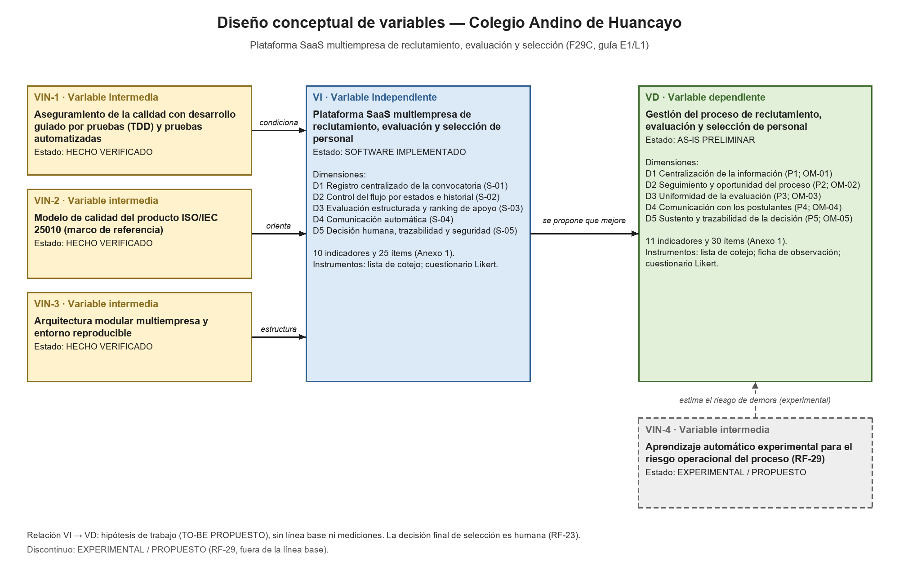

# Variables y matriz de operacionalización del proyecto (F29C)

> Generado por `docs/academico/tools/f27b/f29c.py` desde `m_variables.py`. No editar a mano: `python docs/academico/tools/f27b/build.py f29c`. El anexo Word equivalente es [`F29C_Operacionalizacion_Variables.docx`](F29C_Operacionalizacion_Variables.docx).

## Fuente normativa

Guía de laboratorio **E1 «Desarrollo de Software con Inteligencia Artificial»** (Pruebas y Calidad de Software, Dr. Maglioni Arana Caparachin) y su versión **L1** (Taller de Investigación 2), con el mismo contenido (`00-fuentes-oficiales/guias-ia/`). Reglas que se aplican:

- **Variables:**
  - la solución es la variable independiente;
  - el problema es la variable dependiente;
  - la metodología, los principios y las herramientas de apoyo son las variables intermedias.
- **Columnas de la matriz:** variables, dimensiones, indicadores, ítems de medición, instrumentos de recolección de datos y escala de medición.
  - Cada variable tiene varias dimensiones, cada dimensión varios indicadores y cada indicador varios ítems.
  - Instrumentos: ficha de observación, lista de cotejo o cuestionario Likert.
- **Machine learning:** los indicadores de la variable dependiente son los que usa la predicción.
- **Informe:** la matriz y el diagrama se documentan como **Anexo 1** y **Anexo 2**, junto con la definición conceptual.

Esta matriz añade las columnas «Definición conceptual» y «Definición operacional», pedidas para el proyecto.

> **Estado de la información:**
>
> - La matriz define **qué se mide y con qué**; no trae valores medidos.
> - No hay línea base del AS-IS, y los cuestionarios Likert no se han aplicado.
> - No se afirma validación institucional ni beneficios medidos.
> - Cada indicador lleva su estado: HECHO VERIFICADO, AS-IS PRELIMINAR, TO-BE PROPUESTO, SOFTWARE IMPLEMENTADO o EXPERIMENTAL / PROPUESTO.

## 1. Variables del proyecto

| ID | Tipo | Rol (guía E1/L1) | Variable | Estado |
|---|---|---|---|---|
| VI | Independiente | La solución (guía E1/L1: «la solución es la variable independiente») | Plataforma SaaS multiempresa de reclutamiento, evaluación y selección de personal | SOFTWARE IMPLEMENTADO |
| VD | Dependiente | El problema (guía E1/L1: «el problema es la variable dependiente») | Gestión del proceso de reclutamiento, evaluación y selección de personal | AS-IS PRELIMINAR |
| VIN-1 | Intermedia | Metodología (guía E1/L1: «la metodología … suele ser variable intermedia») | Aseguramiento de la calidad con desarrollo guiado por pruebas (TDD) y pruebas automatizadas | HECHO VERIFICADO |
| VIN-2 | Intermedia | Principio / norma de calidad | Modelo de calidad del producto ISO/IEC 25010 (marco de referencia) | HECHO VERIFICADO |
| VIN-3 | Intermedia | Herramientas y principios de arquitectura | Arquitectura modular multiempresa y entorno reproducible | HECHO VERIFICADO |
| VIN-4 | Intermedia | Herramienta de apoyo para la predicción (guía E1/L1: machine learning) | Aprendizaje automático experimental para el riesgo operacional del proceso (RF-29) | EXPERIMENTAL / PROPUESTO |

**Definición conceptual y operacional:**

- **VI — Plataforma SaaS multiempresa de reclutamiento, evaluación y selección de personal**
  - *Conceptual:* Sistema de información web ofrecido como servicio a varias organizaciones, con los datos de cada una aislados, que registra, controla y documenta el ciclo de reclutamiento, evaluación y selección de personal y apoya —sin sustituirla— la decisión humana.
  - *Operacional:* Se mide por la cobertura verificada de sus capacidades en cinco dimensiones (lista de cotejo contra la trazabilidad RF → prueba del repositorio) y por la utilidad que perciben sus usuarios internos (cuestionario Likert propuesto, todavía no aplicado).
- **VD — Gestión del proceso de reclutamiento, evaluación y selección de personal**
  - *Conceptual:* Conjunto de actividades con que la organización cubre una necesidad de personal, desde el requerimiento del área hasta la comunicación del resultado. En el caso de estudio presenta cinco problemas (P1 a P5): información distribuida, seguimiento manual, evaluaciones heterogéneas, comunicación manual e indicadores limitados. Es un AS-IS preliminar, sin validación institucional.
  - *Operacional:* Se mide en cinco dimensiones, una por problema, con indicadores obtenidos de los registros de la plataforma (ficha de observación), listas de cotejo y un cuestionario Likert a RR. HH. y al Aprobador / Dirección. No hay línea base medida del AS-IS: los indicadores quedan definidos para medir el TO-BE. Los indicadores de avance, oportunidad, carga y evaluación contienen las 15 variables operacionales que usa el componente experimental RF-29 (la guía pide que los indicadores de la variable dependiente sean los de la predicción).
- **VIN-1 — Aseguramiento de la calidad con desarrollo guiado por pruebas (TDD) y pruebas automatizadas**
  - *Conceptual:* Enfoque de desarrollo en que cada regla de negocio se escribe primero como una prueba que falla (RED) y después se implementa hasta que la prueba pasa (GREEN), complementado con pruebas automatizadas de componentes, de extremo a extremo e integración continua.
  - *Operacional:* Se mide por los ciclos RED → GREEN documentados, la trazabilidad RF → prueba y los resultados de las suites automatizadas y de la integración continua, tal como están registrados en el repositorio y en GitHub Actions.
- **VIN-2 — Modelo de calidad del producto ISO/IEC 25010 (marco de referencia)**
  - *Conceptual:* Modelo normativo que organiza la calidad del producto software en características como la seguridad, la usabilidad, la eficiencia de desempeño, la fiabilidad, la compatibilidad y la mantenibilidad. En el proyecto es un marco de referencia: el producto no se evaluó ni se certificó según la norma.
  - *Operacional:* Se mide por el estado de verificación de los diez RNF académicos del Formato 07, agrupados por característica de la norma.
- **VIN-3 — Arquitectura modular multiempresa y entorno reproducible**
  - *Conceptual:* Organización técnica del sistema como monolito modular (Laravel 13 y React 19 con Inertia, sobre PostgreSQL 17 y Redis 7), con aislamiento lógico por organización, un entorno reproducible con Docker Compose y control de versiones con Git.
  - *Operacional:* Se mide por la modularidad de la arquitectura conceptual (F11), el aislamiento verificado entre organizaciones y la reproducibilidad del entorno de desarrollo, demostración y pruebas.
- **VIN-4 — Aprendizaje automático experimental para el riesgo operacional del proceso (RF-29)**
  - *Conceptual:* Modelo de clasificación supervisada (regresión logística) que estima el riesgo de que un proceso de selección cierre después de su plazo objetivo, a partir de variables operacionales del proceso. Es informativo: no evalúa, puntúa, ordena ni selecciona personas, y no toma la decisión.
  - *Operacional:* Se describe por las 15 variables operacionales que usa (coinciden con indicadores de la variable dependiente), la salida que entrega y sus salvaguardas. Su desempeño solo se midió con datos sintéticos: no está validado institucionalmente ni autorizado para producción.

**Justificación de la selección:**

- **VI:** es la solución que el proyecto construye. Sus dimensiones son las cinco soluciones S-01 a S-05 del TO-BE (Formato 05), implementadas en la plataforma v1.1.
- **VD:** es el problema. Sus dimensiones son los problemas P1 a P5 (Formato 04) y los objetivos de mejora OM-01 a OM-05 (Formato 05).
- **Intermedias:** solo se incluyen la metodología, las normas y las herramientas con evidencia en el repositorio.
  - Con evidencia: TDD y pruebas automatizadas (`docs/tdd-evidence.md`); ISO/IEC 25010 como marco de referencia (capítulo 5); la arquitectura modular multiempresa con Docker (capítulo 7 y F11); el machine learning experimental de RF-29 (`docs/v1.1/ml/`).
  - **Sin evidencia, no se incluyen:** Scrum, DevOps y SOLID, que la guía usa como ejemplo.

## 2. Relaciones entre variables

| Origen | Destino | Relación | Estado |
|---|---|---|---|
| VIN-1 | VI | Condiciona la calidad con que se construye la solución | HECHO VERIFICADO |
| VIN-2 | VI | Orienta las características de calidad que la solución debe cumplir | HECHO VERIFICADO |
| VIN-3 | VI | Define cómo se estructura y se despliega la solución | HECHO VERIFICADO |
| VI | VD | Se propone que mejore la gestión del proceso (P1–P5). Relación no medida | TO-BE PROPUESTO |
| VIN-4 | VD | Estima el riesgo de demora con indicadores de la variable dependiente | EXPERIMENTAL / PROPUESTO |

La relación VI → VD es la hipótesis de trabajo del proyecto (TO-BE PROPUESTO). No hay línea base del AS-IS ni mediciones del TO-BE, así que no se afirma ningún efecto ni beneficio medido.

## 3. Anexo 1. Matriz de Operacionalización de Variables

| Variable | Definición conceptual | Definición operacional | Dimensión | Indicador | Ítem | Instrumento | Escala |
|---|---|---|---|---|---|---|---|
| VI — Plataforma SaaS multiempresa de reclutamiento, evaluación y selección de personal | Sistema de información web ofrecido como servicio a varias organizaciones, con los datos de cada una aislados, que registra, controla y documenta el ciclo de reclutamiento, evaluación y selección de personal y apoya —sin sustituirla— la decisión humana. | Se mide por la cobertura verificada de sus capacidades en cinco dimensiones (lista de cotejo contra la trazabilidad RF → prueba del repositorio) y por la utilidad que perciben sus usuarios internos (cuestionario Likert propuesto, todavía no aplicado). | VI-D1 Registro centralizado de la convocatoria (S-01) | VI-D1-I1 Cobertura funcional del registro único | • ¿Está implementado cada RF de la dimensión (RF-01, RF-05, RF-06, RF-09, RF-10 y RF-12)? • ¿Cada uno tiene al menos una prueba automatizada que lo verifica? • N.º de casos de uso de la dimensión soportados por la plataforma | Lista de cotejo | Nominal (Sí / No) y razón (conteo) |
|  |  |  |  | VI-D1-I2 Utilidad percibida del registro único | • La plataforma reúne en un solo lugar la información de cada convocatoria • Encuentro el expediente del postulante sin recurrir a otros medios | Cuestionario Likert (RR. HH. y Área solicitante) | Ordinal (Likert 1–5) |
|  |  |  | VI-D2 Control del flujo por estados e historial (S-02) | VI-D2-I1 Cobertura funcional del control por estados | • ¿Está implementado cada RF de la dimensión (RF-02, RF-03, RF-13, RF-14, RF-24 y RF-25)? • ¿Cada uno tiene al menos una prueba automatizada que lo verifica? | Lista de cotejo | Nominal (Sí / No) |
|  |  |  |  | VI-D2-I2 Transiciones de estado controladas | • N.º de transiciones permitidas definidas para requerimiento, vacante y postulación • ¿Una transición no permitida se rechaza sin efectos? | Lista de cotejo | Razón (conteo) y nominal (Sí / No) |
|  |  |  | VI-D3 Evaluación estructurada y ranking de apoyo (S-03) | VI-D3-I1 Cobertura funcional de la evaluación estructurada | • ¿Está implementado cada RF de la dimensión (RF-16 a RF-22)? • ¿Cada uno tiene al menos una prueba automatizada que lo verifica? | Lista de cotejo | Nominal (Sí / No) |
|  |  |  |  | VI-D3-I2 Ranking explicable y no decisorio | • ¿El ranking muestra el desglose del puntaje por criterio? • ¿El ranking cambia el estado de alguna postulación? (esperado: No) • ¿Se señalan los empates y los candidatos con evaluación incompleta? | Lista de cotejo | Nominal (Sí / No) |
|  |  |  | VI-D4 Comunicación automática (S-04) | VI-D4-I1 Cobertura funcional de las notificaciones | • ¿Está implementado cada RF de la dimensión (RF-04, RF-11, RF-15, RF-17 y RF-26)? • ¿Cada uno tiene al menos una prueba automatizada que lo verifica? | Lista de cotejo | Nominal (Sí / No) |
|  |  |  |  | VI-D4-I2 Eventos clave notificados automáticamente | • N.º de tipos de evento con notificación automática (rechazo, recepción, cambio de etapa, convocatoria y resultado) • ¿La notificación se encola y se envía después de confirmar la operación? | Lista de cotejo | Razón (conteo) y nominal (Sí / No) |
|  |  |  | VI-D5 Decisión humana, trazabilidad y seguridad (S-05) | VI-D5-I1 Decisión final humana | • ¿Solo el Aprobador / Dirección puede registrar la decisión final? • ¿La decisión exige confirmación explícita y justificación? • ¿Se admite una sola decisión por vacante? | Lista de cotejo | Nominal (Sí / No) |
|  |  |  |  | VI-D5-I2 Acceso, trazabilidad y aislamiento de los datos | • ¿Todo acceso exige cuenta propia e inicio de sesión (cuenta del postulante: RF-08)? • N.º de acciones de negocio auditadas (AuditAction) • ¿El registro de auditoría es de solo inserción? • ¿El acceso a datos de otra organización se rechaza sin efectos (403 o 404)? | Lista de cotejo | Razón (conteo) y nominal (Sí / No) |
| VD — Gestión del proceso de reclutamiento, evaluación y selección de personal | Conjunto de actividades con que la organización cubre una necesidad de personal, desde el requerimiento del área hasta la comunicación del resultado. En el caso de estudio presenta cinco problemas (P1 a P5): información distribuida, seguimiento manual, evaluaciones heterogéneas, comunicación manual e indicadores limitados. Es un AS-IS preliminar, sin validación institucional. | Se mide en cinco dimensiones, una por problema, con indicadores obtenidos de los registros de la plataforma (ficha de observación), listas de cotejo y un cuestionario Likert a RR. HH. y al Aprobador / Dirección. No hay línea base medida del AS-IS: los indicadores quedan definidos para medir el TO-BE. Los indicadores de avance, oportunidad, carga y evaluación contienen las 15 variables operacionales que usa el componente experimental RF-29 (la guía pide que los indicadores de la variable dependiente sean los de la predicción). | VD-D1 Centralización de la información (P1; OM-01) | VD-D1-I1 Completitud del expediente | • % de postulaciones con perfil completo y CV vigente • N.º de convocatorias con requerimiento aprobado, vacante y criterios vinculados • N.º de postulaciones recibidas por vacante (ML-FEAT-05) | Ficha de observación (registros de la plataforma) | Razón (conteo, %, días) |
|  |  |  |  | VD-D1-I2 Dispersión de la información del proceso | • N.º de documentos del proceso que se gestionan fuera de la plataforma • La información de una convocatoria está disponible en un solo lugar | Lista de cotejo y Cuestionario Likert (RR. HH.) | Razón (conteo) y ordinal (Likert 1–5) |
|  |  |  | VD-D2 Seguimiento y oportunidad del proceso (P2; OM-02) | VD-D2-I1 Trazabilidad del avance | • % de cambios de etapa con autor y fecha en el historial • N.º de cambios de etapa registrados (ML-FEAT-16) • N.º de postulaciones sin estado actual | Ficha de observación (registros de la plataforma) | Razón (conteo, %, días) |
|  |  |  |  | VD-D2-I2 Oportunidad del proceso respecto de su plazo objetivo | • Días transcurridos desde la publicación de la vacante (ML-FEAT-01) • Días restantes hasta el plazo objetivo del proceso (ML-FEAT-02) • Días desde el último evento operacional del proceso (ML-FEAT-17) • ¿El proceso cerró después de su plazo objetivo? (etiqueta del modelo experimental RF-29) | Ficha de observación (registros de la plataforma) | Razón (días) y nominal (Sí / No) |
|  |  |  |  | VD-D2-I3 Carga y configuración del proceso | • Días de la ventana de postulación de la vacante (ML-FEAT-03) • N.º de plazas de la vacante (ML-FEAT-04) • N.º de vacantes de la organización abiertas en paralelo (ML-FEAT-18) | Ficha de observación (registros de la plataforma) | Razón (conteo, %, días) |
|  |  |  | VD-D3 Uniformidad de la evaluación (P3; OM-03) | VD-D3-I1 Evaluación con criterios comunes | • % de evaluaciones con puntaje en todos los criterios de la vacante • N.º de criterios ponderados configurados por vacante (ML-FEAT-06) • N.º de puntajes rechazados por estar fuera de rango | Ficha de observación (registros de la plataforma) | Razón (conteo, %, días) |
|  |  |  |  | VD-D3-I2 Avance de evaluaciones y entrevistas | • Evaluaciones programadas, realizadas y vencidas pendientes (ML-FEAT-08, ML-FEAT-09 y ML-FEAT-11) • Entrevistas programadas, realizadas y vencidas pendientes (ML-FEAT-12, ML-FEAT-13 y ML-FEAT-15) | Ficha de observación (registros de la plataforma) | Razón (conteo, %, días) |
|  |  |  | VD-D4 Comunicación con los postulantes (P4; OM-04) | VD-D4-I1 Cobertura de los avisos del proceso | • % de cambios de etapa con notificación generada • N.º de postulantes sin aviso de resultado al cerrar la convocatoria • N.º de sesiones de evaluación o entrevista convocadas con aviso | Ficha de observación (registros de la plataforma) | Razón (conteo, %, días) |
|  |  |  |  | VD-D4-I2 Dependencia de avisos manuales | • Los postulantes reciben su resultado sin gestiones manuales de RR. HH. • Cada etapa del proceso genera su aviso sin intervención adicional | Cuestionario Likert (RR. HH.) | Ordinal (Likert 1–5) |
|  |  |  | VD-D5 Sustento y trazabilidad de la decisión (P5; OM-05) | VD-D5-I1 Decisión final documentada | • % de vacantes cerradas con decisión humana registrada y justificada • % de decisiones con la instantánea del ranking guardada • N.º de acciones críticas registradas en la auditoría por convocatoria | Ficha de observación (registros de la plataforma) | Razón (conteo, %, días) |
|  |  |  |  | VD-D5-I2 Transparencia percibida de la comparación | • La comparación muestra por qué cada candidato ocupa su posición • La decisión final queda justificada y se puede consultar después | Cuestionario Likert (Aprobador / Dirección y RR. HH.) | Ordinal (Likert 1–5) |
| VIN-1 — Aseguramiento de la calidad con desarrollo guiado por pruebas (TDD) y pruebas automatizadas | Enfoque de desarrollo en que cada regla de negocio se escribe primero como una prueba que falla (RED) y después se implementa hasta que la prueba pasa (GREEN), complementado con pruebas automatizadas de componentes, de extremo a extremo e integración continua. | Se mide por los ciclos RED → GREEN documentados, la trazabilidad RF → prueba y los resultados de las suites automatizadas y de la integración continua, tal como están registrados en el repositorio y en GitHub Actions. | VIN-1-D1 Práctica de TDD | VIN-1-D1-I1 Ciclos RED → GREEN documentados | • N.º de ciclos documentados con la salida real de RED y de GREEN • N.º de RF con al menos una prueba `test_rfNN_*` | Lista de cotejo | Razón (conteo, %, días) |
|  |  |  |  | VIN-1-D1-I2 Defectos cubiertos por pruebas de regresión | • N.º de defectos registrados (DEF-01 a DEF-13) • ¿Cada defecto cerrado indica la prueba o la validación que lo cubre? | Lista de cotejo | Razón (conteo) y nominal (Sí / No) |
|  |  |  | VIN-1-D2 Automatización e integración continua | VIN-1-D2-I1 Resultado de las suites automatizadas | • Pruebas PHPUnit superadas, omitidas y fallidas en la última ejecución registrada • Especificaciones Cypress superadas en la última ejecución registrada | Ficha de observación (registros de ejecución) | Razón (conteo, %, días) |
|  |  |  |  | VIN-1-D2-I2 Integración continua | • N.º de ejecuciones de CI en verde sobre el total en develop y main • ¿Cada integración a develop y main tiene su ejecución de CI en verde? | Ficha de observación (registros de GitHub Actions) | Razón (conteo) y nominal (Sí / No) |
| VIN-2 — Modelo de calidad del producto ISO/IEC 25010 (marco de referencia) | Modelo normativo que organiza la calidad del producto software en características como la seguridad, la usabilidad, la eficiencia de desempeño, la fiabilidad, la compatibilidad y la mantenibilidad. En el proyecto es un marco de referencia: el producto no se evaluó ni se certificó según la norma. | Se mide por el estado de verificación de los diez RNF académicos del Formato 07, agrupados por característica de la norma. | VIN-2-D1 Características de calidad cubiertas | VIN-2-D1-I1 Correspondencia de los RNF con la norma | • ¿Cada RNF está asignado a una característica de la norma? • N.º de características de la norma con al menos un RNF asociado | Lista de cotejo | Nominal (Sí / No) y razón (conteo) |
|  |  |  |  | VIN-2-D1-I2 RNF con criterio y método de verificación | • ¿Cada RNF tiene un criterio de aceptación medible? • ¿Cada RNF declara su método de verificación? | Lista de cotejo | Nominal (Sí / No) |
|  |  |  | VIN-2-D2 Estado de verificación de los RNF | VIN-2-D2-I1 Estado de cada RNF académico | • N.º de RNF VERIFICADOS • N.º de RNF con EVIDENCIA PARCIAL • N.º de RNF NO VERIFICADOS (RNF-06 y RNF-07) | Lista de cotejo | Ordinal (verificado > parcial > no verificado) |
|  |  |  |  | VIN-2-D2-I2 Evidencia y brechas declaradas | • ¿Cada RNF VERIFICADO cita la ejecución o la prueba que lo respalda? • ¿Cada RNF NO VERIFICADO o con EVIDENCIA PARCIAL declara qué le falta? • ¿Se declaran las características no evaluadas (eficiencia de desempeño)? | Lista de cotejo | Nominal (Sí / No) |
| VIN-3 — Arquitectura modular multiempresa y entorno reproducible | Organización técnica del sistema como monolito modular (Laravel 13 y React 19 con Inertia, sobre PostgreSQL 17 y Redis 7), con aislamiento lógico por organización, un entorno reproducible con Docker Compose y control de versiones con Git. | Se mide por la modularidad de la arquitectura conceptual (F11), el aislamiento verificado entre organizaciones y la reproducibilidad del entorno de desarrollo, demostración y pruebas. | VIN-3-D1 Modularidad | VIN-3-D1-I1 Componentes y dependencias | • N.º de componentes conceptuales (CMP-01 a CMP-17) • N.º de dependencias circulares entre módulos de negocio (esperado: 0) | Lista de cotejo | Razón (conteo, %, días) |
|  |  |  |  | VIN-3-D1-I2 Relaciones entre componentes | • N.º de relaciones documentadas entre componentes (R-01 a R-20) • ¿Cada relación declara su tipo, la información intercambiada y la dependencia? | Lista de cotejo | Razón (conteo) y nominal (Sí / No) |
|  |  |  | VIN-3-D2 Aislamiento y reproducibilidad | VIN-3-D2-I1 Aislamiento multiempresa | • ¿Toda entidad de negocio lleva organization_id? • ¿Pasan las pruebas de acceso cruzado (CrossTenantAccessTest y E2E-11)? | Lista de cotejo | Nominal (Sí / No) |
|  |  |  |  | VIN-3-D2-I2 Entorno reproducible | • N.º de servicios de Docker Compose con verificación de salud • ¿El entorno se levanta con los comandos documentados, sin instalar PHP ni Node locales? | Lista de cotejo | Razón (conteo) y nominal (Sí / No) |
| VIN-4 — Aprendizaje automático experimental para el riesgo operacional del proceso (RF-29) | Modelo de clasificación supervisada (regresión logística) que estima el riesgo de que un proceso de selección cierre después de su plazo objetivo, a partir de variables operacionales del proceso. Es informativo: no evalúa, puntúa, ordena ni selecciona personas, y no toma la decisión. | Se describe por las 15 variables operacionales que usa (coinciden con indicadores de la variable dependiente), la salida que entrega y sus salvaguardas. Su desempeño solo se midió con datos sintéticos: no está validado institucionalmente ni autorizado para producción. | VIN-4-D1 Variables de entrada del proceso | VIN-4-D1-I1 Disponibilidad de las variables operacionales | • N.º de variables del contrato de features que la plataforma puede calcular (de 15) • ¿Alguna variable identifica o describe a un candidato? (esperado: No) | Lista de cotejo | Razón (conteo) y nominal (Sí / No) |
|  |  |  |  | VIN-4-D1-I2 Datos de entrenamiento y etiqueta | • ¿El modelo se entrenó solo con datos sintéticos? • ¿La etiqueta describe el proceso (cierre después del plazo objetivo) y no a una persona? | Lista de cotejo | Nominal (Sí / No) |
|  |  |  | VIN-4-D2 Uso informativo y salvaguardas | VIN-4-D2-I1 Salida limitada al riesgo del proceso | • ¿El resultado se muestra solo como riesgo del proceso en la ficha de la vacante? • ¿El resultado modifica el ranking, la decisión o la selección? (esperado: No) • ¿La aplicación funciona igual cuando el servicio no está disponible? | Lista de cotejo | Nominal (Sí / No) |
|  |  |  |  | VIN-4-D2-I2 Contrato científico congelado | • ¿El modelo servido coincide con la huella SHA-256 registrada en el freeze de la Fase 15B? • ¿El umbral de decisión es el congelado (0.1679418172266036)? | Lista de cotejo | Nominal (Sí / No) |

## 4. Trazabilidad de los indicadores

- **RF, RNF y variables de RF-29:** se indican solo cuando hay correspondencia real.
- **CU:** se derivan de los RF con la tabla del Formato 08, no a mano.
- **Variables de RF-29:** son las del contrato de features del componente experimental.

| Indicador | RF | CU (derivados de los RF, F8) | RNF | Variables RF-29 | Estado | Fuente |
|---|---|---|---|---|---|---|
| VI-D1-I1 | RF-01, RF-05, RF-06, RF-09, RF-10, RF-12 | CU-01, CU-04, CU-05, CU-08, CU-09, CU-10 | — | — | HECHO VERIFICADO | docs/final-report/traceability-master.md |
| VI-D1-I2 | RF-01, RF-10, RF-12 | CU-01, CU-09, CU-10 | — | — | TO-BE PROPUESTO | Instrumento propuesto; no aplicado |
| VI-D2-I1 | RF-02, RF-03, RF-13, RF-14, RF-24, RF-25 | CU-02, CU-03, CU-11, CU-12, CU-19, CU-20 | — | — | HECHO VERIFICADO | docs/final-report/traceability-master.md |
| VI-D2-I2 | RF-02, RF-03, RF-14 | CU-02, CU-03, CU-12 | — | — | HECHO VERIFICADO | cap. 7 §7.2 (enums de estados y transiciones); pruebas de los RF |
| VI-D3-I1 | RF-16, RF-17, RF-18, RF-19, RF-20, RF-21, RF-22 | CU-13, CU-14, CU-15, CU-16, CU-17 | RNF-10 | — | HECHO VERIFICADO | docs/final-report/traceability-master.md |
| VI-D3-I2 | RF-21, RF-22 | CU-17 | — | — | HECHO VERIFICADO | cap. 7 §7.8 (RankingService puro); A-23 a A-27 |
| VI-D4-I1 | RF-04, RF-11, RF-15, RF-17, RF-26 | CU-03, CU-09, CU-12, CU-13, CU-20 | — | — | HECHO VERIFICADO | docs/final-report/traceability-master.md |
| VI-D4-I2 | RF-04, RF-11, RF-15, RF-17, RF-26 | CU-03, CU-09, CU-12, CU-13, CU-20 | — | — | HECHO VERIFICADO | cap. 7 §7.6 (afterCommit, cola Redis) |
| VI-D5-I1 | RF-23 | CU-18 | — | — | HECHO VERIFICADO | cap. 7 §7.4 y §7.8 (VacancyPolicy::decide, FinalDecisionRequest); A-27; ADR-002 |
| VI-D5-I2 | RF-08, RF-27 | CU-07 | RNF-01, RNF-02, RNF-03, RNF-04 | — | HECHO VERIFICADO | cap. 7 §7.3 y §7.7; CandidateRegistrationTest; AuthenticationTest; CrossTenantAccessTest; E2E-11 |
| VD-D1-I1 | RF-01, RF-05, RF-09, RF-10 | CU-01, CU-04, CU-08, CU-09 | — | ML-FEAT-05 | TO-BE PROPUESTO | F4 (P1); F5 (OM-01, S-01); feature-contract.md |
| VD-D1-I2 | RF-01, RF-10 | CU-01, CU-09 | — | — | TO-BE PROPUESTO | F4 (P1): problema AS-IS preliminar, sin línea base medida |
| VD-D2-I1 | RF-02, RF-03, RF-13, RF-14 | CU-02, CU-03, CU-11, CU-12 | — | ML-FEAT-16 | TO-BE PROPUESTO | F4 (P2); F5 (OM-02, S-02); feature-contract.md |
| VD-D2-I2 | — | — | — | ML-FEAT-01, ML-FEAT-02, ML-FEAT-17 | TO-BE PROPUESTO · uso predictivo EXPERIMENTAL / PROPUESTO | docs/v1.1/ml/problem-definition.md (ML-PROBLEM-01) y feature-contract.md |
| VD-D2-I3 | RF-05, RF-07 | CU-04, CU-06 | — | ML-FEAT-03, ML-FEAT-04, ML-FEAT-18 | TO-BE PROPUESTO · uso predictivo EXPERIMENTAL / PROPUESTO | feature-contract.md |
| VD-D3-I1 | RF-05, RF-16, RF-19, RF-20 | CU-04, CU-13, CU-15, CU-16 | RNF-10 | ML-FEAT-06 | TO-BE PROPUESTO | F4 (P3); F5 (OM-03, S-03); feature-contract.md |
| VD-D3-I2 | RF-16, RF-17, RF-18, RF-19 | CU-13, CU-14, CU-15 | — | ML-FEAT-08, ML-FEAT-09, ML-FEAT-11, ML-FEAT-12, ML-FEAT-13, ML-FEAT-15 | TO-BE PROPUESTO · uso predictivo EXPERIMENTAL / PROPUESTO | feature-contract.md |
| VD-D4-I1 | RF-04, RF-11, RF-15, RF-17, RF-26 | CU-03, CU-09, CU-12, CU-13, CU-20 | — | — | TO-BE PROPUESTO | F4 (P4); F5 (OM-04, S-04) |
| VD-D4-I2 | RF-15, RF-26 | CU-12, CU-20 | — | — | TO-BE PROPUESTO | Instrumento propuesto; no aplicado |
| VD-D5-I1 | RF-21, RF-22, RF-23, RF-27 | CU-17, CU-18 | RNF-03 | — | TO-BE PROPUESTO | F4 (P5); F5 (OM-05, S-05) |
| VD-D5-I2 | RF-22, RF-23 | CU-17, CU-18 | — | — | TO-BE PROPUESTO | Instrumento propuesto; no aplicado |
| VIN-1-D1-I1 | — | — | — | — | HECHO VERIFICADO | docs/tdd-evidence.md; docs/final-report/traceability-master.md |
| VIN-1-D1-I2 | — | — | — | — | HECHO VERIFICADO | docs/defects.md |
| VIN-1-D2-I1 | — | — | — | — | HECHO VERIFICADO | README.md (sección Pruebas); docs/testing/cypress-e2e.md |
| VIN-1-D2-I2 | — | — | — | — | HECHO VERIFICADO | .github/workflows/tests.yml; GitHub Actions |
| VIN-2-D1-I1 | — | — | RNF-01, RNF-02, RNF-03, RNF-04, RNF-05, RNF-06, RNF-07, RNF-08, RNF-09, RNF-10 | — | HECHO VERIFICADO | docs/academico/practica-07 (F7, columna de categoría); cap. 5 |
| VIN-2-D1-I2 | — | — | RNF-01, RNF-02, RNF-03, RNF-04, RNF-05, RNF-06, RNF-07, RNF-08, RNF-09, RNF-10 | — | HECHO VERIFICADO | docs/academico/practica-07 (F7) |
| VIN-2-D2-I1 | — | — | RNF-01, RNF-02, RNF-03, RNF-04, RNF-05, RNF-06, RNF-07, RNF-08, RNF-09, RNF-10 | — | HECHO VERIFICADO | docs/academico/practica-07 (F7) |
| VIN-2-D2-I2 | — | — | RNF-05, RNF-06, RNF-07 | — | HECHO VERIFICADO | docs/academico/practica-07 (F7); cap. 5 |
| VIN-3-D1-I1 | — | — | RNF-09 | — | HECHO VERIFICADO | docs/academico/practica-11 (F11 y VALIDATION.md) |
| VIN-3-D1-I2 | — | — | RNF-09 | — | HECHO VERIFICADO | docs/academico/practica-11/RELATIONSHIPS.md |
| VIN-3-D2-I1 | — | — | RNF-02 | — | HECHO VERIFICADO | cap. 7 §7.3; tests/Feature/Tenancy |
| VIN-3-D2-I2 | — | — | — | — | HECHO VERIFICADO | docker-compose.yml; docs/docker.md; A-36 |
| VIN-4-D1-I1 | — | — | — | ML-FEAT-01, ML-FEAT-02, ML-FEAT-03, ML-FEAT-04, ML-FEAT-05, ML-FEAT-06, ML-FEAT-08, ML-FEAT-09, ML-FEAT-11, ML-FEAT-12, ML-FEAT-13, ML-FEAT-15, ML-FEAT-16, ML-FEAT-17, ML-FEAT-18 | EXPERIMENTAL / PROPUESTO | docs/v1.1/ml/feature-contract.md |
| VIN-4-D1-I2 | — | — | — | — | EXPERIMENTAL / PROPUESTO | docs/v1.1/ml/dataset-specification.md; docs/v1.1/ml/problem-definition.md |
| VIN-4-D2-I1 | — | — | — | — | EXPERIMENTAL / PROPUESTO | ADR-001; ADR-004; docs/v1.1/phase-16-laravel-ml-integration.md |
| VIN-4-D2-I2 | — | — | — | — | EXPERIMENTAL / PROPUESTO | docs/v1.1/ml/phase-15b-experiment-freeze.json; docs/v1.1/ml/model-card-draft.md |

## 5. Anexo 2. Diseño conceptual de variables

Versión vectorial: [`F29C_diagrama_conceptual_variables.svg`](diagramas/F29C_diagrama_conceptual_variables.svg). La guía propone generar el diagrama con código Python; aquí lo genera `f29c.py` con Pillow, de forma reproducible.

## 6. Actividad de la guía E1/L1 con IA

La guía E1/L1 propone la actividad completa: 4 prompts en 4 chatbots, comparaciones y capítulos 1 y 2. Por el criterio docente informado por el equipo, el alcance efectivo de este entregable es la evidencia de ChatGPT (P-01 a P-06) y su integración con los capítulos 1 y 2. Gemini, DeepSeek, Copilot y el chat del docente quedan NO REQUERIDOS y no se presentan como ejecutados. La evidencia está en el registro de ejecuciones, y `validate.py --cierre-f29c` informa si está completa.

- **Criterio de alcance:** Criterio docente informado por el equipo (30/09/2026): para este entregable no se exige ejecutar la comparación con Gemini, DeepSeek y Copilot. No es contenido de la guía E1/L1, que sí propone esa actividad comparativa, y el repositorio no contiene un documento del docente que lo respalde: lo registra el equipo.
- **Requisitos de la guía, alcance, prompts y protocolo:** [`ACTIVIDAD_IA_COMPARACION.md`](ACTIVIDAD_IA_COMPARACION.md).
- **Evidencia ejecutada:** [`evidencias-ia/REGISTRO_EJECUCIONES_IA.md`](evidencias-ia/REGISTRO_EJECUCIONES_IA.md).

La matriz y el diagrama de la F29C los elaboró el asistente de IA del equipo (Claude, en Claude Code) a partir de la evidencia versionada del repositorio, siguiendo las reglas de la guía. No sustituyen la actividad de la guía con ChatGPT, que se registra aparte.
