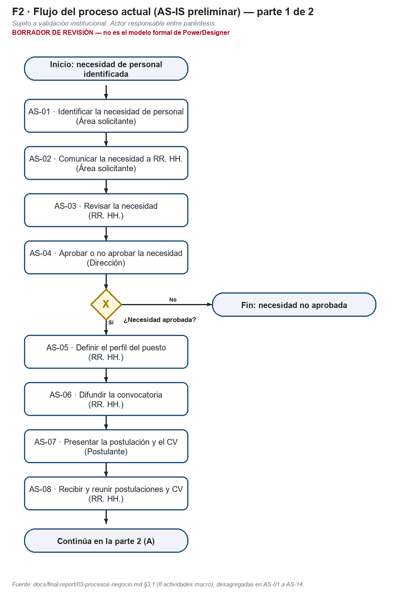
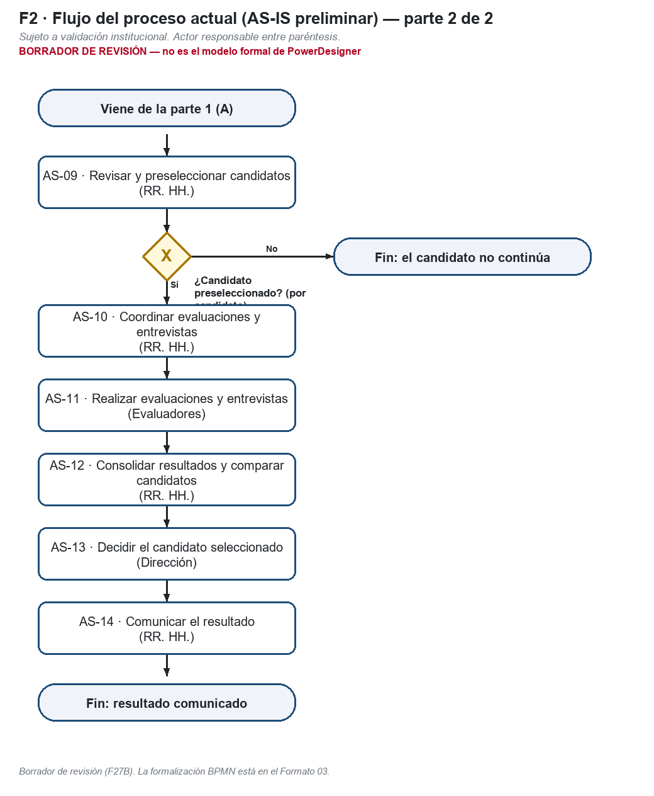

# Formato 02 — Análisis del proceso (AS-IS preliminar)

> Espejo en Markdown de `F2_Analisis_del_Proceso_Colegio_Andino.docx`, generado desde el mismo modelo (`docs/academico/tools/f27b/`). El entregable es el DOCX.

## 1. Datos generales del proyecto

| Campo | Valor |
|---|---|
| Nombre del proyecto | Análisis y Diseño de una Plataforma SaaS Multiempresa para la Gestión del Reclutamiento, Evaluación y Selección de Personal – Caso de estudio: Colegio Andino de Huancayo |
| Integrantes del equipo | Coronacion Meza Fredy; Peña Arroyo Anthony; Vila Meza Luis Antonio |
| Nombre de la empresa o institución | Colegio Andino de Huancayo (caso de estudio académico) |
| Nombre del proceso analizado | Reclutamiento, evaluación y selección de personal |
| Docente | Dr. Maglioni Arana Caparachin |
| Fecha de elaboración | 26/09/2026 |

> **Estado de la información de este formato**
>
> **HECHO VERIFICADO:** comprobado en el repositorio (código, pruebas ejecutadas, documentos versionados).
>
> **AS-IS PRELIMINAR:** reconstrucción del proceso actual hecha por el equipo; **sujeta a validación institucional** (RR. HH. / Administración del Colegio). No es un procedimiento validado por la institución.
>
> **TO-BE PROPUESTO:** proceso mejorado diseñado por el equipo; su adopción en la institución no está validada.
>
> **SOFTWARE IMPLEMENTADO:** comportamiento de la plataforma v1.1 (etiqueta v1.1.0-academic), verificado con pruebas.
>
> **EXPERIMENTAL / PROPUESTO:** RF-28 (candidato, no implementado), RF-29 (experimental, solo sobre el proceso) y RNF-C (propuesta). No forman parte de la línea base RF-01 a RF-27.
>
> Todo el contenido de proceso de este formato es **AS-IS PRELIMINAR**. No describe el software implementado ni el diagrama de actividad AC-01 de la v1.1, que modela el sistema ya construido.
>
> La plataforma **nunca** selecciona, descarta ni contrata automáticamente: el ranking calcula, ordena y compara.
>
> La decisión final de selección es **humana**: la registra el Aprobador / Dirección con confirmación explícita y justificación (RF-23).
>
> Todos los datos de ejemplo son ficticios. No se usan datos personales reales.

## 2. Descripción general del proceso

*Describir de manera clara y breve en qué consiste el proceso analizado, indicando su propósito, contexto y alcance (inicio y fin del proceso).*

| Campo | Detalle |
|---|---|
| Nombre del proceso | Reclutamiento, evaluación y selección de personal (AS-IS preliminar sujeto a validación institucional). |
| Propósito | Cubrir las necesidades de personal del Colegio incorporando al candidato más adecuado para cada puesto, con una decisión final tomada por la Dirección. |
| Contexto | El Colegio Andino de Huancayo es el caso de estudio académico. Participan el área que necesita personal, Recursos Humanos, la Dirección, los evaluadores y los postulantes. El repositorio no contiene documentación institucional verificada (estadísticas, herramientas, organigrama ni procedimientos), por lo que este análisis es una reconstrucción preliminar del equipo. |
| Alcance (inicio y fin) | Inicio: un área identifica una necesidad de personal. Fin: se comunica el resultado final a los postulantes (o se descarta la necesidad no aprobada). |
| Estado | AS-IS PRELIMINAR. Validación pendiente con RR. HH. / Administración del Colegio: tiempos, canales, formatos, herramientas y responsables reales. |

## 3. Diagrama del proceso actual (AS-IS)

*Inserte el diagrama de flujo del proceso actual elaborado con la herramienta seleccionada.*

Diagrama de flujo con símbolos básicos (inicio/fin, proceso, decisión). **Borrador de revisión** generado desde el modelo del documento; el modelado BPMN formal corresponde al Formato 03.

*Figura 1. Flujo AS-IS preliminar, parte 1 (AS-01 a AS-08).*

*Figura 2. Flujo AS-IS preliminar, parte 2 (AS-09 a AS-14).*

## 4. Lista de actividades del proceso

| N° | Actividad | Descripción | Origen (§3.1) |
|---|---|---|---|
| AS-01 | Identificar la necesidad de personal | El área detecta que requiere cubrir un puesto (vacante, reemplazo o nueva plaza). | Actividad macro 1 |
| AS-02 | Comunicar la necesidad a RR. HH. | El área transmite la necesidad a RR. HH. El canal y el formato no están verificados. | Actividad macro 1 |
| AS-03 | Revisar la necesidad | RR. HH. revisa la necesidad comunicada antes de elevarla a Dirección. | Actividad macro 2 — desagregación F27B |
| AS-04 | Aprobar o no aprobar la necesidad | Dirección decide si la necesidad procede. Si no procede, el proceso termina para esa necesidad. | Actividad macro 2 — desagregación F27B |
| AS-05 | Definir el perfil del puesto | RR. HH. define el perfil del puesto a cubrir. | Actividad macro 3 — desagregación F27B |
| AS-06 | Difundir la convocatoria | RR. HH. da a conocer la convocatoria. Los medios de difusión no están verificados. | Actividad macro 3 — desagregación F27B |
| AS-07 | Presentar la postulación y el CV | La persona interesada presenta su postulación y su CV. | Actividad macro 4 — desagregación F27B |
| AS-08 | Recibir y reunir postulaciones y CV | RR. HH. recibe y reúne las postulaciones de la convocatoria. | Actividad macro 4 |
| AS-09 | Revisar y preseleccionar candidatos | RR. HH. revisa los CV y decide qué candidatos continúan. No está verificado si se informa a quienes no continúan. | Actividad macro 5 |
| AS-10 | Coordinar evaluaciones y entrevistas | RR. HH. coordina fechas y participantes, y cita a los candidatos preseleccionados. | Actividad macro 6 — desagregación F27B |
| AS-11 | Realizar evaluaciones y entrevistas | Los evaluadores evalúan y entrevistan a los candidatos y entregan sus resultados. No hay constancia de criterios, ponderaciones ni rangos comunes definidos de antemano. | Actividad macro 6 — desagregación F27B |
| AS-12 | Consolidar resultados y comparar candidatos | RR. HH. reúne los resultados de cada candidato y los compara. | Actividad macro 7 |
| AS-13 | Decidir el candidato seleccionado | Dirección decide a quién seleccionar a partir de la información consolidada. | Actividad macro 8 — desagregación F27B |
| AS-14 | Comunicar el resultado | RR. HH. comunica el resultado a los postulantes. El canal y el alcance de la comunicación no están verificados. | Actividad macro 8 — desagregación F27B |

La F27B desagrega las 8 actividades macro versionadas en 14 sin añadir hechos: los pasos separados (por ejemplo, revisar y aprobar) ya estaban nombrados en la actividad macro y en sus responsables.

## 5. Identificación de actores

| N° | Actor | Tipo (Interno / Externo / Sistemas) | Rol en el proceso |
|---|---|---|---|
| AA-01 | Área solicitante | Interno | Detecta la necesidad de personal y la comunica a RR. HH. |
| AA-02 | Recursos Humanos (RR. HH.) | Interno | Revisa la necesidad, define el perfil, difunde la convocatoria, recibe postulaciones, preselecciona, coordina evaluaciones y entrevistas, consolida resultados y comunica el resultado. |
| AA-03 | Dirección | Interno | Aprueba o no la necesidad de personal y decide el candidato a contratar. |
| AA-04 | Evaluadores | Interno | Realizan las evaluaciones y entrevistas que se les encargan. Quiénes son en concreto (cargo, área) no está verificado. |
| AA-05 | Postulante | Externo | Postula con su CV, participa en evaluaciones y entrevistas y recibe el resultado. |

Tipo «Sistemas»: el AS-IS preliminar **no identifica** ninguna herramienta informática específica del Colegio. No se afirma que el proceso sea en papel, por correo ni con otra herramienta: queda pendiente de validación.

## 6. Relación actividades-actores

| N° | Actividad | Actor | Rol (Ejecuta / Recibe / Valida) |
|---|---|---|---|
| 1 | AS-01 Identificar la necesidad de personal | Área solicitante | Ejecuta |
| 2 | AS-02 Comunicar la necesidad a RR. HH. | Área solicitante | Ejecuta |
| 3 | AS-02 Comunicar la necesidad a RR. HH. | RR. HH. | Recibe |
| 4 | AS-03 Revisar la necesidad | RR. HH. | Ejecuta |
| 5 | AS-04 Aprobar o no aprobar la necesidad | Dirección | Valida |
| 6 | AS-04 Aprobar o no aprobar la necesidad | Área solicitante | Recibe |
| 7 | AS-05 Definir el perfil del puesto | RR. HH. | Ejecuta |
| 8 | AS-06 Difundir la convocatoria | RR. HH. | Ejecuta |
| 9 | AS-06 Difundir la convocatoria | Postulante | Recibe |
| 10 | AS-07 Presentar la postulación y el CV | Postulante | Ejecuta |
| 11 | AS-07 Presentar la postulación y el CV | RR. HH. | Recibe |
| 12 | AS-08 Recibir y reunir postulaciones y CV | RR. HH. | Ejecuta |
| 13 | AS-09 Revisar y preseleccionar candidatos | RR. HH. | Ejecuta |
| 14 | AS-10 Coordinar evaluaciones y entrevistas | RR. HH. | Ejecuta |
| 15 | AS-10 Coordinar evaluaciones y entrevistas | Evaluadores | Recibe |
| 16 | AS-10 Coordinar evaluaciones y entrevistas | Postulante | Recibe |
| 17 | AS-11 Realizar evaluaciones y entrevistas | Evaluadores | Ejecuta |
| 18 | AS-11 Realizar evaluaciones y entrevistas | Postulante | Recibe |
| 19 | AS-11 Realizar evaluaciones y entrevistas | RR. HH. | Recibe |
| 20 | AS-12 Consolidar resultados y comparar candidatos | RR. HH. | Ejecuta |
| 21 | AS-13 Decidir el candidato seleccionado | Dirección | Valida |
| 22 | AS-13 Decidir el candidato seleccionado | RR. HH. | Recibe |
| 23 | AS-14 Comunicar el resultado | RR. HH. | Ejecuta |
| 24 | AS-14 Comunicar el resultado | Postulante | Recibe |

## 7. Observaciones del proceso

*Registrar observaciones relevantes sobre el proceso actual (ineficiencias, redundancias, puntos críticos, etc.), sin proponer soluciones.*

| ID | Observación (AS-IS preliminar) | Problema | Actividades |
|---|---|---|---|
| O-01 | La información de cada convocatoria (necesidad, perfil, CV, evaluaciones y decisión) no está centralizada en un único registro. | P1 | AS-02, AS-05, AS-06, AS-08 |
| O-02 | El avance de la necesidad y de cada candidato se controla sin estados ni historial sistematizados. | P2 | AS-02, AS-03, AS-04, AS-09 |
| O-03 | Los candidatos no se evalúan con criterios, ponderaciones y rangos definidos de antemano y comunes a toda la convocatoria. | P3 | AS-11, AS-12 |
| O-04 | Los avisos a postulantes y participantes dependen de gestiones manuales. | P4 | AS-07, AS-10, AS-14 |
| O-05 | No hay información consolidada para comparar candidatos ni trazabilidad de las acciones críticas. | P5 | AS-12, AS-13 |
| O-06 | Punto crítico: la decisión de Dirección (AS-13) depende de la calidad de la consolidación (AS-12). | P3, P5 | AS-12, AS-13 |
| O-07 | Sin validación institucional: tiempos, canales, formatos, herramientas y responsables reales de cada actividad deben confirmarse con RR. HH. / Administración del Colegio. | — | Todas |

## 8. Evidencias

- Fuente del AS-IS: `docs/final-report/03-procesos-negocio.md` §3.1 (8 actividades macro, responsables y problemas P1–P5 asociados) — rotulado como «preliminar, pendiente de validación» desde la v1.0.
- Contexto y problemas: `docs/final-report/02-contexto-problema.md` §2.1–2.2 (sin documentación institucional verificada en el repositorio).
- Informe del BPMN AS-IS v1.0: `docs/final-report/diagram-reports/01-bpmn-as-is-report.md` (el diagrama original del equipo **no está versionado**; estado «evidencia externa pendiente»).
- Guía oficial: `docs/academico/00-fuentes-oficiales/guias/` (Prácticas 02 y 03) y plantillas oficiales de los Formatos 02 y 03 (SHA-256 en `docs/academico/00-fuentes-oficiales/inventory.md`).
- Modelo de datos del documento y generador reproducible: `docs/academico/tools/f27b/` (`m_asis.py`, `build.py`).
- Borradores: `docs/academico/practica-02/diagramas/draft/F2-flujo-as-is-parte1.png` y `…parte2.png`.
- No se adjuntan capturas institucionales porque no existen en el repositorio. No hay firmas ni validación de RR. HH.: esa validación es la condición para retirar el rótulo «preliminar».
