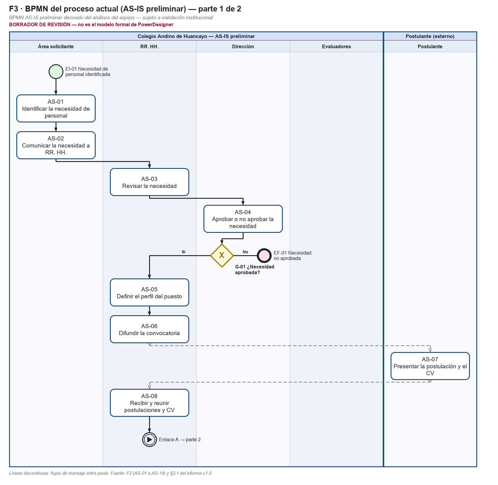
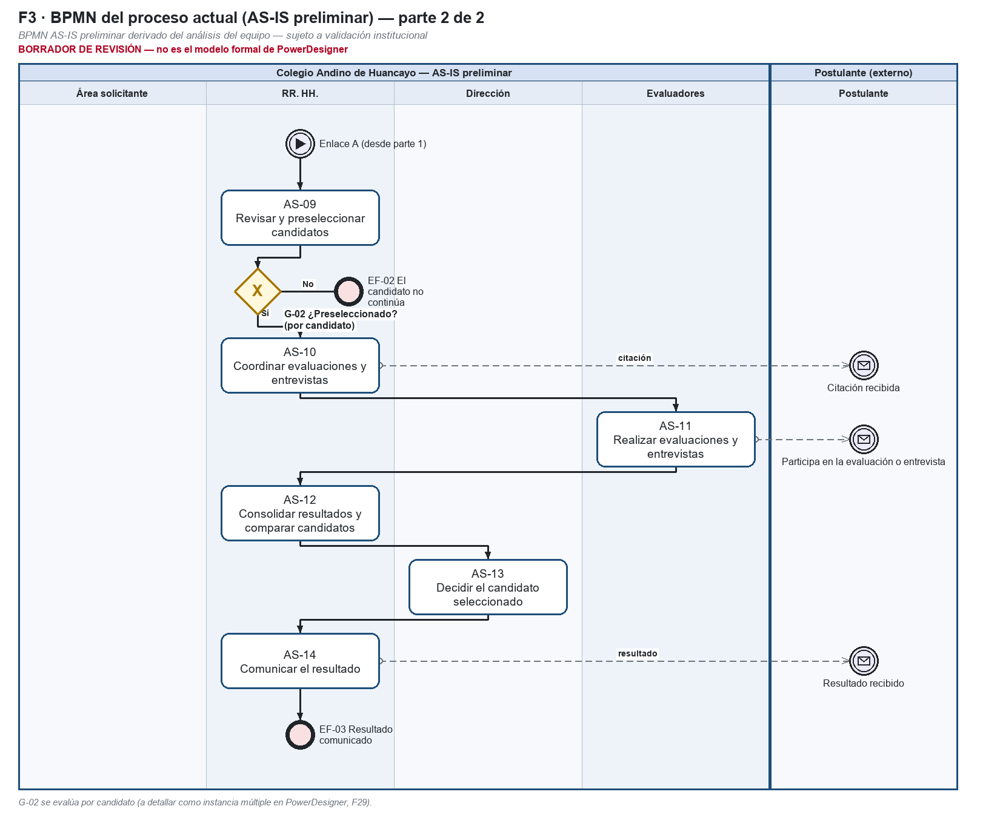

# Formato 03 — Diagrama BPM del proceso actual (AS-IS preliminar)

> Espejo en Markdown de `F3_Diagrama_BPM_ASIS_Colegio_Andino.docx`, generado desde el mismo modelo (`docs/academico/tools/f27b/`). El entregable es el DOCX.

## 1. Datos generales del proyecto

| Campo | Valor |
|---|---|
| Nombre del proyecto | Análisis y Diseño de una Plataforma SaaS Multiempresa para la Gestión del Reclutamiento, Evaluación y Selección de Personal – Caso de estudio: Colegio Andino de Huancayo |
| Integrantes del equipo | Coronacion Meza Fredy; Peña Arroyo Anthony; Vila Meza Luis Antonio |
| Nombre de la empresa o institución | Colegio Andino de Huancayo (caso de estudio académico) |
| Nombre del proceso analizado | Reclutamiento, evaluación y selección de personal |
| Docente | Dr. Maglioni Arana Caparachin |
| Fecha de elaboración | 26/09/2026 |

> **Estado de la información de este formato**
>
> **HECHO VERIFICADO:** comprobado en el repositorio (código, pruebas ejecutadas, documentos versionados).
>
> **AS-IS PRELIMINAR:** reconstrucción del proceso actual hecha por el equipo; **sujeta a validación institucional** (RR. HH. / Administración del Colegio). No es un procedimiento validado por la institución.
>
> **TO-BE PROPUESTO:** proceso mejorado diseñado por el equipo; su adopción en la institución no está validada.
>
> **SOFTWARE IMPLEMENTADO:** comportamiento de la plataforma v1.1 (etiqueta v1.1.0-academic), verificado con pruebas.
>
> **EXPERIMENTAL / PROPUESTO:** RF-28 (candidato, no implementado), RF-29 (experimental, solo sobre el proceso) y RNF-C (propuesta). No forman parte de la línea base RF-01 a RF-27.
>
> Este BPMN es un **BPMN AS-IS preliminar derivado del análisis del equipo**. No está validado por la institución y no es el modelo formal de PowerDesigner (pendiente para la Fase 29, ver `POWERDESIGNER_PENDING.md`).
>
> La plataforma **nunca** selecciona, descarta ni contrata automáticamente: el ranking calcula, ordena y compara.
>
> La decisión final de selección es **humana**: la registra el Aprobador / Dirección con confirmación explícita y justificación (RF-23).
>
> Todos los datos de ejemplo son ficticios. No se usan datos personales reales.

## 2. Descripción general del proceso

*Describir brevemente el proceso que será representado en el diagrama BPM, indicando su propósito, alcance (inicio y fin) y contexto.*

> **Proceso:** Reclutamiento, evaluación y selección de personal en el Colegio Andino de Huancayo (caso de estudio académico).
>
> **Propósito:** cubrir necesidades de personal con una decisión final de la Dirección.
>
> **Alcance:** desde que un área identifica una necesidad de personal (EI-01) hasta que se comunica el resultado a los postulantes (EF-03). Caminos alternativos: necesidad no aprobada (EF-01) y candidato no preseleccionado (EF-02).
>
> **Contexto:** representa las 14 actividades del Formato 02 (AS-01 a AS-14). Es un modelo preliminar, sin canales, herramientas ni tiempos reales verificados.

## 3. Diagrama BPM del proceso actual (AS-IS)

*Inserte el diagrama BPM elaborado utilizando notación BPMN.*

*Figura 1. BPMN AS-IS preliminar, parte 1 (EI-01 a AS-08).*

*Figura 2. BPMN AS-IS preliminar, parte 2 (AS-09 a EF-03).*

Borrador de revisión dibujado desde la especificación de este formato. La versión formal se modelará en PowerDesigner cuando la auditoría F27C apruebe el contenido.

## 4. Elementos BPMN utilizados

| N° | Elemento BPMN | Descripción | Uso en el proceso |
|---|---|---|---|
| 1 | Pool (participante) | Contenedor de un participante del proceso. | «Colegio Andino de Huancayo — reclutamiento y selección (AS-IS preliminar)» y «Postulante» (externo). |
| 2 | Lane (carril) | Subdivisión de un pool por responsable. | Área solicitante, RR. HH., Dirección y Evaluadores dentro del pool del Colegio. |
| 3 | Evento de inicio | Punto donde empieza el proceso. | EI-01 «Necesidad de personal identificada» (Área solicitante). |
| 4 | Tarea | Trabajo que realiza un actor. | AS-01 a AS-14. |
| 5 | Compuerta exclusiva | Decisión con una sola salida posible. | G-01 «¿Necesidad aprobada?» (Dirección) y G-02 «¿Candidato preseleccionado?» (RR. HH., por candidato). |
| 6 | Evento de fin | Punto donde termina un camino del proceso. | EF-01 «Necesidad no aprobada», EF-02 «Candidato no continúa» y EF-03 «Resultado comunicado». |
| 7 | Flujo de secuencia | Orden de ejecución dentro de un pool. | Conecta las tareas y compuertas del Colegio. |
| 8 | Flujo de mensaje | Comunicación entre pools. | Convocatoria (AS-06 → Postulante), postulación y CV (AS-07 → AS-08), citación (AS-10 → Postulante) y resultado (AS-14 → Postulante). |
| 9 | Anotación | Texto aclaratorio. | Marca «AS-IS preliminar, sujeto a validación institucional». |

## 5. Identificación de actores (Pools / Lanes)

| N° | Actor | Tipo (Interno / Externo / Sistemas) | Lane asignado |
|---|---|---|---|
| 1 | Área solicitante | Interno | Lane «Área solicitante» (pool del Colegio) |
| 2 | Recursos Humanos | Interno | Lane «RR. HH.» (pool del Colegio) |
| 3 | Dirección | Interno | Lane «Dirección» (pool del Colegio) |
| 4 | Evaluadores | Interno | Lane «Evaluadores» (pool del Colegio) |
| 5 | Postulante | Externo | Pool «Postulante» (externo), comunicado por flujos de mensaje |

No hay lane de «Sistemas»: el AS-IS preliminar no identifica ninguna herramienta informática del Colegio.

## 6. Descripción del flujo del proceso

*Describir paso a paso cómo se desarrolla el proceso según el diagrama BPM.*

> 1. El proceso inicia cuando el **Área solicitante** identifica una necesidad de personal (EI-01, AS-01) y la comunica a RR. HH. (AS-02).
>
> 2. **RR. HH.** revisa la necesidad (AS-03) y la eleva a **Dirección**, que decide si procede (AS-04). En la compuerta G-01, si no se aprueba, el camino termina (EF-01) y el área recibe la respuesta.
>
> 3. Si se aprueba, RR. HH. define el perfil del puesto (AS-05) y difunde la convocatoria (AS-06), que llega al **Postulante** como mensaje.
>
> 4. El Postulante presenta su postulación y CV (AS-07). RR. HH. los recibe y reúne (AS-08).
>
> 5. RR. HH. revisa los CV y preselecciona (AS-09). En G-02, que se evalúa por candidato, quien no es preseleccionado no continúa (EF-02). **No está verificado** si se le informa.
>
> 6. Para los preseleccionados, RR. HH. coordina evaluaciones y entrevistas y cita a los candidatos (AS-10). Los **Evaluadores** las realizan y entregan sus resultados (AS-11).
>
> 7. RR. HH. consolida y compara los resultados (AS-12). Dirección decide el candidato seleccionado (AS-13).
>
> 8. RR. HH. comunica el resultado a los postulantes (AS-14) y el proceso termina (EF-03).

## 7. Validación del modelo

*Marque con un aspa (X) si se cumplen los enunciados. Se aplica a la especificación y al borrador de este formato.*

| Enunciado | X | Comprobación |
|---|---|---|
| El proceso tiene evento de inicio y fin claramente definidos. | X | EI-01; EF-01, EF-02 y EF-03. |
| Todas las actividades están conectadas correctamente. | X | AS-01 a AS-14 tienen entrada y salida; las partes 1 y 2 se unen con el enlace A. |
| Se utilizan correctamente los elementos BPMN. | X | Secuencia dentro del pool y mensajes entre pools. G-02 por candidato queda anotada para modelarse como instancia múltiple en PowerDesigner. |
| Cada actividad tiene un actor asignado. | X | Cada tarea está en el lane de su actor (tabla 5). |
| El flujo es coherente y entendible. | X | Coincide con las 8 actividades macro de §3.1 y con el Formato 02. |

La validación es **interna del equipo**. Falta la validación institucional del contenido del AS-IS.

## 8. Evidencias

- Fuente del AS-IS: `docs/final-report/03-procesos-negocio.md` §3.1 (8 actividades macro, responsables y problemas P1–P5 asociados) — rotulado como «preliminar, pendiente de validación» desde la v1.0.
- Contexto y problemas: `docs/final-report/02-contexto-problema.md` §2.1–2.2 (sin documentación institucional verificada en el repositorio).
- Informe del BPMN AS-IS v1.0: `docs/final-report/diagram-reports/01-bpmn-as-is-report.md` (el diagrama original del equipo **no está versionado**; estado «evidencia externa pendiente»).
- Guía oficial: `docs/academico/00-fuentes-oficiales/guias/` (Prácticas 02 y 03) y plantillas oficiales de los Formatos 02 y 03 (SHA-256 en `docs/academico/00-fuentes-oficiales/inventory.md`).
- Modelo de datos del documento y generador reproducible: `docs/academico/tools/f27b/` (`m_asis.py`, `build.py`).
- Borradores: `docs/academico/practica-03/diagramas/draft/F3-bpmn-as-is-parte1.png` y `…parte2.png`.
- Pendiente de modelado formal: `docs/academico/practica-03/POWERDESIGNER_PENDING.md`.
