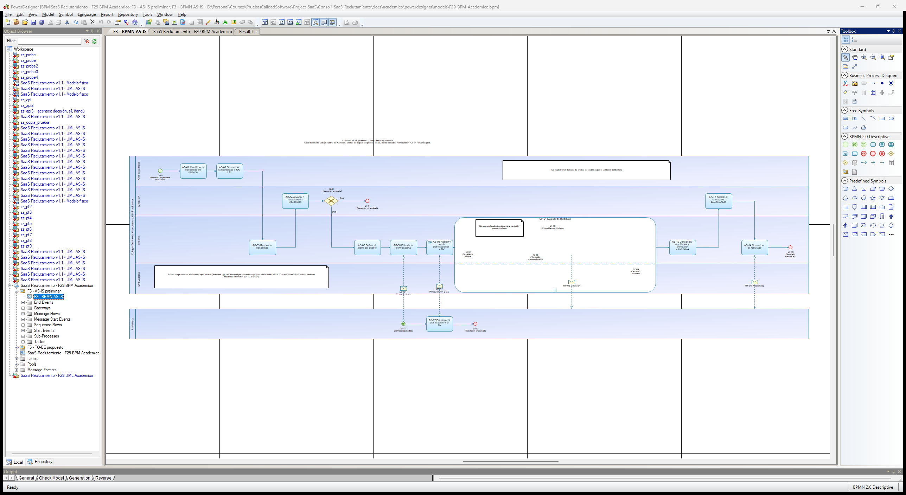
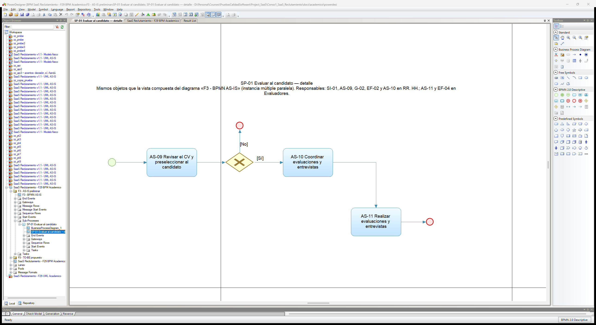

# Formato 03 — Diagrama BPM del proceso actual (AS-IS preliminar)

> Espejo en Markdown de `F3_Diagrama_BPM_ASIS_Colegio_Andino.docx`, generado desde el mismo modelo (`docs/academico/tools/f27b/`). El entregable es el DOCX.

## 1. Datos generales del proyecto

| Campo | Valor |
|---|---|
| Nombre del proyecto | Análisis y Diseño de una Plataforma SaaS Multiempresa para la Gestión del Reclutamiento, Evaluación y Selección de Personal – Caso de estudio: Colegio Andino de Huancayo |
| Integrantes del equipo | Coronacion Meza Fredy; Peña Arroyo Anthony; Vila Meza Luis Antonio |
| Nombre de la empresa o institución | Colegio Andino de Huancayo (caso de estudio académico) |
| Nombre del proceso analizado | Reclutamiento, evaluación y selección de personal |
| Docente | Dr. Maglioni Arana Caparachin |
| Fecha de elaboración | 26/09/2026 |

> **Estado de la información de este formato**
>
> **HECHO VERIFICADO:** comprobado en el repositorio (código, pruebas ejecutadas, documentos versionados).
>
> **AS-IS PRELIMINAR:** reconstrucción del proceso actual hecha por el equipo; **sujeta a validación institucional** (RR. HH. / Administración del Colegio). No es un procedimiento validado por la institución.
>
> **TO-BE PROPUESTO:** proceso mejorado diseñado por el equipo; su adopción en la institución no está validada.
>
> **SOFTWARE IMPLEMENTADO:** comportamiento de la plataforma v1.1 (etiqueta v1.1.0-academic), verificado con pruebas.
>
> **EXPERIMENTAL / PROPUESTO:** RF-28 (candidato, no implementado), RF-29 (experimental, solo sobre el proceso) y RNF-C (propuesta). No forman parte de la línea base RF-01 a RF-27.
>
> Este BPMN es un **BPMN AS-IS preliminar derivado del análisis del equipo**. No está validado por la institución. Su modelo formal es el diagrama «F3 - BPMN AS-IS» de PowerDesigner (F29, con el hotfix F29B): formalizarlo no cambia su condición de preliminar.
>
> La plataforma **nunca** selecciona, descarta ni contrata automáticamente: el ranking calcula, ordena y compara.
>
> La decisión final de selección es **humana**: la registra el Aprobador / Dirección con confirmación explícita y justificación (RF-23).
>
> Todos los datos de ejemplo son ficticios. No se usan datos personales reales.

## 2. Descripción general del proceso

*Describir brevemente el proceso que será representado en el diagrama BPM, indicando su propósito, alcance (inicio y fin) y contexto.*

> **Proceso:** Reclutamiento, evaluación y selección de personal en el Colegio Andino de Huancayo (caso de estudio académico).
>
> **Propósito:** cubrir necesidades de personal con una decisión final de la Dirección.
>
> **Alcance:** desde que un área identifica una necesidad de personal (EI-01) hasta que se comunica el resultado a los postulantes (EF-03). Caminos alternativos: necesidad no aprobada (EF-01) y, para cada candidato dentro de SP-01, candidato no preseleccionado (EF-02).
>
> **Contexto:** representa las 14 actividades del Formato 02 (AS-01 a AS-14). Es un modelo preliminar, sin canales, herramientas ni tiempos reales verificados.

## 3. Diagrama BPM del proceso actual (AS-IS)

*Inserte el diagrama BPM elaborado utilizando notación BPMN.*

Diagrama formal modelado en **PowerDesigner 16.6** (Fase 29): diagrama «F3 - BPMN AS-IS» del modelo `F29_BPM_Academico.bpm`, paquete F3. La figura 1 es la exportación completa; las figuras 2 y 3 amplían sus dos mitades para leerlas mejor y no añaden contenido.

*Figura 1. BPMN AS-IS preliminar: exportación formal de PowerDesigner (F29), diagrama «F3 - BPMN AS-IS» (`F3_BPMN_ASIS.png`).*

*Figura 2. Ampliación de la figura 1 (franja del 0 % al 55 % del ancho): EI-01 a AS-08 y pool Postulante. Recorte sin retoque de la exportación formal.* (En el DOCX: ampliación de la franja del 0 % al 55 % del ancho de [`F3_BPMN_ASIS.png`](../powerdesigner/exports/F3_BPMN_ASIS.png).)

*Figura 3. Ampliación de la figura 1 (franja del 45 % al 100 % del ancho): SP-01, AS-12 a AS-14 y EF-03. Recorte sin retoque de la exportación formal.* (En el DOCX: ampliación de la franja del 45 % al 100 % del ancho de [`F3_BPMN_ASIS.png`](../powerdesigner/exports/F3_BPMN_ASIS.png).)

SP-01 es un subproceso expandido de instancia múltiple paralela (marcador |||) con SI-01, AS-09, G-02, AS-10, AS-11, EF-02 y EF-04 dentro. PowerDesigner 16.6 no dibuja ese contenido en la vista principal del editor (limitación F29B-OBS-01): se consulta en el diagrama «SP-01 Evaluar al candidato — detalle», con los mismos objetos. La exportación, reproducible, es la evidencia formal.

El borrador de revisión de la F27B–F28 (`diagramas/draft/`) queda como antecedente: DRAFT / SUPERSEDED BY F29 FORMAL EXPORT.

## 4. Elementos BPMN utilizados

| N° | Elemento BPMN | Descripción | Uso en el proceso |
|---|---|---|---|
| 1 | Pool (participante) | Contenedor de un participante del proceso. | «Colegio Andino de Huancayo — reclutamiento y selección (AS-IS preliminar)», caja blanca con cuatro lanes, y «Postulante», participante externo visible con comportamiento mínimo (EP-01 → AS-07 → EP-02). |
| 2 | Lane (carril) | Subdivisión de un pool por responsable. | Área solicitante, RR. HH., Dirección y Evaluadores, dentro del pool del Colegio. |
| 3 | Evento de inicio | Punto donde empieza el proceso. | EI-01 «Necesidad de personal identificada» (Área solicitante). |
| 4 | Evento de inicio de mensaje | Inicio disparado por un mensaje. | EP-01 «Convocatoria recibida» (pool Postulante, por MF-01). |
| 5 | Tarea | Trabajo que realiza un actor. | AS-01 a AS-14. |
| 6 | Tarea de recepción | Tarea que espera un mensaje. | AS-08 «Recibir y reunir postulaciones y CV» recibe MF-02. |
| 7 | Subproceso de instancia múltiple | Subproceso que se ejecuta una vez por elemento de una colección. | SP-01 «Evaluar al candidato», paralelo, una instancia por candidato (AS-09 a AS-11). |
| 8 | Compuerta exclusiva | Decisión con una sola salida posible. | G-01 «¿Necesidad aprobada?» (Dirección) y G-02 «¿Candidato preseleccionado?» (RR. HH., dentro de SP-01). |
| 9 | Evento de fin | Punto donde termina un camino. | Del proceso: EF-01 «Necesidad no aprobada» y EF-03 «Resultado comunicado». De SP-01: EF-02 «El candidato no continúa» y EF-04 «Candidato evaluado». Del Postulante: EP-02 «Postulación presentada». |
| 10 | Flujo de secuencia | Orden de ejecución dentro de un pool. | Dentro de cada pool. Incluye AS-06 → AS-08: la tarea de recepción sigue a la difusión. |
| 11 | Flujo de mensaje | Comunicación entre pools, unidireccional. | MF-01 a MF-04 (tabla de mensajes). |
| 12 | Anotación | Texto aclaratorio. | Marca «AS-IS preliminar, sujeto a validación institucional». |

**Glosario de nombres oficiales**

| ID | Tipo | Nombre oficial |
|---|---|---|
| EI-01 | Evento de inicio (pool Colegio) | Necesidad de personal identificada |
| G-01 | Compuerta exclusiva | ¿Necesidad aprobada? |
| EF-01 | Evento de fin del proceso | Necesidad no aprobada |
| SP-01 | Subproceso de instancia múltiple (paralela), una instancia por candidato | Evaluar al candidato |
| SI-01 | Evento de inicio de SP-01 | Candidato a evaluar |
| G-02 | Compuerta exclusiva (dentro de SP-01) | ¿Candidato preseleccionado? |
| EF-02 | Evento de fin de SP-01 | El candidato no continúa |
| EF-04 | Evento de fin de SP-01 | Candidato evaluado |
| EF-03 | Evento de fin del proceso | Resultado comunicado |
| EP-01 | Evento de inicio de mensaje (pool Postulante) | Convocatoria recibida |
| EP-02 | Evento de fin (pool Postulante) | Postulación presentada |

Cada ID tiene **un solo nombre**, que se usa igual en el formato, el borrador, el README y el pendiente de PowerDesigner.

**Pool del Postulante y subproceso por candidato**

Pool **Postulante**: participante externo **visible (caja blanca), con comportamiento mínimo**. Contiene: EP-01 «Convocatoria recibida» (inicio de mensaje) → AS-07 «Presentar la postulación y el CV» → EP-02 «Postulación presentada» (fin). No es un pool de caja negra. Los mensajes posteriores (citación y resultado) llegan al **borde del pool**, sin evento interno, porque el AS-IS no documenta cómo reacciona el postulante; dibujar esa reacción sería inventarla.

**SP-01 «Evaluar al candidato»** es un **subproceso expandido de instancia múltiple paralela**, con una instancia por candidato cuya postulación reunió AS-08. Contiene SI-01 → AS-09 → G-02 → [No] EF-02 | [Sí] AS-10 → AS-11 → EF-04. La secuencia del pool continúa hacia AS-12 cuando **todas** las instancias terminaron. No hay otra opción de modelado.

**Flujos de mensaje (lista cerrada, unidireccional)**

| ID | Origen | Destino | Elemento receptor | Contenido |
|---|---|---|---|---|
| MF-01 | AS-06 Difundir la convocatoria (Colegio, RR. HH.) | Postulante | EP-01 Convocatoria recibida | Convocatoria |
| MF-02 | AS-07 Presentar la postulación y el CV (Postulante) | Colegio, RR. HH. | AS-08 (tarea de recepción) | Postulación y CV |
| MF-03 | AS-10 Coordinar evaluaciones y entrevistas (Colegio, RR. HH., dentro de SP-01) | Postulante | Borde del pool Postulante | Citación |
| MF-04 | AS-14 Comunicar el resultado (Colegio, RR. HH.) | Postulante | Borde del pool Postulante | Resultado |

## 5. Identificación de actores (Pools / Lanes)

| N° | Actor | Tipo (Interno / Externo / Sistemas) | Lane asignado |
|---|---|---|---|
| 1 | Área solicitante | Interno | Lane «Área solicitante» (pool del Colegio) |
| 2 | Recursos Humanos | Interno | Lane «RR. HH.» (pool del Colegio) |
| 3 | Dirección | Interno | Lane «Dirección» (pool del Colegio) |
| 4 | Evaluadores | Interno (supuesto de modelado) | Lane «Evaluadores» (pool del Colegio) |
| 5 | Postulante | Externo (supuesto de modelado) | Pool «Postulante»: participante visible con EP-01 → AS-07 → EP-02 |

No hay lane de «Sistemas»: el AS-IS preliminar no identifica ninguna herramienta informática del Colegio.

## 6. Descripción del flujo del proceso

*Describir paso a paso cómo se desarrolla el proceso según el diagrama BPM.*

> 1. El proceso inicia cuando el **Área solicitante** identifica una necesidad de personal (EI-01 «Necesidad de personal identificada», AS-01) y la comunica a RR. HH. (AS-02).
>
> 2. **RR. HH.** revisa la necesidad (AS-03) y **Dirección** decide si procede (AS-04). En G-01 «¿Necesidad aprobada?», si no se aprueba, el proceso termina en EF-01 «Necesidad no aprobada».
>
> 3. Si se aprueba, RR. HH. define el perfil del puesto (AS-05) y difunde la convocatoria (AS-06). MF-01 lleva la convocatoria al pool **Postulante**, donde inicia EP-01 «Convocatoria recibida».
>
> 4. El Postulante presenta su postulación y su CV (AS-07), que llegan a RR. HH. por MF-02; su pool termina en EP-02 «Postulación presentada». En el pool del Colegio, AS-06 continúa en **AS-08**, una tarea de recepción que reúne las postulaciones recibidas.
>
> 5. Con las postulaciones reunidas se ejecuta **SP-01 «Evaluar al candidato»**, una instancia por candidato. RR. HH. revisa el CV (AS-09); en G-02 «¿Candidato preseleccionado?», si no se preselecciona, la instancia termina en EF-02 «El candidato no continúa». **No está verificado** si se informa a ese candidato.
>
> 6. Si se preselecciona, RR. HH. coordina evaluaciones y entrevistas y cita al candidato (AS-10, MF-03). Los **Evaluadores** las realizan y entregan sus resultados (AS-11), y la instancia termina en EF-04 «Candidato evaluado».
>
> 7. Cuando todas las instancias de SP-01 terminaron, RR. HH. consolida y compara los resultados (AS-12) y Dirección decide el candidato seleccionado (AS-13).
>
> 8. RR. HH. comunica el resultado (AS-14, MF-04) y el proceso termina en EF-03 «Resultado comunicado».

## 7. Validación del modelo

*Marque con un aspa (X) si se cumplen los enunciados. Se aplica a la especificación y al modelo formal de PowerDesigner (F29), verificado en `docs/academico/powerdesigner/F29_VALIDATION.md`.*

| Enunciado | X | Comprobación |
|---|---|---|
| El proceso tiene evento de inicio y fin claramente definidos. | X | Proceso: EI-01; EF-01 y EF-03. SP-01: SI-01; EF-02 y EF-04. Postulante: EP-01; EP-02. |
| Todas las actividades están conectadas correctamente. | X | AS-01 a AS-14 tienen entrada y salida de secuencia; AS-06 → AS-08 es secuencia (AS-08 es tarea de recepción); AS-07 está entre EP-01 y EP-02; el modelo formal es un solo diagrama (el borrador unía sus dos partes con el enlace A). |
| Se utilizan correctamente los elementos BPMN. | X | Secuencia solo dentro de cada pool; MF-01 a MF-04 unidireccionales entre pools; SP-01 de instancia múltiple paralela por candidato. |
| Cada actividad tiene un actor asignado. | X | Cada tarea está en el lane de su actor (tabla 5). |
| El flujo es coherente y entendible. | X | Coincide con las 8 actividades macro de §3.1, con el Formato 02 y con el glosario de nombres. |

La validación es **interna del equipo**. Falta la validación institucional del contenido del AS-IS.

## 8. Evidencias

- Fuente del AS-IS: `docs/final-report/03-procesos-negocio.md` §3.1 (8 actividades macro, responsables y problemas P1–P5 asociados) — rotulado como «preliminar, pendiente de validación» desde la v1.0.
- Contexto y problemas: `docs/final-report/02-contexto-problema.md` §2.1–2.2 (sin documentación institucional verificada en el repositorio).
- Informe del BPMN AS-IS v1.0: `docs/final-report/diagram-reports/01-bpmn-as-is-report.md` (el diagrama original del equipo **no está versionado**; estado «evidencia externa pendiente»).
- Guía oficial: `docs/academico/00-fuentes-oficiales/guias/` (Prácticas 02 y 03) y plantillas oficiales de los Formatos 02 y 03 (SHA-256 en `docs/academico/00-fuentes-oficiales/inventory.md`).
- Modelo de datos del documento y generador reproducible: `docs/academico/tools/f27b/` (`m_asis.py`, `build.py`).
- Modelo formal: `docs/academico/powerdesigner/models/F29_BPM_Academico.bpm` (paquete F3); exportaciones `F3_BPMN_ASIS.png` y `F3_BPMN_ASIS.svg` en `docs/academico/powerdesigner/exports/`; validación en `F29_VALIDATION.md` y `F29B_HOTFIX.md`.
- Especificación de PowerDesigner: `docs/academico/practica-03/POWERDESIGNER_PENDING.md` (FORMALIZED / DONE).
- Borradores: `docs/academico/practica-03/diagramas/draft/F3-bpmn-as-is-parte1.png` y `…parte2.png` (DRAFT / SUPERSEDED BY F29 FORMAL EXPORT).

Capturas reales de PowerDesigner, tomadas con el modelo reabierto desde el disco:

*Figura 4. Captura de PowerDesigner: diagrama «F3 - BPMN AS-IS» y paquete F3 en el Object Browser.*

*Figura 5. Captura de PowerDesigner: diagrama «SP-01 Evaluar al candidato — detalle» (contenido de SP-01; F29B-OBS-01).*
