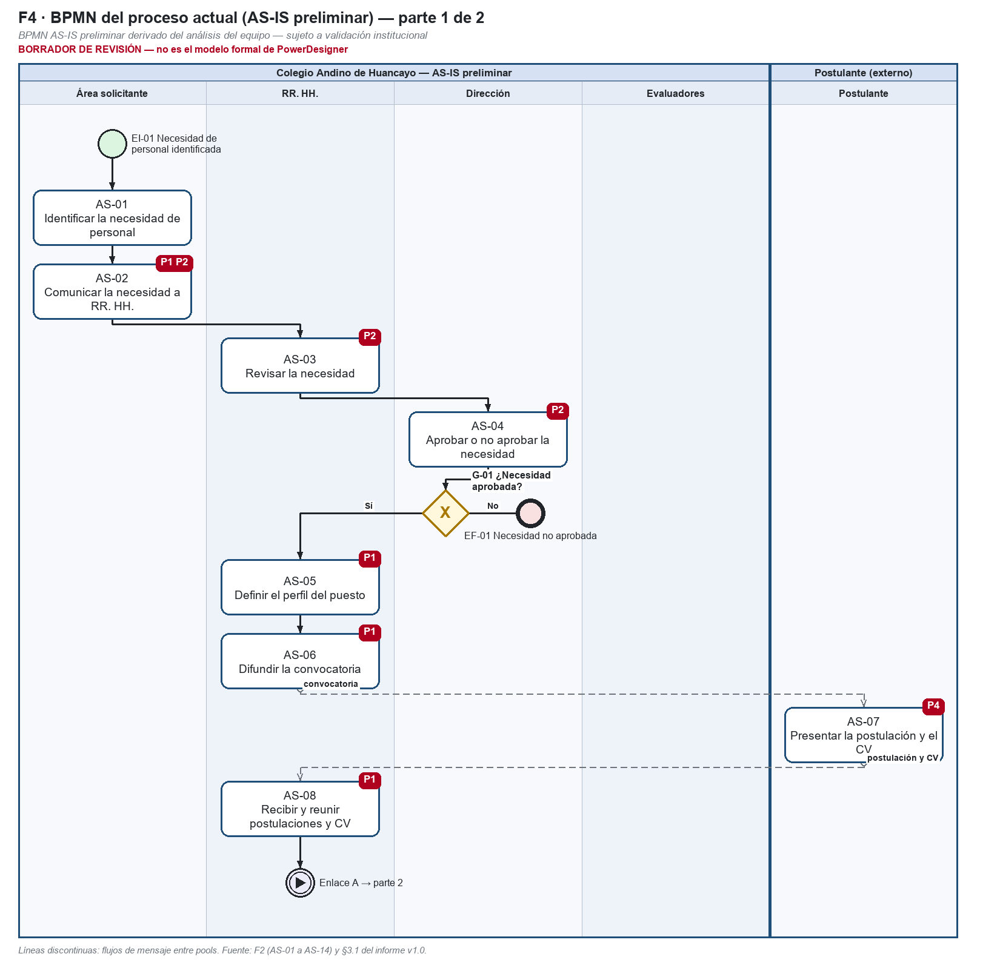
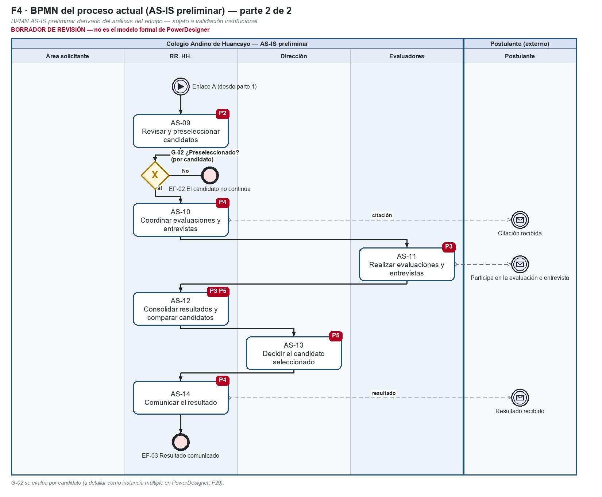

# Formato 04 — Identificación de problemas del proceso

> Espejo en Markdown de `F4_Problemas_del_Proceso_Colegio_Andino.docx`, generado desde el mismo modelo (`docs/academico/tools/f27b/`). El entregable es el DOCX.

## 1. Datos generales del proyecto

| Campo | Valor |
|---|---|
| Nombre del proyecto | Análisis y Diseño de una Plataforma SaaS Multiempresa para la Gestión del Reclutamiento, Evaluación y Selección de Personal – Caso de estudio: Colegio Andino de Huancayo |
| Integrantes del equipo | Coronacion Meza Fredy; Peña Arroyo Anthony; Vila Meza Luis Antonio |
| Nombre de la empresa o institución | Colegio Andino de Huancayo (caso de estudio académico) |
| Nombre del proceso analizado | Reclutamiento, evaluación y selección de personal |
| Docente | Dr. Maglioni Arana Caparachin |
| Fecha de elaboración | 26/09/2026 |

> **Estado de la información de este formato**
>
> **HECHO VERIFICADO:** comprobado en el repositorio (código, pruebas ejecutadas, documentos versionados).
>
> **AS-IS PRELIMINAR:** reconstrucción del proceso actual hecha por el equipo; **sujeta a validación institucional** (RR. HH. / Administración del Colegio). No es un procedimiento validado por la institución.
>
> **TO-BE PROPUESTO:** proceso mejorado diseñado por el equipo; su adopción en la institución no está validada.
>
> **SOFTWARE IMPLEMENTADO:** comportamiento de la plataforma v1.1 (etiqueta v1.1.0-academic), verificado con pruebas.
>
> **EXPERIMENTAL / PROPUESTO:** RF-28 (candidato, no implementado), RF-29 (experimental, solo sobre el proceso) y RNF-C (propuesta). No forman parte de la línea base RF-01 a RF-27.
>
> Los problemas son **AS-IS PRELIMINAR**. La prioridad es una **priorización analítica del equipo** y las causas son hipótesis del equipo; ninguna está validada por la institución.
>
> La plataforma **nunca** selecciona, descarta ni contrata automáticamente: el ranking calcula, ordena y compara.
>
> La decisión final de selección es **humana**: la registra el Aprobador / Dirección con confirmación explícita y justificación (RF-23).
>
> Todos los datos de ejemplo son ficticios. No se usan datos personales reales.

## 2. Descripción general del proceso

*Describir de manera breve el proceso analizado (AS-IS), indicando su propósito, alcance (inicio y fin) y contexto organizacional.*

> **Proceso analizado:** reclutamiento, evaluación y selección de personal (AS-IS preliminar de los Formatos 02 y 03).
>
> **Propósito:** cubrir necesidades de personal con una decisión final de la Dirección.
>
> **Alcance:** desde que un área identifica una necesidad (EI-01) hasta que se comunica el resultado (EF-03).
>
> **Contexto organizacional:** Colegio Andino de Huancayo, caso de estudio académico. Intervienen el área solicitante, RR. HH., la Dirección, los evaluadores y los postulantes. No hay documentación institucional verificada.

## 3. Listado de problemas identificados

| N° | Actividad del proceso | Problema identificado | Tipo de problema | Descripción del problema | Impacto | Prioridad (Alta/Media/Baja) |
|---|---|---|---|---|---|---|
| P1 | AS-02, AS-05, AS-06, AS-08 | Información distribuida | Calidad (sec.: Redundancia) | Los datos del proceso (requerimiento, perfil del puesto, CV, evaluaciones y decisiones) no están centralizados en un único registro por convocatoria. | Dificulta reconstruir el expediente y el estado integral de una postulación; riesgo de pérdida o duplicación de información y menor trazabilidad. | Alta (priorización analítica del equipo) |
| P2 | AS-02, AS-03, AS-04, AS-09 | Seguimiento manual | Control (sec.: Tiempo) | El avance de cada requerimiento y postulación se controla sin estados ni historial sistematizados. | Poca visibilidad del estado del proceso y de quién hizo cada cambio; más esfuerzo para controlar etapas y responsables. | Alta (priorización analítica del equipo) |
| P3 | AS-11, AS-12 | Evaluaciones heterogéneas | Calidad (sec.: Control) | Los candidatos no se evalúan con criterios, ponderaciones y rangos definidos de antemano y comunes a toda la convocatoria. | Comparaciones poco objetivas y difíciles de justificar; menor comparabilidad de resultados. | Alta (priorización analítica del equipo) |
| P4 | AS-07, AS-10, AS-14 | Comunicación manual | Tiempo (sec.: Control) | Los avisos a postulantes y participantes (recepción, cambios de etapa, convocatorias y resultado) dependen de gestiones manuales. | Demoras u omisiones en la comunicación; es difícil comprobar qué se comunicó y cuándo. | Media (priorización analítica del equipo) |
| P5 | AS-12, AS-13 | Indicadores limitados | Control (sec.: Otros: información de gestión) | No se dispone de información consolidada para comparar candidatos ni de trazabilidad de las acciones críticas. | Decisiones con menos sustento, baja capacidad de auditoría y dificultad para medir demoras y resultados del proceso. | Media (priorización analítica del equipo) |

**Justificación de la prioridad y estado de la evidencia**

| N° | Prioridad | Justificación (analítica) | Estado de la evidencia |
|---|---|---|---|
| P1 | Alta | Afecta a todas las etapas y es la base para atender P2, P3 y P5. | AS-IS preliminar. Problema definido en el análisis previo del equipo (cap. 2 §2.2; F9 v1.0 §3.2). Validación institucional pendiente con RR. HH.. |
| P2 | Alta | Sin estados ni historial no se puede verificar quién decidió qué ni en qué etapa está cada candidato. | AS-IS preliminar. Problema definido en el análisis previo del equipo (cap. 2 §2.2; F9 v1.0 §3.2). Validación institucional pendiente con RR. HH.. |
| P3 | Alta | Incide directamente en la equidad y en el sustento de la decisión final. | AS-IS preliminar. Problema definido en el análisis previo del equipo (cap. 2 §2.2; F9 v1.0 §3.2). Validación institucional pendiente con RR. HH. / Dirección. |
| P4 | Media | Afecta a la experiencia del postulante y a la trazabilidad, pero no altera por sí mismo la decisión de selección. | AS-IS preliminar. Problema definido en el análisis previo del equipo (cap. 2 §2.2; F9 v1.0 §3.2). Validación institucional pendiente con RR. HH.. |
| P5 | Media | Condiciona el sustento de la decisión y la mejora continua. La parte de indicadores de gestión queda fuera de la línea base (RF-28 es un candidato no implementado). | AS-IS preliminar. Problema definido en el análisis previo del equipo (cap. 2 §2.2; F9 v1.0 §3.2). Validación institucional pendiente con Dirección. |

## 4. Clasificación de problemas

*Clasificar los problemas según su naturaleza.*

**Problemas de tiempo (retrasos, cuellos de botella)**

> P4 (tipo principal): avisos manuales con demoras u omisiones. P2 (secundario): sin estados ni historial, el seguimiento exige más esfuerzo y tiempo. No hay tiempos medidos del AS-IS.

**Problemas de calidad (errores, reprocesos)**

> P1 (principal): riesgo de pérdida o duplicación de información. P3 (principal): comparaciones poco objetivas.

**Problemas de control (falta de supervisión o validación)**

> P2 (principal): cambios sin estados ni responsable registrado. P5 (principal): sin trazabilidad de acciones críticas. P3 y P4 (secundarios): sin criterios comunes y sin constancia de comunicaciones.

**Problemas de redundancia (actividades duplicadas)**

> P1 (secundario): riesgo de duplicar información entre etapas. **No se identificaron actividades duplicadas verificadas** en el AS-IS preliminar.

**Otros (especificar)**

> P5 (secundario): falta de información de gestión (indicadores de tiempos y resultados). No se implementa en la línea base (RF-28 es un candidato no implementado).

## 5. Análisis de causas

| N° | Problema identificado | Causa principal | Descripción de la causa |
|---|---|---|---|
| P1 | Información distribuida | Ausencia de un registro único por convocatoria | Cada etapa conserva su información por separado. No existe un expediente común que reúna la necesidad, el perfil, los CV, las evaluaciones y la decisión. |
| P2 | Seguimiento manual | Estados del proceso no definidos ni registrados | Las etapas del requerimiento y de la postulación no están formalizadas como estados con sus transiciones, y los cambios no quedan registrados con autor y fecha. |
| P3 | Evaluaciones heterogéneas | Criterios de evaluación no definidos antes de evaluar | El perfil no fija criterios con ponderación y rango, y los resultados no se registran con una escala común por criterio. |
| P4 | Comunicación manual | Avisos que dependen de una gestión manual en cada evento | Cada aviso requiere que alguien lo redacte y envíe. No hay un disparador asociado a cada evento del proceso ni constancia del envío. |
| P5 | Indicadores limitados | Datos no consolidados y sin registro de acciones críticas | Los resultados no se integran en una vista comparable y las acciones críticas no dejan un registro auditable. Tampoco hay datos agregados del proceso para medir tiempos. |

Las causas son **hipótesis del equipo** derivadas del análisis. Se confirmarán o corregirán en la validación institucional.

## 6. Relación con el diagrama BPM

*Describir en qué parte del diagrama BPM se encuentra cada problema identificado.*

| N° | Problema | Ubicación en el BPMN AS-IS (Formato 03) | Actividades |
|---|---|---|---|
| P1 | Información distribuida | Pool del Colegio: AS-02 (lane Área solicitante), AS-05, AS-06 y AS-08 (lane RR. HH.) y el mensaje de postulación y CV (Postulante → AS-08). | AS-02, AS-05, AS-06, AS-08 |
| P2 | Seguimiento manual | AS-02 → AS-03 → AS-04 y la compuerta G-01 (parte 1); AS-09 y la compuerta G-02 (parte 2). | AS-02, AS-03, AS-04, AS-09 |
| P3 | Evaluaciones heterogéneas | AS-11 (lane Evaluadores) y AS-12 (lane RR. HH.), parte 2. | AS-11, AS-12 |
| P4 | Comunicación manual | Flujos de mensaje de AS-06 (convocatoria), AS-07/AS-08 (recepción), AS-10 (citación) y AS-14 (resultado). | AS-07, AS-10, AS-14 |
| P5 | Indicadores limitados | AS-12 (lane RR. HH.) y AS-13 (lane Dirección), parte 2. | AS-12, AS-13 |

## 7. Conclusiones del análisis

> El AS-IS preliminar presenta cinco problemas.
>
> Tres se priorizan como **altos** (P1, P2 y P3) porque afectan a la integridad de la información, al control del avance y a la objetividad de la evaluación, que son la base de una decisión de selección justificable.
>
> P4 y P5 se priorizan como **medios**: afectan a la comunicación y a la medición, sin alterar por sí mismos la decisión.
>
> La priorización es una **priorización analítica del equipo**. Las causas son hipótesis del equipo. Ninguna de las dos está validada por la institución, y no hay tiempos ni costos medidos que cuantifiquen el impacto.
>
> La necesidad de mejora se concreta en el TO-BE del Formato 05.

## 8. Evidencias

*Adjuntar capturas del diagrama BPM donde se evidencien los problemas identificados.*

*Figura 1. BPMN AS-IS preliminar con la ubicación de los problemas (parte 1). Borrador.*

*Figura 2. BPMN AS-IS preliminar con la ubicación de los problemas (parte 2). Borrador.*

- Problemas P1–P5: `docs/final-report/02-contexto-problema.md` §2.2–2.3 y tabla 3.2 del F9 v1.0 (`docs/academico/phase-24/`).
- Matriz consolidada con todas las columnas: `docs/academico/practica-04/matriz-problemas.md`.
- El documento original de identificación de problemas del equipo **no está versionado** (`docs/final-report/evidence-index.md`).
