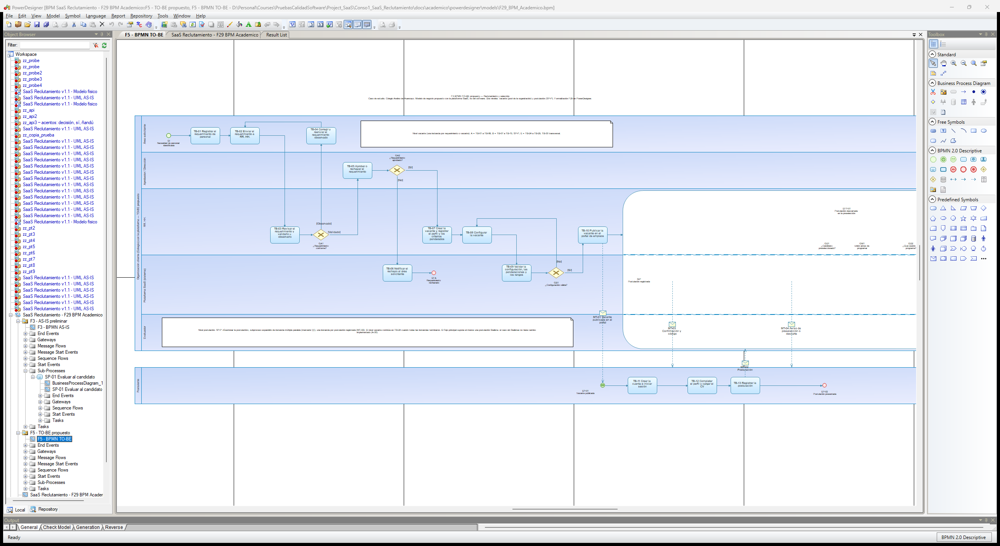
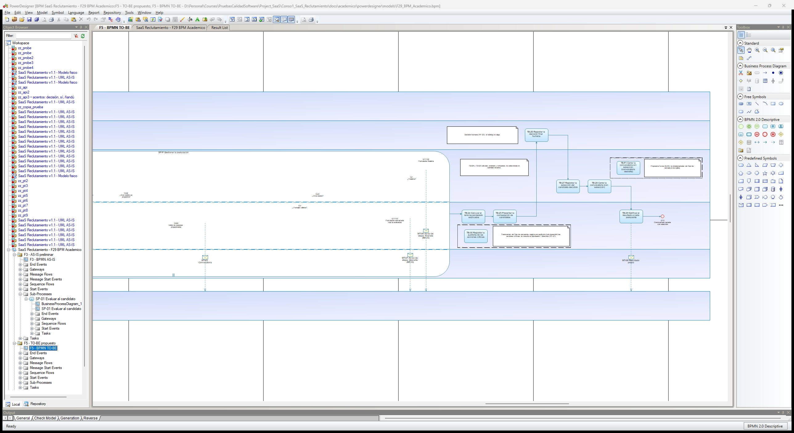
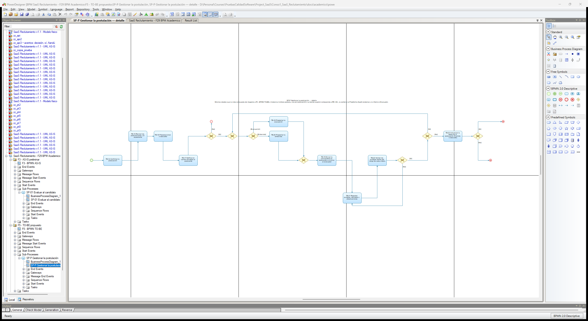
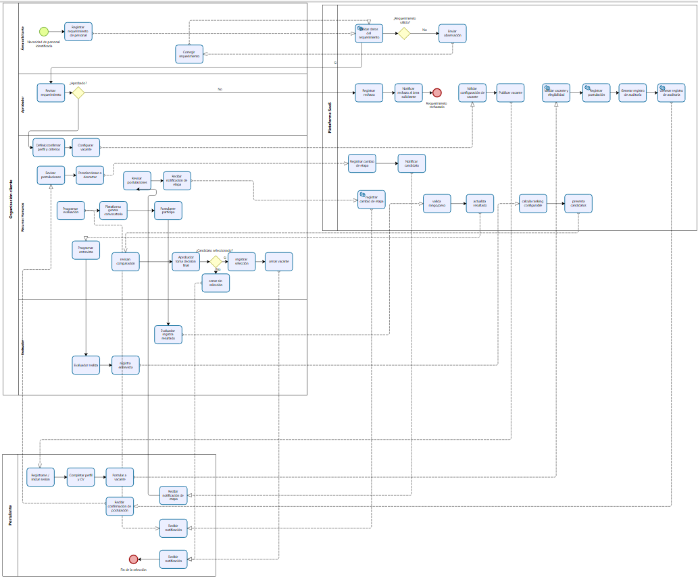

# Formato 05 — Modelo BPM mejorado (proceso TO-BE)

> Espejo en Markdown de `F5_Modelo_BPM_TOBE_Colegio_Andino.docx`, generado desde el mismo modelo (`docs/academico/tools/f27b/`). El entregable es el DOCX.

## 1. Datos generales del proyecto

| Campo | Valor |
|---|---|
| Nombre del proyecto | Análisis y Diseño de una Plataforma SaaS Multiempresa para la Gestión del Reclutamiento, Evaluación y Selección de Personal – Caso de estudio: Colegio Andino de Huancayo |
| Integrantes del equipo | Coronacion Meza Fredy; Peña Arroyo Anthony; Vila Meza Luis Antonio |
| Nombre de la empresa o institución | Colegio Andino de Huancayo (caso de estudio académico) |
| Nombre del proceso analizado | Reclutamiento, evaluación y selección de personal |
| Docente | Dr. Maglioni Arana Caparachin |
| Fecha de elaboración | 26/09/2026 |

> **Estado de la información de este formato**
>
> **HECHO VERIFICADO:** comprobado en el repositorio (código, pruebas ejecutadas, documentos versionados).
>
> **AS-IS PRELIMINAR:** reconstrucción del proceso actual hecha por el equipo; **sujeta a validación institucional** (RR. HH. / Administración del Colegio). No es un procedimiento validado por la institución.
>
> **TO-BE PROPUESTO:** proceso mejorado diseñado por el equipo; su adopción en la institución no está validada.
>
> **SOFTWARE IMPLEMENTADO:** comportamiento de la plataforma v1.1 (etiqueta v1.1.0-academic), verificado con pruebas.
>
> **EXPERIMENTAL / PROPUESTO:** RF-28 (candidato, no implementado), RF-29 (experimental, solo sobre el proceso) y RNF-C (propuesta). No forman parte de la línea base RF-01 a RF-27.
>
> El proceso de este formato es **TO-BE PROPUESTO**: está soportado por el **SOFTWARE IMPLEMENTADO** v1.1, salvo TB-F1 (propuesta futura no implementada). RF-29 (experimental) no forma parte del TO-BE base. Su modelo formal es el diagrama «F5 - BPMN TO-BE» de PowerDesigner (F29, con el hotfix F29B).
>
> La plataforma **nunca** selecciona, descarta ni contrata automáticamente: el ranking calcula, ordena y compara.
>
> La decisión final de selección es **humana**: la registra el Aprobador / Dirección con confirmación explícita y justificación (RF-23).
>
> Todos los datos de ejemplo son ficticios. No se usan datos personales reales.

## 2. Descripción general del proceso

*Describir de manera clara el proceso mejorado.*

**Objetivo del proceso.**

> Gestionar el reclutamiento, la evaluación y la selección de personal de forma centralizada, trazable y multiempresa: el sistema calcula, ordena y compara, y la decisión final la toma y justifica una persona autorizada (Aprobador / Dirección).

**Alcance (inicio y fin).**

> **Inicio:** un área identifica una necesidad de personal y registra el requerimiento (TB-01).
>
> **Fin:** la convocatoria se cierra con selección y cada postulante recibe su resultado (TB-28, TB-29 y EFE). Caminos alternativos: requerimiento rechazado (TB-06 y EFA). Para cada postulación, dentro de SP-P: descartada en la preselección (EFP-01), descartada tras la evaluación (EFP-03) o finalista (EFP-02).
>
> **Dos niveles:** el nivel vacante (A, B, E y TB-30) y el nivel postulación (SP-P, de instancia múltiple, con C y D). El flujo principal supone al menos un finalista; el caso sin finalistas no tiene camino implementado (A-30).

**Principales mejoras respecto al proceso actual (AS-IS).**

- S-01: Centralización de la información (P1).
- S-02: Control del avance y responsables identificados (P2).
- S-03: Evaluación uniforme y comparable (P3).
- S-04: Comunicación oportuna y con constancia (P4).
- S-05: Sustento y trazabilidad de la decisión (parcial) (P5).

**Reglas del TO-BE**

- El ranking **no** cambia estados ni elige a nadie (A-23 a A-27).
- La **decisión final** la registra solo el **Aprobador / Dirección** de la organización, con confirmación explícita y justificación. Puede recaer en un finalista que no sea el primero del ranking (A-27, RF-23).
- RR. HH. **aplica** la decisión (selección, RF-24) y cierra (RF-25). No decide.
- Tras la decisión no se permiten cambios manuales de etapa (A-28).
- La convocatoria solo se cierra **con selección**. El cierre sin selección es una propuesta futura (TB-F1, A-30).
- El resultado final se notifica solo al cerrar (A-31).
- La consulta del riesgo operacional (RF-29, **experimental**) **no** forma parte del TO-BE base: es informativa, sobre el proceso, y no interviene en el ranking ni en la decisión.

## 3. Objetivos de mejora

*Detallar los objetivos que se buscan con el rediseño del proceso.*

| ID | Objetivo de mejora | Problema (F4) |
|---|---|---|
| OM-01 | Centralizar la información de cada convocatoria en un único registro por organización. | P1 |
| OM-02 | Controlar el avance con estados, transiciones válidas e historial con autor y fecha. | P2 |
| OM-03 | Evaluar con criterios, ponderaciones y rangos comunes definidos antes de publicar. | P3 |
| OM-04 | Eliminar la dependencia de avisos manuales en los eventos clave del proceso. | P4 |
| OM-05 | Dar sustento y trazabilidad a la decisión final, que sigue siendo humana. | P5 |

Los objetivos **no se cuantifican** (por ejemplo, «reducir X % el tiempo»): no hay una línea base medida del AS-IS. Cuantificarlos exige medir el proceso real con la institución.

## 4. Relación Problema-Solución

| N° | Problema identificado (F4) | Solución propuesta | Mejora aplicada |
|---|---|---|---|
| P1 | Información distribuida | Registro único por convocatoria en la plataforma multiempresa: requerimiento, vacante con perfil y criterios, perfil del postulante con CV privado y expediente de postulación. | Centralización de la información |
| P2 | Seguimiento manual | Estados e historial sistematizados del requerimiento y de la postulación (quién, cuándo y de qué estado a cuál), con transiciones controladas. | Control del avance y responsables identificados |
| P3 | Evaluaciones heterogéneas | Criterios con ponderación y rango definidos antes de publicar; puntajes validados; ranking ponderado explicable y comparación común. | Evaluación uniforme y comparable |
| P4 | Comunicación manual | Notificaciones automáticas en cada evento clave: rechazo, recepción, cambio de etapa, convocatoria y resultado. No incluyen datos confidenciales. | Comunicación oportuna y con constancia |
| P5 | Indicadores limitados | Comparación explicable como apoyo a la decisión humana y auditoría de solo inserción consultable por Dirección. **Límite:** los indicadores de gestión del proceso (tiempos, embudo) no se implementan; RF-28 es un candidato no implementado. | Sustento y trazabilidad de la decisión (parcial) |

**Matriz problema → solución → actividad TO-BE → RF**

| Problema (F4) | Solución | Actividades TO-BE | RF asociados |
|---|---|---|---|
| P1 | S-01 | TB-01, TB-07, TB-08, TB-12, TB-13, TB-15 | RF-01, RF-05, RF-06, RF-09, RF-10, RF-12 |
| P2 | S-02 | TB-02, TB-03, TB-04, TB-05, TB-16, TB-23, TB-27, TB-28 | RF-02, RF-03, RF-13, RF-14, RF-24, RF-25 |
| P3 | S-03 | TB-07, TB-09, TB-18, TB-19, TB-20, TB-21, TB-22, TB-24, TB-25 | RF-05, RF-16, RF-17, RF-18, RF-19, RF-20, RF-21, RF-22 |
| P4 | S-04 | TB-06, TB-14, TB-17, TB-19, TB-29 | RF-04, RF-11, RF-15, RF-17, RF-26 |
| P5 | S-05 | TB-24, TB-25, TB-26, TB-30 | RF-21, RF-22, RF-23, RF-27 |

## 5. Diagrama BPM mejorado (TO-BE)

*Inserte el diagrama BPM del proceso mejorado.*

Diagrama formal modelado en **PowerDesigner 16.6** (Fase 29): diagrama «F5 - BPMN TO-BE» del modelo `F29_BPM_Academico.bpm`, paquete F5. Por su anchura, la figura 1 muestra la exportación completa en una página horizontal y las figuras 2 a 5 amplían cuatro franjas consecutivas, que se solapan para no cortar ningún elemento. Las ampliaciones son recortes sin retoque y no añaden contenido.

*Figura 1. BPMN TO-BE propuesto: exportación formal de PowerDesigner (F29), diagrama «F5 - BPMN TO-BE» (`F5_BPMN_TOBE.png`), completo.*

*Figura 2. Ampliación de la figura 1 (franja del 0 % al 28 % del ancho): nivel vacante: requerimiento, aprobación y configuración (EI a GB1, TB-01 a TB-09). Recorte sin retoque de la exportación formal.* (En el DOCX: ampliación de la franja del 0 % al 28 % del ancho de [`F5_BPMN_TOBE.png`](../powerdesigner/exports/F5_BPMN_TOBE.png).)

*Figura 3. Ampliación de la figura 1 (franja del 24 % al 52 % del ancho): publicación (TB-10), pool Postulante (EP-01, TB-11 a TB-13, EP-02) e inicio de SP-P (SIP, TB-14 a TB-17). Recorte sin retoque de la exportación formal.* (En el DOCX: ampliación de la franja del 24 % al 52 % del ancho de [`F5_BPMN_TOBE.png`](../powerdesigner/exports/F5_BPMN_TOBE.png).)

*Figura 4. Ampliación de la figura 1 (franja del 48 % al 76 % del ancho): SP-P, continuación: sesiones, evaluación y entrevista (TB-18 a TB-23). Recorte sin retoque de la exportación formal.* (En el DOCX: ampliación de la franja del 48 % al 76 % del ancho de [`F5_BPMN_TOBE.png`](../powerdesigner/exports/F5_BPMN_TOBE.png).)

*Figura 5. Ampliación de la figura 1 (franja del 72 % al 100 % del ancho): fin de SP-P y nivel vacante: ranking, decisión humana, selección y cierre (TB-24 a TB-29, EFE), TB-30 y TB-F1. Recorte sin retoque de la exportación formal.* (En el DOCX: ampliación de la franja del 72 % al 100 % del ancho de [`F5_BPMN_TOBE.png`](../powerdesigner/exports/F5_BPMN_TOBE.png).)

**Observaciones del modelo formal (Check Model de PowerDesigner)**

| Elemento | Hallazgo de PowerDesigner | Tratamiento |
|---|---|---|
| TB-30 Registrar la auditoría de las acciones críticas | Proceso sin flujos de entrada ni de salida | Esperado: es **transversal** (se ejecuta en cada acción crítica) y se representa desconectado a propósito |
| TB-F1 Cerrar la convocatoria sin selección | Proceso sin flujos de entrada ni de salida | Esperado: es una **propuesta futura** (A-30), no implementada y desconectada del flujo |
| MT-02 Postulación | Advertencia de mensaje incoherente (CheckFlowIncohMsg) | Advertencia **aceptada** de la herramienta: MT-02 llega al borde de SP-P con su formato de mensaje, y PowerDesigner no permite declarar un mensaje recibido en un subproceso compuesto |

Ninguno de estos hallazgos es una falla funcional del TO-BE: los tres se aceptaron en la auditoría de la F29. SP-P es un subproceso expandido de instancia múltiple paralela; PowerDesigner 16.6 no dibuja su contenido en la vista principal del editor (limitación F29B-OBS-01) y se consulta en el diagrama «SP-P Gestionar la postulación — detalle», con los mismos objetos.

El borrador de revisión de la F27B–F28 (`diagramas/draft/`, partes 1, 2a, 2b y 3) queda como antecedente: DRAFT / SUPERSEDED BY F29 FORMAL EXPORT.

**Estructura del modelo: niveles**

| Nivel | Instancias | Contenido |
|---|---|---|
| Nivel vacante (convocatoria) | Una instancia por requerimiento o vacante | Subprocesos A y B (TB-01 a TB-10), SP-P y subproceso E (TB-24 a TB-29). TB-30 es transversal |
| Nivel postulación (candidato) | SP-P: una instancia por postulación registrada (instancia múltiple paralela) | Subprocesos C y D. En el pool de la organización: TB-14 a TB-23. En el pool del Postulante: TB-11 a TB-13 |

**SP-P «Gestionar la postulación»** es un subproceso expandido de **instancia múltiple paralela** en el pool de la organización. Cada postulación registrada (mensaje MT-02) genera una instancia, que termina en EFP-01, EFP-02 o EFP-03. El nivel vacante continúa en TB-24 cuando todas las instancias terminaron. **El flujo principal supone al menos una postulación finalista.** El caso sin finalistas no tiene camino implementado (A-30) y no se modela como regla del sistema: la única referencia es la propuesta futura TB-F1, desconectada.

**Eventos (nombres oficiales)**

| ID | Tipo | Nombre oficial |
|---|---|---|
| EI | Inicio (nivel vacante) | Necesidad de personal identificada |
| EFA | Fin (nivel vacante) | Requerimiento rechazado |
| EFE | Fin (nivel vacante) | Convocatoria cerrada con selección |
| SIP | Inicio de SP-P | Postulación registrada |
| EFP-01 | Fin de SP-P | Postulación descartada en la preselección |
| EFP-02 | Fin de mensaje de SP-P (envía MT-06) | Postulación finalista |
| EFP-03 | Fin de mensaje de SP-P (envía MT-07) | Postulación descartada tras la evaluación |
| EP-01 | Inicio de mensaje (pool Postulante) | Vacante publicada |
| EP-02 | Fin (pool Postulante) | Postulación presentada |

**Compuertas (incluidas las uniones explícitas)**

| ID | Tipo | Lane | Nombre | Salidas |
|---|---|---|---|---|
| GA1 | Exclusiva | RR. HH. | ¿Requerimiento conforme? | Observado → TB-04 (→ TB-02) · Validado → TB-05 |
| GA2 | Exclusiva | Aprobador / Dirección | ¿Requerimiento aprobado? | No → TB-06 → EFA · Sí → TB-07 |
| GB1 | Exclusiva | Plataforma | ¿Configuración válida? | No → TB-08 · Sí → TB-10 |
| GD1 | Exclusiva (SP-P) | RR. HH. | ¿Candidato preseleccionado? | No → EFP-01 · Sí → GM1 |
| GM1 | Unión exclusiva (SP-P) | RR. HH. | Unión antes de programar | Entradas: GD1 [Sí] y GD3 [Sí] → GD2 |
| GD2 | Exclusiva (SP-P) | RR. HH. | ¿Qué sesión se programa? | Evaluación → TB-18 · Entrevista → TB-20 |
| GM2 | Unión exclusiva (SP-P) | Plataforma | Unión de sesiones programadas | Entradas: TB-18 y TB-20 → TB-19 |
| GV | Exclusiva (SP-P) | Plataforma | ¿Puntajes válidos? | No → TB-21 (el sistema rechaza y el evaluador corrige y reenvía; no se guarda nada) · Sí → GD3 |
| GD3 | Exclusiva (SP-P) | RR. HH. | ¿Otra sesión? | Sí → GM1 · No → TB-23 |
| GF | Exclusiva (SP-P) | RR. HH. | ¿Finalista? | Sí → EFP-02 · No → EFP-03 |

**Flujos de mensaje (lista cerrada, unidireccional)**

| ID | Origen | Destino | Elemento receptor | Contenido |
|---|---|---|---|---|
| MT-01 | TB-10 Publicar la vacante (organización) | Postulante | EP-01 Vacante publicada | Vacante publicada en el portal |
| MT-02 | TB-13 Registrar la postulación (Postulante) | Organización | Borde de SP-P (crea una instancia) | Postulación |
| MT-03 | TB-14 Confirmar la postulación (Plataforma, SP-P) | Postulante | Borde del pool Postulante | Confirmación y código |
| MT-04 | TB-17 Notificar el cambio de etapa (Plataforma, SP-P) | Postulante | Borde del pool Postulante | Aviso de preselección o de descarte |
| MT-05 | TB-19 Enviar la convocatoria (Plataforma, SP-P) | Postulante | Borde del pool Postulante | Convocatoria (el aviso al evaluador es interno al pool) |
| MT-06 | EFP-02 Postulación finalista (fin de mensaje) | Postulante | Borde del pool Postulante | Aviso de etapa: finalista (RF-15) |
| MT-07 | EFP-03 Postulación descartada tras la evaluación (fin de mensaje) | Postulante | Borde del pool Postulante | Aviso de etapa: descarte (RF-15) |
| MT-08 | TB-29 Notificar el resultado (Plataforma) | Postulante | Borde del pool Postulante | Resultado propio |

## 6. Descripción de actividades del proceso

| N° | Actividad | Descripción | Actor responsable | RF |
|---|---|---|---|---|
| TB-01 | Registrar el requerimiento de personal | Registra puesto, área, número de plazas, tipo de contrato, fecha requerida y justificación. | Área solicitante | RF-01 |
| TB-02 | Enviar el requerimiento a RR. HH. | Envía el requerimiento registrado. Queda en estado «enviado», con historial. | Área solicitante | RF-02 |
| TB-03 | Revisar el requerimiento y validarlo u observarlo | RR. HH. lo valida o lo observa con un comentario. | RR. HH. | RF-02 |
| TB-04 | Corregir y reenviar el requerimiento observado | El área corrige lo observado y lo reenvía a RR. HH. | Área solicitante | RF-02 |
| TB-05 | Aprobar o rechazar el requerimiento | Decide sobre el requerimiento validado. El rechazo exige un motivo. | Aprobador / Dirección | RF-03 |
| TB-06 | Notificar el rechazo al área solicitante | Aviso automático del rechazo con su motivo. | Sistema | RF-04 |
| TB-07 | Crear la vacante y registrar el perfil y los criterios ponderados | Crea la vacante desde un requerimiento aprobado, con perfil del puesto y criterios (etapa, ponderación y rango). | RR. HH. | RF-05 |
| TB-08 | Configurar la vacante | Define plazas (sin superar las aprobadas), fechas y demás datos de la convocatoria. | RR. HH. | RF-06 |
| TB-09 | Validar la configuración, las ponderaciones y los rangos | Validación automática previa a la publicación. Si no es válida, la vacante no se publica. | Sistema | RF-06, RF-20 |
| TB-10 | Publicar la vacante en el portal de empleos | La vacante válida queda visible en el portal público. | RR. HH. | RF-07 |
| TB-11 | Crear la cuenta e iniciar sesión | El postulante crea su cuenta global de postulante. | Postulante | RF-08 |
| TB-12 | Completar el perfil y cargar el CV | Perfil mínimo (sin DNI ni fecha de nacimiento) y CV en PDF privado. | Postulante | RF-09 |
| TB-13 | Registrar la postulación | Una sola postulación por vacante publicada y vigente, con perfil completo y CV. | Postulante | RF-10 |
| TB-14 | Confirmar la postulación | Código de seguimiento y aviso de recepción al postulante. | Sistema | RF-11 |
| TB-15 | Revisar las postulaciones y el expediente | Listado por vacante y expediente con datos, CV e historial. | RR. HH. | RF-12 |
| TB-16 | Preseleccionar o descartar | Preselecciona o descarta. El descarte lleva un motivo interno, que no se envía al postulante. | RR. HH. | RF-13 |
| TB-17 | Notificar el cambio de etapa al postulante | Aviso de preselección o descarte, sin observaciones internas. Los avisos de finalista o de descarte tras la evaluación los emiten EFP-02 y EFP-03 (mismo comportamiento, RF-15). | Sistema | RF-15 |
| TB-18 | Programar la evaluación | Evaluador de la organización, fecha futura, modalidad y lugar. | RR. HH. | RF-16 |
| TB-19 | Enviar la convocatoria al postulante y el aviso al evaluador | Convocatoria automática con fecha, modalidad, lugar e indicaciones. | Sistema | RF-17 |
| TB-20 | Programar la entrevista | Entrevista con evaluador asignado. Usa la misma convocatoria que la evaluación. | RR. HH. | RF-18 |
| TB-21 | Registrar puntajes, resultado y observaciones | El evaluador asignado registra una sola vez los puntajes de todos los criterios de la etapa. | Evaluador | RF-19 |
| TB-22 | Validar los puntajes dentro del rango de cada criterio | Rechaza puntajes fuera de rango o de criterios ajenos. | Sistema | RF-20 |
| TB-23 | Actualizar la etapa de la postulación (finalista o descarte) | Registra el cambio de etapa a «finalista» o «descartado» según la máquina de estados, con historial. La compuerta GF «¿Finalista?» decide cómo termina la instancia de SP-P. | RR. HH. | RF-14 |
| TB-24 | Calcular el ranking ponderado explicable | Ranking determinista con aportes por criterio, empates marcados y candidatos incompletos aparte. **No selecciona ni cambia estados.** | Sistema | RF-21 |
| TB-25 | Presentar la comparación de candidatos | Comparación con criterios, promedios, aportes, total y posición. La consultan RR. HH. y el Aprobador / Dirección. | Sistema | RF-22 |
| TB-26 | Registrar la decisión final humana | **Decisión humana** con confirmación explícita y justificación. Puede recaer en un finalista que no sea el primero del ranking. Es única e inmutable por vacante. | Aprobador / Dirección | RF-23 |
| TB-27 | Registrar la selección del candidato decidido | Aplica la decisión: la postulación elegida pasa a «seleccionado». | RR. HH. | RF-24 |
| TB-28 | Cerrar la convocatoria (con selección) | Solo después de la selección. Las demás postulaciones activas pasan a «no seleccionado». | RR. HH. | RF-25 |
| TB-29 | Notificar el resultado a cada postulante | Resultado propio de cada postulante, solo al cerrar, sin puntajes ni datos de otros candidatos. | Sistema | RF-26 |
| TB-30 | Registrar la auditoría de las acciones críticas | Registro de solo inserción de cada acción crítica. Lo consulta el Aprobador / Dirección. | Sistema | RF-27 |
| TB-F1 | Cerrar la convocatoria sin selección (convocatoria desierta) | **Propuesta futura, NO implementada y desconectada del flujo.** Figura en el TO-BE original del equipo (anexo A del F9 v1.0). El prototipo solo cierra con selección (A-30, RF-25) y no tiene ninguna condición que dispare este camino. Para implementarla hace falta un cambio de alcance con un RF nuevo o una redefinición aprobada de RF-25, y sus pruebas. | RR. HH. | — |

**Correcciones conceptuales respecto del TO-BE original del equipo**

| ID | Tema | Corrección |
|---|---|---|
| C-01 | Decisión final | Se mantiene **humana** y a cargo del **Aprobador / Dirección** (RF-23). RR. HH. solo registra la selección y cierra. Coincide con el TO-BE original del equipo («Aprobador toma decisión final»). |
| C-02 | Cierre sin selección | El TO-BE original tenía la rama «cerrar sin selección». Se conserva como **propuesta futura no implementada** (TB-F1), fuera del flujo principal. |
| C-03 | Ranking | Se presenta como apoyo que calcula, ordena y compara. No selecciona (A-23 a A-27). |
| C-04 | Riesgo operacional (RF-29) | Queda fuera del TO-BE base: es experimental y no evalúa personas. |
| C-05 | Indicadores de gestión (P5) | No se presentan como resueltos: RF-28 es un candidato no implementado. |

## 7. Conclusiones del rediseño

> **Qué cambia respecto del AS-IS:** el TO-BE sustituye un proceso con información dispersa, seguimiento manual, evaluaciones heterogéneas y avisos manuales por un flujo con registro único, estados e historial, criterios ponderados definidos de antemano, notificaciones automáticas y auditoría.
>
> **Qué se mantiene:** la decisión sigue siendo **humana y de la Dirección**; el sistema solo aporta un ranking y una comparación explicables como apoyo.
>
> **Qué queda fuera:** el cierre sin selección es una propuesta futura, y los indicadores de gestión (P5) no se resuelven (RF-28 es un candidato).
>
> **Qué no está demostrado:** el impacto en tiempos o costos no está medido, y la adopción en el Colegio no está validada.

## 8. Evidencias

*Adjuntar capturas del diagrama BPM mejorado.*

Capturas reales de PowerDesigner, tomadas con el modelo reabierto desde el disco. La vista principal se capturó en dos partes por su anchura.

*Figura 6. Captura de PowerDesigner: diagrama «F5 - BPMN TO-BE», parte 1 (nivel vacante hasta el inicio de SP-P).*

*Figura 7. Captura de PowerDesigner: diagrama «F5 - BPMN TO-BE», parte 2 (SP-P hasta el cierre, TB-30 y TB-F1).*

*Figura 8. Captura de PowerDesigner: diagrama «SP-P Gestionar la postulación — detalle» (contenido de SP-P; F29B-OBS-01).*

*Figura 9. Antecedente: TO-BE original del equipo (anexo A del F9 v1.0, copia sin modificar). Incluye la rama «cerrar sin selección», no implementada.*

- TO-BE escrito e implementado: `docs/final-report/03-procesos-negocio.md` §3.3–3.5 y `docs/final-report/diagram-reports/02-bpmn-to-be-report.md`.
- Reglas: `docs/assumptions.md` (A-05, A-13, A-16, A-23 a A-31). Verificación del flujo completo: E2E-13 y la QA de la Fase 25 (`docs/v1.1/phase-25-final-qa.md`).
- Comportamiento implementado de referencia (no es el TO-BE institucional): AC-01 (`docs/v1.1/powerdesigner/exports/AC-01-proceso-reclutamiento.png`).
- Modelo formal: `docs/academico/powerdesigner/models/F29_BPM_Academico.bpm` (paquete F5); exportaciones `F5_BPMN_TOBE.png` y `F5_BPMN_TOBE.svg`; validación en `F29_VALIDATION.md` y `F29B_HOTFIX.md`.
- Borradores: `docs/academico/practica-05/diagramas/draft/` (DRAFT / SUPERSEDED BY F29 FORMAL EXPORT).
