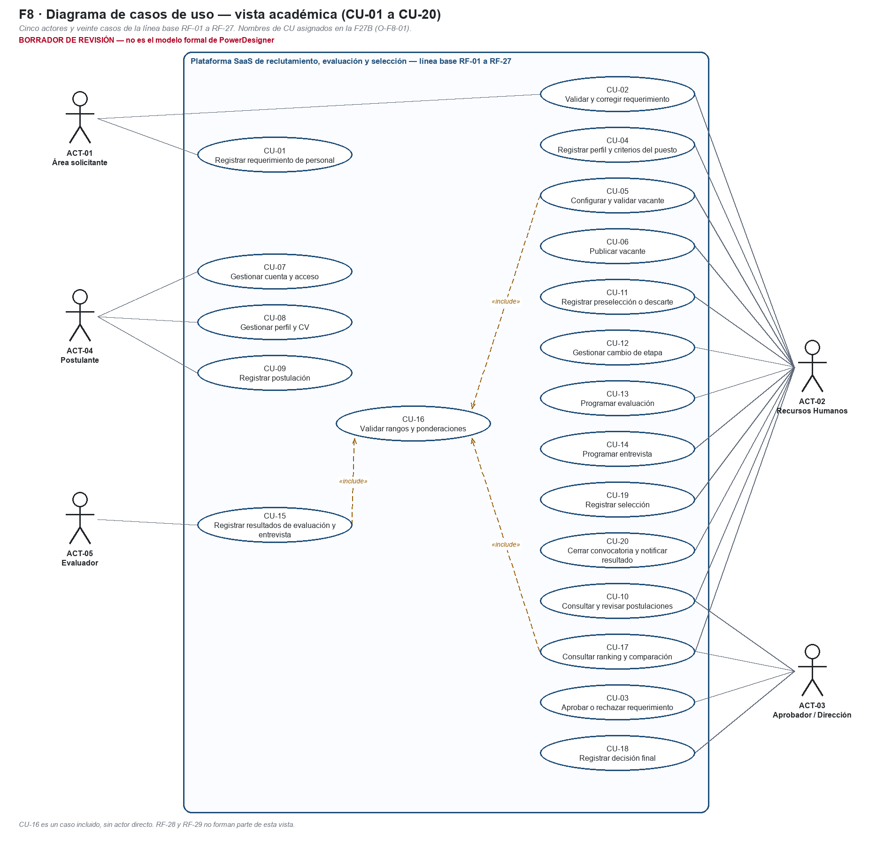
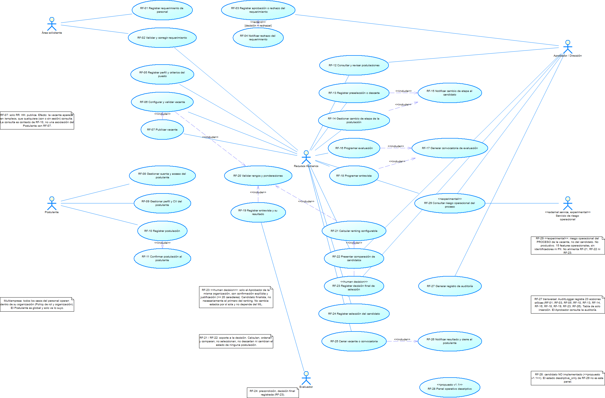
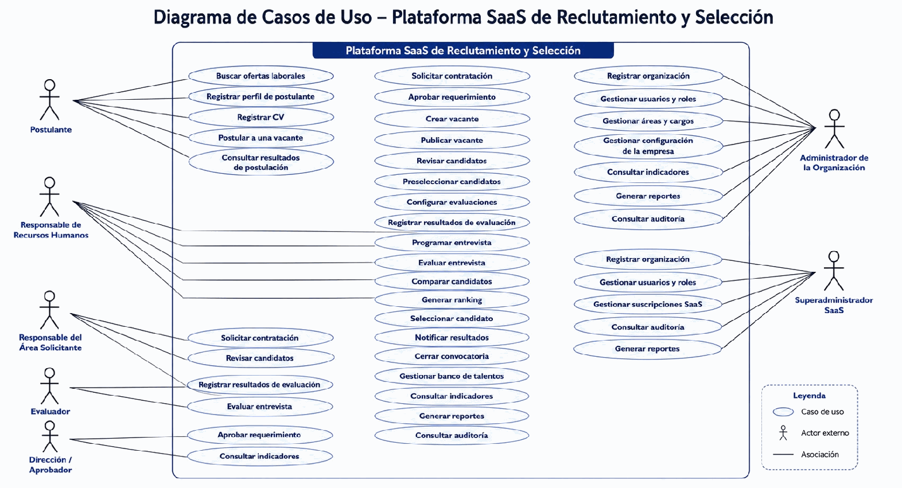

# Formato 08 — Diagrama de casos de uso

> Espejo en Markdown de `F8_Diagrama_Casos_de_Uso_Colegio_Andino.docx`, generado desde el mismo modelo (`docs/academico/tools/f27b/`). El entregable es el DOCX.

## 1. Datos generales del proyecto

| Campo | Valor |
|---|---|
| Nombre del proyecto | Análisis y Diseño de una Plataforma SaaS Multiempresa para la Gestión del Reclutamiento, Evaluación y Selección de Personal – Caso de estudio: Colegio Andino de Huancayo |
| Integrantes del equipo | Coronacion Meza Fredy; Peña Arroyo Anthony; Vila Meza Luis Antonio |
| Módulo / Sistema | Plataforma SaaS multiempresa de reclutamiento, evaluación y selección (línea base RF-01 a RF-27) |
| Docente | Dr. Maglioni Arana Caparachin |
| Fecha | 26/09/2026 |

> **Estado de la información de este formato**
>
> **HECHO VERIFICADO:** comprobado en el repositorio (código, pruebas ejecutadas, documentos versionados).
>
> **AS-IS PRELIMINAR:** reconstrucción del proceso actual hecha por el equipo; **sujeta a validación institucional** (RR. HH. / Administración del Colegio). No es un procedimiento validado por la institución.
>
> **TO-BE PROPUESTO:** proceso mejorado diseñado por el equipo; su adopción en la institución no está validada.
>
> **SOFTWARE IMPLEMENTADO:** comportamiento de la plataforma v1.1 (etiqueta v1.1.0-academic), verificado con pruebas.
>
> **EXPERIMENTAL / PROPUESTO:** RF-28 (candidato, no implementado), RF-29 (experimental, solo sobre el proceso) y RNF-C (propuesta). No forman parte de la línea base RF-01 a RF-27.
>
> Los casos de uso representan el **SOFTWARE IMPLEMENTADO** de la línea base RF-01 a RF-27. El diagrama académico es un **borrador**. La vista técnica formal es UC-01 de PowerDesigner (F23), que no se modifica.
>
> La plataforma **nunca** selecciona, descarta ni contrata automáticamente: el ranking calcula, ordena y compara.
>
> La decisión final de selección es **humana**: la registra el Aprobador / Dirección con confirmación explícita y justificación (RF-23).
>
> Todos los datos de ejemplo son ficticios. No se usan datos personales reales.

## 2. Descripción general del sistema

*Describir brevemente el sistema a desarrollar.*

**Objetivo del sistema.**

> Gestionar de forma centralizada, trazable y multiempresa el ciclo de reclutamiento, evaluación y selección de personal: desde el requerimiento hasta el cierre de la convocatoria. Los datos de cada organización quedan aislados y la decisión final de selección se reserva a una persona autorizada (Aprobador / Dirección).

**Funcionalidades principales.**

- Requerimientos de personal (CU-01 a CU-03).
- Vacantes (CU-04 a CU-06).
- Cuenta y postulación (CU-07 a CU-09).
- Seguimiento de postulaciones (CU-10 a CU-12).
- Evaluación y entrevista (CU-13 a CU-15).
- Comparación y ranking (CU-16 y CU-17).
- Decisión humana, selección y cierre (CU-18 a CU-20), con auditoría.

**Relación con los requerimientos funcionales.**

> Los 20 CU cubren los 27 RF del Formato 06 sin RF adicionales. Cada CU indica sus RF, y cada RF tiene al menos un CU (sección 8). RF-28 y RF-29 son extensiones fuera de esta vista.

## 3. Identificación de actores

| ID | Actor | Descripción |
|---|---|---|
| ACT-01 | Área solicitante | Interno. Registra, envía y corrige requerimientos; recibe la notificación de rechazo. |
| ACT-02 | Recursos Humanos | Interno. Valida requerimientos y gestiona vacantes, postulaciones, sesiones, selección y cierre. No toma la decisión final. |
| ACT-03 | Aprobador / Dirección | Interno. Aprueba o rechaza requerimientos, consulta la comparación, **registra la decisión final humana** y consulta la auditoría. |
| ACT-04 | Postulante | Externo. Gestiona su cuenta, su perfil, su CV y sus postulaciones; recibe convocatorias, avisos y resultados propios. |
| ACT-05 | Evaluador | Interno. Registra puntajes, resultado y observaciones de las sesiones que tiene asignadas. |

El Sistema no es un actor: valida, calcula, notifica y audita como parte de los casos (inclusiones). No existen actores de superadministración ni de facturación (OUT-01 a OUT-03). El servicio de riesgo operacional (RF-29) es un actor secundario experimental que solo aparece en la vista técnica UC-RF.

## 4. Identificación de casos de uso

| ID | Caso de uso | Descripción |
|---|---|---|
| CU-01 | Registrar requerimiento de personal | El área registra la necesidad de personal. |
| CU-02 | Validar y corregir requerimiento | RR. HH. valida u observa; el área corrige y reenvía. |
| CU-03 | Aprobar o rechazar requerimiento | La Dirección decide sobre el requerimiento validado; el rechazo se notifica. |
| CU-04 | Registrar perfil y criterios del puesto | RR. HH. crea la vacante con perfil y criterios ponderados. |
| CU-05 | Configurar y validar vacante | RR. HH. configura la convocatoria; el sistema valida. |
| CU-06 | Publicar vacante | RR. HH. publica la vacante válida en el portal. |
| CU-07 | Gestionar cuenta y acceso | El postulante crea su cuenta e inicia sesión. |
| CU-08 | Gestionar perfil y CV | El postulante completa su perfil y carga su CV. |
| CU-09 | Registrar postulación | El postulante postula y recibe la confirmación. |
| CU-10 | Consultar y revisar postulaciones | Revisa el listado por vacante y el expediente. |
| CU-11 | Registrar preselección o descarte | RR. HH. preselecciona o descarta con motivo interno. |
| CU-12 | Gestionar cambio de etapa | RR. HH. cambia la etapa; el postulante recibe el aviso. |
| CU-13 | Programar evaluación | RR. HH. programa la evaluación; se envía la convocatoria. |
| CU-14 | Programar entrevista | RR. HH. programa la entrevista; se envía la convocatoria. |
| CU-15 | Registrar resultados de evaluación y entrevista | El evaluador asignado registra puntajes y resultado. |
| CU-16 | Validar rangos y ponderaciones | Validación incluida por la configuración, el registro de resultados y el ranking. |
| CU-17 | Consultar ranking y comparación | Ranking y comparación explicables. No selecciona. |
| CU-18 | Registrar decisión final | **Decisión humana** con confirmación y justificación. Según el F9, incluye el registro de auditoría. |
| CU-19 | Registrar selección | RR. HH. aplica la decisión registrada. |
| CU-20 | Cerrar convocatoria y notificar resultado | RR. HH. cierra con selección; cada postulante recibe su resultado. |

## 5. Relación actores-casos de uso

| Actor | Caso de uso |
|---|---|
| ACT-01 Área solicitante | CU-01, CU-02 |
| ACT-02 Recursos Humanos | CU-02, CU-04, CU-05, CU-06, CU-10, CU-11, CU-12, CU-13, CU-14, CU-17, CU-19, CU-20 |
| ACT-03 Aprobador / Dirección | CU-03, CU-10, CU-17, CU-18 |
| ACT-04 Postulante | CU-07, CU-08, CU-09 |
| ACT-05 Evaluador | CU-15 |
| — (caso incluido) | CU-16, incluido por CU-05, CU-15 y CU-17 |

## 6. Diagrama de casos de uso

*Insertar aquí el diagrama elaborado con herramienta UML.*

*Figura 1. Diagrama de casos de uso, vista académica (CU-01 a CU-20). Borrador de revisión.*

*Figura 2. Referencia técnica: UC-01 de PowerDesigner (F23), un caso por RF. Exportación versionada, sin cambios.*

La adaptación formal de la vista académica en PowerDesigner está en `POWERDESIGNER_PENDING.md`. No se modificó el OOM de la F23.

## 7. Relación con los requerimientos y correspondencia de vistas

| CU académico (F9) | CU agrupado (v1.0) | UC-RF (F22/F23) | Actor | RF | Alcance (F9) |
|---|---|---|---|---|---|
| CU-01 Registrar requerimiento de personal | CU-01 | UC-RF01 | ACT-01 | RF-01 | IN-01 |
| CU-02 Validar y corregir requerimiento | CU-01 (corregir) · CU-02 (validar) | UC-RF02 | ACT-01, ACT-02 | RF-02 | IN-01 |
| CU-03 Aprobar o rechazar requerimiento | CU-03 | UC-RF03, UC-RF04 «extend» | ACT-03 | RF-03, RF-04 | IN-01 |
| CU-04 Registrar perfil y criterios del puesto | CU-04 | UC-RF05 | ACT-02 | RF-05 | IN-02 |
| CU-05 Configurar y validar vacante | CU-04 | UC-RF06 | ACT-02 | RF-06 | IN-02 |
| CU-06 Publicar vacante | CU-04 | UC-RF07 | ACT-02 | RF-07 | IN-02 |
| CU-07 Gestionar cuenta y acceso | CU-05 | UC-RF08 | ACT-04 | RF-08 | IN-03 |
| CU-08 Gestionar perfil y CV | CU-05 | UC-RF09 | ACT-04 | RF-09 | IN-03 |
| CU-09 Registrar postulación | CU-06 | UC-RF10, UC-RF11 «include» | ACT-04 | RF-10, RF-11 | IN-03 |
| CU-10 Consultar y revisar postulaciones | CU-07 | UC-RF12 | ACT-02, ACT-03 | RF-12 | IN-04 |
| CU-11 Registrar preselección o descarte | CU-07 | UC-RF13, UC-RF15 «include» | ACT-02 | RF-13 | IN-04 |
| CU-12 Gestionar cambio de etapa | CU-07 | UC-RF14, UC-RF15 «include» | ACT-02 | RF-14, RF-15 | IN-04 |
| CU-13 Programar evaluación | CU-08 | UC-RF16, UC-RF17 «include» | ACT-02 | RF-16, RF-17 | IN-05 |
| CU-14 Programar entrevista | CU-08 | UC-RF18, UC-RF17 «include» | ACT-02 | RF-18 | IN-05 |
| CU-15 Registrar resultados de evaluación y entrevista | CU-09 | UC-RF19 | ACT-05 | RF-19 | IN-05 |
| CU-16 Validar rangos y ponderaciones | CU-04 · CU-09 | UC-RF20 | — (incluido) | RF-20 | IN-06 |
| CU-17 Consultar ranking y comparación | CU-10 | UC-RF21, UC-RF22 | ACT-02, ACT-03 | RF-21, RF-22 | IN-06 |
| CU-18 Registrar decisión final | CU-11 · CU-13 (consulta de auditoría) | UC-RF23 «human decision», UC-RF27 | ACT-03 | RF-23, RF-27 | IN-07 · IN-08 |
| CU-19 Registrar selección | CU-12 | UC-RF24 | ACT-02 | RF-24 | IN-07 |
| CU-20 Cerrar convocatoria y notificar resultado | CU-12 | UC-RF25, UC-RF26 «include» | ACT-02 | RF-25, RF-26 | IN-07 |

**Los 13 CU agrupados de v1.0 (se conservan)**

| CU (v1.0) | Caso de uso | Actor | RF |
|---|---|---|---|
| CU-01 | Gestionar requerimiento de personal | Área solicitante | RF-01, RF-02 |
| CU-02 | Validar requerimiento | RR. HH. | RF-02 |
| CU-03 | Aprobar o rechazar requerimiento | Aprobador / Dirección | RF-03, RF-04 |
| CU-04 | Configurar y publicar vacante | RR. HH. | RF-05, RF-06, RF-07, RF-20 |
| CU-05 | Registrarse y gestionar perfil/CV | Postulante | RF-08, RF-09 |
| CU-06 | Postular a una vacante | Postulante | RF-10, RF-11 |
| CU-07 | Revisar postulaciones y gestionar etapas | RR. HH. | RF-12, RF-13, RF-14, RF-15 |
| CU-08 | Programar evaluación o entrevista | RR. HH. | RF-16, RF-17, RF-18 |
| CU-09 | Registrar resultados de evaluación/entrevista | Evaluador | RF-19, RF-20 |
| CU-10 | Consultar ranking y comparación | RR. HH., Aprobador / Dirección | RF-21, RF-22 |
| CU-11 | Registrar decisión final | Aprobador / Dirección | RF-23 |
| CU-12 | Registrar selección y cerrar convocatoria | RR. HH. | RF-24, RF-25, RF-26 |
| CU-13 | Consultar auditoría | Aprobador / Dirección | RF-27 |

Las tres vistas se conservan: 20 CU académicos (F9), 13 CU agrupados (informe v1.0) y 29 UC-RF técnicos (F22/F23, uno por RF, con UC-RF28 candidato y UC-RF29 experimental). No se renumera ninguna.

## 8. Observaciones

| ID | Tema | Observación |
|---|---|---|
| O-F8-01 | Nombres de CU-01 a CU-20 | El F9 no registra los nombres, solo la numeración y los RF. La F27B asigna el nombre del RF principal que agrupa cada CU, sin renumerar. El equipo debe confirmarlos. |
| O-F8-02 | Consulta de auditoría | En la vista de 20 CU, RF-27 figura «incluido en CU-18» (F9). La consulta de auditoría del Aprobador existe (CU-13 agrupado, UC-RF27), pero no tiene un CU académico propio. **Propuesta, pendiente de decisión del equipo:** CU-21 «Consultar auditoría». No se crea en esta fase. |
| O-F8-03 | CU-16 sin actor directo | Es un caso incluido («include») por CU-05, CU-15 y CU-17. Sus actores indirectos son RR. HH. (al configurar) y el Evaluador (al registrar). En UML es válido; no es un caso huérfano. |
| O-F8-04 | CU-10 y el Aprobador | El F9 asigna CU-10 solo a RR. HH. La implementación también permite la consulta del Aprobador / Dirección (UC-RF12), así que se asocian ambos. El F9 publicado no se modifica. |
| O-F8-05 | Convocatoria de la entrevista | La entrevista también envía la convocatoria de RF-17 (UC-RF18 incluye UC-RF17), aunque el nombre del RF dice «evaluación». |
| O-F8-06 | Antecedente superado | El diagrama de CU del F9 v1.0 (anexo B) mostraba al Administrador de la Organización, al Superadministrador SaaS, suscripciones y banco de talentos, que están fuera del alcance. La F24 lo sustituyó por UC-01 (D-04). Se conserva solo como antecedente. |
| O-F8-07 | Extensiones | RF-28 (candidato) y RF-29 (experimental) no forman parte de los 20 CU. Solo aparecen en la vista técnica UC-RF (UC-RF28 «propuesto v1.1», UC-RF29 «experimental»). |

*Figura 3. Antecedente superado: diagrama de CU del F9 v1.0 (anexo B, copia sin modificar). Incluye actores fuera del alcance (O-F8-06).*
