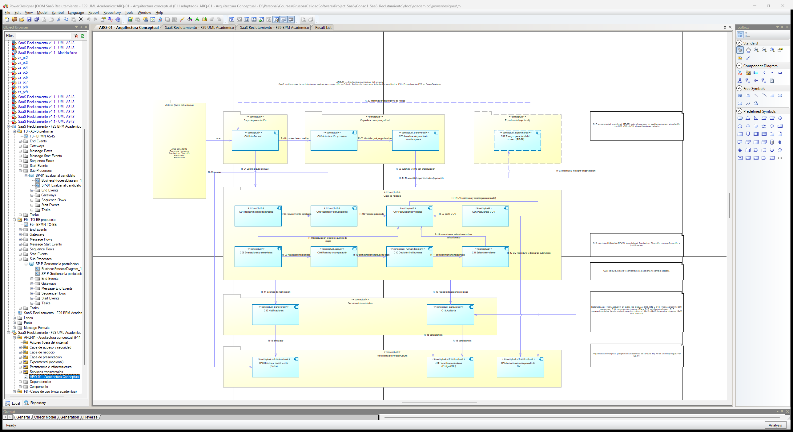

# Formato 11 — Arquitectura del sistema (adaptación académica)

> Espejo en Markdown de `F11_Arquitectura_del_Sistema_ADAPTADO_Colegio_Andino.docx`. **Documento adaptado académicamente a partir de la Guía de Práctica N.° 11. La institución no proporcionó un Formato 11 oficial.**

> **Formato 11 – Arquitectura del sistema. Adaptación académica**
>
> Documento adaptado académicamente a partir de la Guía de Práctica N.° 11. La institución no proporcionó un Formato 11 oficial. Formato oficial no publicado / no disponible.
>
> Estructura derivada de las actividades y entregables de la Guía 11: lista de componentes, relación entre componentes, diagrama de arquitectura conceptual y arquitectura validada.
>
> Estados usados: **SOFTWARE IMPLEMENTADO** (componentes IMPLEMENTADOS), TRANSVERSAL, **EXPERIMENTAL** (RF-29), NO IMPLEMENTADO (RF-28). La decisión final de selección es **humana** (RF-23).

## 1. Datos generales

| Campo | Detalle |
|---|---|
| Proyecto | Análisis y Diseño de una Plataforma SaaS Multiempresa para la Gestión del Reclutamiento, Evaluación y Selección de Personal – Caso de estudio: Colegio Andino de Huancayo |
| Curso | Pruebas y Calidad de Software |
| NRC | 28607 |
| Docente | Dr. Maglioni Arana Caparachin |
| Equipo | Coronacion Meza Fredy; Peña Arroyo Anthony; Vila Meza Luis Antonio |
| Formato | Formato 11 – Arquitectura del sistema (adaptación académica; sin plantilla oficial) |
| Fuente normativa | Guía de Práctica N.° 11 (docs/academico/00-fuentes-oficiales/guias/GUIA_PRACTICA_11.docx) |
| Fecha | 28/09/2026 |
| Estado | Versión 1.1: integra la vista formal ARQ-01 de PowerDesigner (F29, con el hotfix F29B). La versión 1.0 se auditó en la Fase 28. Sin aprobación institucional |

**Correspondencia con la Guía 11**

| ID | Exigencia de la guía | Apartado de la guía | Sección de este documento |
|---|---|---|---|
| G-01 | Revisar el alcance del proyecto | Actividad 1 y 2.1 | 2 |
| G-02 | Analizar los casos de uso | 2.2 | 3 |
| G-03 | Identificar los componentes del sistema | Actividad 2 y 2.3 | 4 y 5 |
| G-04 | Definir la relación entre componentes | Actividad 3 y 2.4 | 6 y 7 |
| G-05 | Representar la arquitectura conceptual (diagrama de bloques) | Actividad 4 y 2.5 | 8 |
| G-06 | Validar la arquitectura conceptual | Actividad 5 | 10 |

## 2. Contexto y alcance arquitectónico

Síntesis del Formato 09 v1.1 útil para la arquitectura; el F9 publicado no se modifica.

| Campo | Detalle |
|---|---|
| Problema | Proceso de reclutamiento con información distribuida, seguimiento manual, evaluaciones heterogéneas, comunicación manual e indicadores limitados (P1–P5, AS-IS preliminar, F4). |
| Objetivo | Gestionar de forma centralizada, trazable y multiempresa el ciclo de reclutamiento, evaluación y selección, con datos aislados por organización y la decisión final reservada a una persona autorizada. |
| Usuarios | Área solicitante, Recursos Humanos, Aprobador / Dirección y Evaluador (personal de la organización) y Postulante (cuenta global). No hay superadministrador ni actores comerciales. |
| Entorno | Aplicación web usada desde el navegador. Infraestructura de desarrollo, demostración y pruebas con Docker Compose; no es una plataforma productiva (F9, OUT-09). |
| Alcance incluido | IN-01 Requerimientos · IN-02 Vacantes · IN-03 Cuenta y postulación · IN-04 Seguimiento · IN-05 Evaluación y entrevista · IN-06 Comparación y ranking · IN-07 Decisión y cierre · IN-08 Auditoría. |
| Alcance excluido | Facturación, planes y superadministración SaaS (OUT-01 a OUT-03); selección automática por IA o ML (OUT-04); inferencia de idoneidad (OUT-05); banco de talentos (OUT-06); dashboards (OUT-07, RF-28 candidato); proveedores externos definitivos (OUT-08); infraestructura productiva (OUT-09); integraciones externas (OUT-10); uso productivo o decisorio de RF-29 (OUT-11). |
| Límites | Toda lectura y escritura empresarial respeta la organización. El postulante es global y solo ve lo suyo. Los componentes internos (controladores, servicios, colas, base de datos) no son actores. |
| Restricciones relevantes | Monolito modular; multitenencia lógica sin RLS; el ranking no cambia estados ni selecciona; la decisión final exige autorización, confirmación y justificación; CV privados; datos ficticios; RF-29 opcional, experimental y solo con 15 variables operacionales (F9 §10). |

## 3. Casos de uso que condicionan la arquitectura

Agrupados por responsabilidad arquitectónica a partir del catálogo aprobado del Formato 08 (CU-01 a CU-20). CU-18 es «Registrar decisión final humana». CU-21 «Consultar auditoría» está **DIFERIDO** y no forma parte del catálogo.

| Responsabilidad | Casos de uso | Qué condiciona en la arquitectura | Componentes |
|---|---|---|---|
| Acceso | CU-07 | Cuenta global del postulante; el personal accede con su cuenta y rol | C02, C03 |
| Requerimientos | CU-01, CU-02, CU-03 | Flujo de estados con validación y aprobación | C04 |
| Vacantes | CU-04, CU-05, CU-06 | Configuración validada antes de publicar | C05 |
| Postulantes | CU-08 | Perfil mínimo y CV privado | C06, C15 |
| Postulaciones | CU-09, CU-10, CU-11, CU-12 | Expediente y máquina de estados de la postulación | C07 |
| Evaluaciones y entrevistas | CU-13, CU-14, CU-15 | Programación, convocatoria y registro único por criterio | C08 |
| Ranking | CU-16, CU-17 | Validación de rangos y ponderaciones; cálculo explicable que **no selecciona** | C09 |
| Decisión | CU-18 «Registrar decisión final humana» | Solo el Aprobador / Dirección; confirmación y justificación | C10 |
| Selección y cierre | CU-19, CU-20 | Aplican la decisión humana; cierre solo con selección | C11 |
| Notificaciones | Incluidas en CU-03, CU-09, CU-11, CU-12, CU-13, CU-14 y CU-20 | Avisos automáticos tras cada evento | C12 |
| Auditoría | RF-27 transversal (CU-21 «Consultar auditoría»: DIFERIDO, fuera del catálogo) | Registro de solo inserción y consulta del Aprobador | C13 |

## 4. Componentes principales

| ID | Componente | Capa conceptual | Estado |
|---|---|---|---|
| C01 | Interfaz web | Presentación | IMPLEMENTADO |
| C02 | Autenticación y cuentas | Acceso y seguridad | IMPLEMENTADO |
| C03 | Autorización y contexto multiempresa | Acceso y seguridad | TRANSVERSAL |
| C04 | Requerimientos de personal | Negocio | IMPLEMENTADO |
| C05 | Vacantes y convocatorias | Negocio | IMPLEMENTADO |
| C06 | Postulantes y CV | Negocio | IMPLEMENTADO |
| C07 | Postulaciones y etapas | Negocio | IMPLEMENTADO |
| C08 | Evaluaciones y entrevistas | Negocio | IMPLEMENTADO |
| C09 | Ranking y comparación | Negocio | IMPLEMENTADO |
| C10 | Decisión final humana | Negocio | IMPLEMENTADO |
| C11 | Selección y cierre | Negocio | IMPLEMENTADO |
| C12 | Notificaciones | Servicios transversales | TRANSVERSAL |
| C13 | Auditoría | Servicios transversales | TRANSVERSAL |
| C14 | Persistencia de datos (PostgreSQL) | Persistencia e infraestructura | IMPLEMENTADO |
| C15 | Almacenamiento privado de CV | Persistencia e infraestructura | IMPLEMENTADO |
| C16 | Sesiones, caché y cola (Redis) | Persistencia e infraestructura | IMPLEMENTADO |
| C17 | Riesgo operacional del proceso (RF-29) | Experimental (opcional) | EXPERIMENTAL |

Son **17 componentes conceptuales**: agrupan responsabilidades, no son clases ni carpetas. Evaluaciones y entrevistas forman un solo componente porque comparten programación y registro (un único módulo en el código). La decisión (C10) se separa de la selección y el cierre (C11) para dejar visible la frontera de RF-23.

**Elementos no incluidos como componentes**

| ID | Elemento | Estado | Motivo |
|---|---|---|---|
| X-01 | Panel operativo / reportes | NO IMPLEMENTADO (RF-28, candidato) | RF-28 es un panel descriptivo candidato; no tiene rutas, pantallas ni pruebas. No es un componente de la arquitectura. La página «panel» existente es solo la portada por rol de C01. |
| X-02 | Gestión de organizaciones / superadministración | FUERA DE ALCANCE (OUT-03) | No hay actores ni CU de gestión comercial global. Las organizaciones solo definen el contexto de aislamiento (C03). |
| X-03 | Facturación, planes y suscripciones | FUERA DE ALCANCE (OUT-01, OUT-02) | Sin requerimiento aprobado. |
| X-04 | Selección automática, banco de talentos, integraciones externas, infraestructura en nube | FUERA DE ALCANCE (OUT-04 a OUT-10) | Contradicen RF-23 o no están en la línea base. |

## 5. Responsabilidades

| ID | Componente | Responsabilidad | RF | CU | Actores | Fuente |
|---|---|---|---|---|---|---|
| C01 | Interfaz web | Páginas por rol, portal público de empleos y notificaciones propias; presenta datos y envía acciones. No decide. | RF-01..RF-27 (interacción) | Todos (interfaz) | Todos | CO-01 «Páginas Inertia», «Componentes compartidos»; resources/js/pages |
| C02 | Autenticación y cuentas | Registro del postulante, inicio de sesión, 2FA y restablecimiento; identifica al usuario y su rol. | RF-08 | CU-07 | Postulante; personal | CO-01 «Cuenta y acceso» (Fortify) |
| C03 | Autorización y contexto multiempresa | Autoriza cada operación por rol **y** organización y filtra los datos por `organization_id`. No hay gestión de organizaciones: la organización es un contexto de aislamiento. | RNF (seguridad y multitenencia); aplica a RF-01..RF-27 | Todos (transversal) | Todo el personal | CO-01 «Autorización y multiempresa» (7 Policies, OrganizationScope); cap. 7 §7.3 |
| C04 | Requerimientos de personal | Registro, envío, validación u observación, corrección y aprobación o rechazo del requerimiento, con historial. | RF-01, RF-02, RF-03, RF-04 | CU-01, CU-02, CU-03 | Área solicitante, RR. HH., Aprobador / Dirección | PK-01 «Requerimientos» |
| C05 | Vacantes y convocatorias | Crea la vacante desde un requerimiento aprobado, registra perfil y criterios ponderados, valida la configuración y publica en el portal. | RF-05, RF-06, RF-07, RF-20 | CU-04, CU-05, CU-06, CU-16 | RR. HH. | PK-01 «Vacantes» |
| C06 | Postulantes y CV | Perfil mínimo del postulante (sin DNI ni fecha de nacimiento) y carga del CV en PDF privado. | RF-09 | CU-08 | Postulante | PK-01 «Postulantes» |
| C07 | Postulaciones y etapas | Registro único de postulación, confirmación, revisión del expediente, preselección o descarte y cambios de etapa con historial. | RF-10, RF-11, RF-12, RF-13, RF-14, RF-15 | CU-09, CU-10, CU-11, CU-12 | Postulante, RR. HH., Aprobador / Dirección (consulta) | PK-01 «Postulaciones» y «Postulantes» (ApplicationService) |
| C08 | Evaluaciones y entrevistas | Programación de sesiones con evaluador de la organización, convocatoria y registro único de puntajes, resultado y observaciones, validados contra rangos. | RF-16, RF-17, RF-18, RF-19, RF-20 | CU-13, CU-14, CU-15, CU-16 | RR. HH., Evaluador | PK-01 «Evaluaciones» (evaluaciones y entrevistas en un solo módulo) |
| C09 | Ranking y comparación | Calcula un ranking ponderado, determinista y explicable y presenta la comparación. **Es apoyo: no selecciona, no descarta ni cambia estados.** | RF-20, RF-21, RF-22 | CU-16, CU-17 | RR. HH., Aprobador / Dirección | CO-01 «Cálculo de ranking»; PK-01 «Ranking y selección» |
| C10 | Decisión final humana | Registra la decisión del **Aprobador / Dirección** con confirmación explícita y justificación; única e inmutable por vacante. No cambia estados por sí misma. | RF-23 | CU-18 | Aprobador / Dirección | CO-01 FinalDecisionService; SEQ-07; ADR-002 |
| C11 | Selección y cierre | Aplica la decisión registrando la selección y cierra la convocatoria (solo con selección); dispara el resultado a cada postulante. | RF-24, RF-25, RF-26 | CU-19, CU-20 | RR. HH. | PK-01 «Ranking y selección» |
| C12 | Notificaciones | Avisos automáticos (rechazo, recepción, cambio de etapa, convocatoria, resultado) en la plataforma y por correo con driver `log`; se encolan y se envían después del commit. | RF-04, RF-11, RF-15, RF-17, RF-26 | Incluidas en CU-03, CU-09, CU-11, CU-12, CU-13, CU-14, CU-20 | Postulante, Área solicitante, Evaluador (destinatarios) | CO-01 «Notificaciones» |
| C13 | Auditoría | Registra de forma de solo inserción cada acción crítica (trigger en la base) y permite al Aprobador / Dirección consultarla. La consulta no es un CU académico (CU-21 diferido). | RF-27 | Transversal (UC-RF27) | Aprobador / Dirección (consulta) | CO-01 «Auditoría»; A-33, A-34 |
| C14 | Persistencia de datos (PostgreSQL) | Único almacén de datos de negocio, con restricciones de integridad; historiales, notificaciones y auditoría. | Soporte de RF-01..RF-27 | — | — | CO-01 «PostgreSQL 17»; cap. 7 §7.5 |
| C15 | Almacenamiento privado de CV | Guarda los CV en un disco privado con nombre UUID; la descarga solo pasa por la Policy. | RF-09, RF-12 | CU-08, CU-10 | — | CO-01 «Almacenamiento de CV»; A-12 |
| C16 | Sesiones, caché y cola (Redis) | Sesiones, caché y cola de trabajos; el trabajador de cola envía las notificaciones. | Soporte de C02 y C12 | — | — | CO-01 «Redis 7», «Trabajador de cola»; cap. 7 §7.6 |
| C17 | Riesgo operacional del proceso (RF-29) | Estima el riesgo de demora del **proceso** de una vacante con 15 variables operacionales y un servicio de inferencia externo opcional. Información descriptiva. **No evalúa candidatos, no decide, no ordena ni modifica el ranking** y no guarda su resultado. | RF-29 (candidato, experimental) | — (fuera del catálogo; UC-RF29) | RR. HH., Aprobador / Dirección (consulta) | CO-01 «Riesgo operacional» y «Servicio de inferencia»; SEQ-08; ADR-001; ADR-004 |

## 6. Relaciones entre componentes

| ID | Origen | Destino | Tipo | Información intercambiada | RF/CU |
|---|---|---|---|---|---|
| R-01 | C01 | C02 | Solicitud | Credenciales, sesión | RF-08 · CU-07 |
| R-02 | C02 | C03 | Contexto de seguridad | Usuario autenticado, rol y organización | Todos |
| R-03 | C03 | C04 a C11, C13 | Autorización y filtro | Permiso por rol y organización; datos filtrados por organization_id | RF-01..RF-27 |
| R-04 | C01 | C04 a C11, C13 | Uso | Acciones del usuario y datos a presentar | CU-01..CU-20 |
| R-05 | C04 | C05 | Flujo de información | Requerimiento aprobado (origen de la vacante y plazas) | RF-03 → RF-05 · CU-03 → CU-04 |
| R-06 | C05 | C07 | Flujo de información | Vacante publicada y vigente | RF-07 → RF-10 · CU-06 → CU-09 |
| R-07 | C06 | C07 | Flujo de información | Perfil completo y referencia al CV vigente | RF-09 → RF-10 · CU-08 → CU-09 |
| R-08 | C08 | C07 | Uso | Postulación elegible; avance automático de etapa al programar (A-16) | RF-14, RF-16, RF-18 · CU-13, CU-14 |
| R-09 | C08 | C09 | Flujo de información | Resultados de sesiones realizadas (puntajes por criterio) | RF-19 → RF-21 · CU-15 → CU-17 |
| R-10 | C09 | C10 | Apoyo a la decisión | Comparación explicable; instantánea de posición y puntaje | RF-22 → RF-23 · CU-17 → CU-18 |
| R-11 | C10 | C11 | Precondición | Decisión humana registrada | RF-23 → RF-24 · CU-18 → CU-19 |
| R-12 | C11 | C07 | Uso | Transición a seleccionado y a no seleccionado | RF-24, RF-25 · CU-19, CU-20 |
| R-13 | C04 a C11 | C13 | Registro | Acción crítica (usuario, organización, acción, entidad, fecha) | RF-27 |
| R-14 | C04, C07, C08, C11 | C12 | Evento | Rechazo, recepción, cambio de etapa, convocatoria, resultado | RF-04, RF-11, RF-15, RF-17, RF-26 |
| R-15 | C12 | C16 | Encolado | Trabajos de notificación | RF-04, RF-11, RF-15, RF-17, RF-26 |
| R-16 | C04 a C13 | C14 | Persistencia | Datos de negocio, historiales, notificaciones y auditoría | RF-01..RF-27 |
| R-17 | C06, C07 | C15 | Almacenamiento | Archivo del CV (escritura; descarga autorizada) | RF-09, RF-12 · CU-08, CU-10 |
| R-18 | C02 | C16 | Sesión y caché | Sesión del usuario | RF-08 |
| R-19 | C05 | C17 | Consulta opcional | 15 variables operacionales del proceso de la vacante (sin identificadores ni PII) | RF-29 (experimental) |
| R-20 | C17 | C01 | Información descriptiva | Riesgo operacional del proceso y su estado | RF-29 |

La dependencia y la observación de cada relación están en `RELATIONSHIPS.md`. No hay dependencias circulares entre los módulos de negocio: C07 (postulaciones) no depende de ningún otro módulo de negocio.

## 7. Flujo de información

> 1. El usuario se autentica (C02). El postulante crea una cuenta global; el personal entra con su rol.
>
> 2. C03 establece el contexto: rol y organización. Toda consulta y operación posterior queda filtrada y autorizada.
>
> 3. El **Área solicitante** registra el requerimiento y **RR. HH.** lo valida u observa (C04).
>
> 4. El **Aprobador / Dirección** aprueba o rechaza el requerimiento (C04); el rechazo se notifica (C12).
>
> 5. RR. HH. crea la vacante desde el requerimiento aprobado, configura criterios y publica (C05).
>
> 6. El postulante completa su perfil y su CV (C06, C15) y postula (C07); recibe la confirmación (C12).
>
> 7. RR. HH. revisa, preselecciona o descarta y gestiona las etapas (C07); cada cambio se notifica (C12).
>
> 8. RR. HH. programa evaluaciones y entrevistas; el **Evaluador** registra los resultados (C08).
>
> 9. El ranking calcula y presenta la comparación como **apoyo** (C09).
>
> 10. El **Aprobador / Dirección** registra la **decisión final humana** con confirmación y justificación (C10).
>
> 11. RR. HH. registra la selección y cierra la convocatoria (C11); cada postulante recibe su resultado (C12).
>
> 12. Durante todo el proceso, cada acción crítica queda en la auditoría (C13), persistida en C14.
>
> 13. Las notificaciones se encolan en C16 y se entregan al destinatario (C12).

Precisión respecto del esquema del encargo: el requerimiento lo **registra el Área solicitante** (RF-01) y RR. HH. lo valida (RF-02); evaluaciones y entrevistas las registra el mismo rol **Evaluador** (RF-19).

**Flujo separado de RF-29 (experimental)**

> 1. Solo si el servicio está habilitado (`ML_SERVICE_ENABLED=true`) y la vacante es elegible.
>
> 2. C17 arma 15 variables operacionales del proceso de la vacante: conteos y días; sin identificadores, PII ni texto libre.
>
> 3. C17 consulta el servicio de inferencia externo experimental.
>
> 4. El resultado (riesgo del proceso y estado) se muestra en C01 como información descriptiva y no se guarda.
>
> 5. Sin servicio o con respuesta inválida, el estado es «no disponible» o «solo descriptivo» y el proceso sigue igual. **Este flujo no toca el ranking, la decisión ni la selección.**

## 8. Arquitectura conceptual

| Capa conceptual | Componentes |
|---|---|
| Presentación | C01 |
| Acceso y seguridad | C02, C03 |
| Negocio | C04, C05, C06, C07, C08, C09, C10, C11 |
| Servicios transversales | C12, C13 |
| Persistencia e infraestructura | C14, C15, C16 |
| Experimental (opcional, fuera de la línea base) | C17 |

Organización conceptual para leer la arquitectura. No es una arquitectura física obligatoria ni un despliegue: el despliegue real está en DE-01 (F23).

Vista formal **ARQ-01** modelada en **PowerDesigner 16.6** (Fase 29): diagrama «ARQ-01 - Arquitectura Conceptual» del modelo `F29_UML_Academico.oom`, paquete ARQ01. Muestra los 17 componentes dentro de sus 6 agrupaciones y las relaciones R-01 a R-20. La figura 1 va en una página horizontal; las figuras 2 y 3 amplían sus dos mitades y no añaden contenido.

*Figura 1. Arquitectura conceptual del sistema: vista formal ARQ-01, exportación de PowerDesigner (F29), `ARQ-01_Arquitectura_Conceptual.png`.*

*Figura 2. Ampliación de la figura 1 (franja del 0 % al 55 % del ancho). Recorte sin retoque de la exportación formal.* (En el DOCX: ampliación de la franja del 0 % al 55 % del ancho de [`ARQ-01_Arquitectura_Conceptual.png`](../powerdesigner/exports/ARQ-01_Arquitectura_Conceptual.png).)

*Figura 3. Ampliación de la figura 1 (franja del 45 % al 100 % del ancho), con C17 (RF-29, experimental) y las notas del diagrama. Recorte sin retoque de la exportación formal.* (En el DOCX: ampliación de la franja del 45 % al 100 % del ancho de [`ARQ-01_Arquitectura_Conceptual.png`](../powerdesigner/exports/ARQ-01_Arquitectura_Conceptual.png).)

C10 es la decisión **humana** (RF-23); C09 calcula, ordena y compara, sin seleccionar. RF-28 no se implementó y no es un componente. C17 (RF-29) es experimental y no se relaciona con C09, C10 ni C11. El borrador de la F28 (`diagramas/draft/`) queda como antecedente: DRAFT / SUPERSEDED BY F29 FORMAL EXPORT.

**Arquitectura técnica de referencia (implementación actual)**

Esta sección documenta cómo está construido el sistema. **No es la vista conceptual principal** ni un despliegue.

| Campo | Detalle |
|---|---|
| Estilo | Monolito modular: una sola aplicación Laravel organizada por dominios (cap. 7 §7.2). |
| Backend | Laravel 13 (PHP 8.4). |
| Frontend | React 19 con TypeScript, servido mediante Inertia 3; sin API REST separada. |
| Persistencia | PostgreSQL 17 (único almacén de negocio). |
| Soporte | Redis 7 para sesiones, caché y cola; trabajador de cola para notificaciones. |
| Multitenencia | `organization_id` + scope global + Policies (rol y organización). **Sin RLS de PostgreSQL.** |
| CV | Almacenamiento privado de Laravel (disco local privado, nombre UUID) con descarga autorizada. |
| RF-29 experimental | Servicio FastAPI/Python externo a Docker Compose, llamado por HTTP interno autenticado; opcional y desactivado por defecto. |
| Entorno | Docker Compose para desarrollo, demostración y pruebas; no productivo (A-36). |

## 9. Decisiones arquitectónicas

| ID | Decisión | Motivo | Fuente | Impacto |
|---|---|---|---|---|
| DA-01 | Monolito modular | Un solo despliegue simple, con módulos por dominio y trazabilidad RF → código | cap. 7 §7.2; F9 §10.1 | Mantenibilidad (RNF-09); sin microservicios generales |
| DA-02 | Multitenencia lógica (`organization_id`, scopes y Policies) | Aislar organizaciones en la capa de aplicación | cap. 7 §7.3; A-04; F9 §10.1 | RNF-02; RLS queda como recomendación |
| DA-03 | Decisión final humana | El sistema nunca selecciona; decide el Aprobador / Dirección con confirmación y justificación | ADR-002; RF-23; A-27 | C10 separado de C09; RF-23 |
| DA-04 | Auditoría transversal de solo inserción | Trazabilidad de acciones críticas no alterable | A-33, A-34; DEF-07 | C13 y trigger; RNF-03 |
| DA-05 | CV en almacenamiento privado | Minimizar la exposición de datos del postulante | A-12, A-15 | C15; RNF-04 |
| DA-06 | Ranking configurable como apoyo | Comparación explicable sin decidir | A-23 a A-27; RF-21, RF-22 | C09 no cambia estados; RNF-10 |
| DA-07 | RF-29 separado de la selección | El ML solo evalúa el proceso, nunca personas | ADR-001; ADR-004; OUT-04, OUT-11 | C17 sin relación con C09, C10 ni C11 |
| DA-08 | PostgreSQL como persistencia | Restricciones de integridad reales y el mismo motor en pruebas | cap. 7 §7.5; A-03 | C14; RNF-10 |
| DA-09 | Redis como soporte | Sesiones, caché y cola de notificaciones | cap. 7 §7.6 | C16; C12 asíncrono |
| DA-10 | Inertia entre frontend y backend | SPA con React sin API REST separada | cap. 7 §7.1–7.2 | C01 servido por el monolito |

**RNF académicos → decisiones y componentes**

| RNF | Nombre | Decisión | Componentes / soporte | Estado (F7) |
|---|---|---|---|---|
| RNF-01 | Seguridad y control de acceso | DA-02 | C02, C03 | VERIFICADO |
| RNF-02 | Multitenencia y aislamiento | DA-02 | C03 (todos los módulos) | VERIFICADO |
| RNF-03 | Trazabilidad y auditoría | DA-04 | C13, C14 | VERIFICADO |
| RNF-04 | Privacidad | DA-05 | C06, C15, C12 (sin datos de terceros) | VERIFICADO |
| RNF-05 | Usabilidad | DA-10 | C01 | EVIDENCIA PARCIAL |
| RNF-06 | Rendimiento | DA-01, DA-09 | C16 (caché y cola desacoplan el envío de notificaciones); C14. **NO VERIFICADO**: sin línea base ni umbral | NO VERIFICADO |
| RNF-07 | Disponibilidad y recuperabilidad | DA-08, DA-09 | C14 (transacciones, restricciones), C12 (envío tras el commit). **NO VERIFICADO**: sin respaldo/restauración probado | NO VERIFICADO |
| RNF-08 | Compatibilidad | DA-10 | C01 | EVIDENCIA PARCIAL |
| RNF-09 | Mantenibilidad | DA-01 | Todos (módulos por dominio) | EVIDENCIA PARCIAL |
| RNF-10 | Integridad de datos | DA-06, DA-08 | C04, C05, C07, C08, C09, C14 | VERIFICADO |

RNF-06 y RNF-07 siguen **NO VERIFICADOS**: la arquitectura indica qué decisiones los soportan, pero no hay medición ni prueba de respaldo y restauración.

## 10. Validación

Validación estructural y académica de la arquitectura (22 criterios): **17 PASS**, 3 PASS CON OBSERVACIÓN, 2 NO VERIFICADO y 0 fallas. El detalle está en `VALIDATION.md`. No hay aprobación institucional.

| Criterio | Resultado | Evidencia |
|---|---|---|
| A. Cobertura funcional RF-01..RF-27 | PASS | 27/27 RF asignados a componentes de negocio o transversales |
| A. Ningún RF fuera de la línea base (salvo RF-29 experimental en C17) | PASS | RF-29 solo en C17 |
| B. Cobertura CU-01..CU-20 | PASS | 20/20 CU |
| B. Ningún CU nuevo; CU-21 sigue DIFERIDO | PASS | Sin CU-21 ni otros |
| C. Alcance incluido IN-01..IN-08 representado | PASS | Todos los bloques IN tienen componente (vía CU/RF) |
| C. Ningún componente fuera de alcance (OUT-01..OUT-11) | PASS | Exclusiones listadas aparte (X-01..X-04), no como componentes |
| D. Los 10 RNF académicos relacionados con decisiones y componentes | PASS | 10/10 con decisión (DA) y componente |
| D. RNF-05 Usabilidad | PASS CON OBSERVACIÓN | DA-10; C01 |
| D. RNF-06 Rendimiento | NO VERIFICADO | Soporte arquitectónico: DA-01, DA-09; C16 (caché y cola desacoplan el envío de notificaciones); C14 |
| D. RNF-07 Disponibilidad y recuperabilidad | NO VERIFICADO | Soporte arquitectónico: DA-08, DA-09; C14 (transacciones, restricciones), C12 (envío tras el commit) |
| D. RNF-08 Compatibilidad | PASS CON OBSERVACIÓN | DA-10; C01 |
| D. RNF-09 Mantenibilidad | PASS CON OBSERVACIÓN | DA-01; Todos (módulos por dominio) |
| E. RF-23: decisión final humana en un componente propio (C10), distinto del ranking | PASS | C10 «Decisión final humana»; R-10: el ranking no elige |
| E. RF-29 experimental y separado de ranking, decisión y selección | PASS | C17 EXPERIMENTAL; relaciones solo con C01, C05 |
| E. RF-28 no implementado: sin componente productivo | PASS | X-01 lo registra como NO IMPLEMENTADO |
| F. Multitenencia: C03 autoriza y filtra todos los módulos de negocio | PASS | R-03 C03 → C04..C11, C13 |
| G. Auditoría transversal de las acciones críticas | PASS | R-13 C04..C11 → C13; trigger de solo inserción |
| H. Privacidad del CV: almacenamiento privado y descarga autorizada | PASS | C15; R-17; DA-05 |
| Componentes: todos con RF/CU o justificación transversal o de soporte | PASS | 17 componentes |
| Relaciones: ningún componente aislado | PASS | 20 relaciones |
| Relaciones: sin dependencias circulares entre módulos de negocio | PASS | Grafo C04..C11 acíclico |
| Relaciones: flujo completo requerimiento → vacante → postulación → evaluación → ranking → decisión → selección | PASS | R-05..R-12 |

## 11. Limitaciones y observaciones

- El F11 es una **adaptación académica**: no existe Formato 11 oficial.
- El AS-IS de partida (F2 a F4) es **preliminar**, sin validación institucional.
- RNF-06 (rendimiento) y RNF-07 (disponibilidad y recuperabilidad): **no verificados**.
- H-14: la cabecera del PDF del F4 no aparece en la capa de texto (LOW, pendiente para la F31).
- RF-28: candidato **no implementado**; no se modela como componente.
- RF-29: **experimental**, opcional y fuera de la línea base; solo evalúa el proceso.
- Sin aprobación institucional: la validación de este documento es interna del equipo y académica.
- El diagrama conceptual es la vista formal ARQ-01 de PowerDesigner (F29, con el hotfix F29B de reproducibilidad). Algunos rótulos de relaciones rozan líneas o bordes (F29-L02, LOW pendiente para la F31).

## 12. Conclusiones

> La arquitectura conceptual organiza el sistema en **17 componentes** y seis capas conceptuales: 1 de presentación, 2 de acceso y seguridad, 8 de negocio, 2 transversales, 3 de persistencia e infraestructura y 1 experimental.
>
> Cubre **RF-01 a RF-27** y **CU-01 a CU-20** sin componentes huérfanos ni requisitos nuevos.
>
> Mantiene las fronteras del proyecto: la **decisión final es humana** (C10, distinto del ranking C09), la auditoría es transversal y el riesgo operacional (C17) es **experimental y aislado** de la selección.
>
> Corresponde con la arquitectura técnica implementada (monolito modular Laravel + Inertia/React, PostgreSQL, Redis) sin confundirla con el despliegue.
>
> Está formalizada como vista ARQ-01 en PowerDesigner (F29) y su exportación es reproducible (hotfix F29B).

## 13. Evidencias

- Guía oficial: `docs/academico/00-fuentes-oficiales/guias/GUIA_PRACTICA_11.docx`.
- Alcance: F9 v1.1 (`docs/academico/phase-24/output/`) y su adenda (`docs/academico/practica-09/`).
- Casos de uso, RF y RNF: Formatos 06, 07 y 08 (`docs/academico/practica-06` a `practica-08`).
- Referencias técnicas sin modificar: CO-01 y PK-01 (`docs/v1.1/uml/component-model.md`), DE-01 (`deployment-model.md`), UC-01, SEQ-07 y SEQ-08 (`docs/v1.1/uml/`); exportaciones de la F23.
- Manifiesto con SHA-256: `docs/academico/practica-11/evidencias/README.md`.
- Vista formal ARQ-01: modelo `docs/academico/powerdesigner/models/F29_UML_Academico.oom` (paquete ARQ01), exportaciones `ARQ-01_Arquitectura_Conceptual.png` y `.svg`; validación en `F29_VALIDATION.md` y `F29B_HOTFIX.md`.
- Borrador de la F28: `docs/academico/practica-11/diagramas/draft/F11-arquitectura-conceptual.png` (DRAFT / SUPERSEDED BY F29 FORMAL EXPORT).

Captura real de PowerDesigner, tomada con el modelo reabierto desde el disco:

*Figura 4. Captura de PowerDesigner: diagrama «ARQ-01 - Arquitectura Conceptual» y paquete ARQ01 en el Object Browser.*

## 14. Trazabilidad

| Componente | RF | CU | RNF | Alcance F9 | Artefacto técnico |
|---|---|---|---|---|---|
| C01 Interfaz web | RF-01..RF-27 (interacción) | Todos (interfaz) | RNF-05, RNF-08, RNF-09 | Transversal / soporte | CO-01 «Páginas Inertia», «Componentes compartidos»; resources/js/pages |
| C02 Autenticación y cuentas | RF-08 | CU-07 | RNF-01, RNF-09 | IN-03 | CO-01 «Cuenta y acceso» (Fortify) |
| C03 Autorización y contexto multiempresa | RNF (seguridad y multitenencia); aplica a RF-01..RF-27 | Todos (transversal) | RNF-01, RNF-02, RNF-09 | Transversal / soporte | CO-01 «Autorización y multiempresa» (7 Policies, OrganizationScope); cap. 7 §7.3 |
| C04 Requerimientos de personal | RF-01, RF-02, RF-03, RF-04 | CU-01, CU-02, CU-03 | RNF-09, RNF-10 | IN-01 | PK-01 «Requerimientos» |
| C05 Vacantes y convocatorias | RF-05, RF-06, RF-07, RF-20 | CU-04, CU-05, CU-06, CU-16 | RNF-09, RNF-10 | IN-02, IN-06 | PK-01 «Vacantes» |
| C06 Postulantes y CV | RF-09 | CU-08 | RNF-04, RNF-09 | IN-03 | PK-01 «Postulantes» |
| C07 Postulaciones y etapas | RF-10, RF-11, RF-12, RF-13, RF-14, RF-15 | CU-09, CU-10, CU-11, CU-12 | RNF-09, RNF-10 | IN-03, IN-04 | PK-01 «Postulaciones» y «Postulantes» (ApplicationService) |
| C08 Evaluaciones y entrevistas | RF-16, RF-17, RF-18, RF-19, RF-20 | CU-13, CU-14, CU-15, CU-16 | RNF-09, RNF-10 | IN-05, IN-06 | PK-01 «Evaluaciones» (evaluaciones y entrevistas en un solo módulo) |
| C09 Ranking y comparación | RF-20, RF-21, RF-22 | CU-16, CU-17 | RNF-09, RNF-10 | IN-06 | CO-01 «Cálculo de ranking»; PK-01 «Ranking y selección» |
| C10 Decisión final humana | RF-23 | CU-18 | RNF-09 | IN-07 | CO-01 FinalDecisionService; SEQ-07; ADR-002 |
| C11 Selección y cierre | RF-24, RF-25, RF-26 | CU-19, CU-20 | RNF-09 | IN-07 | PK-01 «Ranking y selección» |
| C12 Notificaciones | RF-04, RF-11, RF-15, RF-17, RF-26 | CU-03, CU-09, CU-11, CU-12, CU-13, CU-14, CU-20 | RNF-04, RNF-07, RNF-09 | IN-01, IN-03, IN-04, IN-05, IN-07 | CO-01 «Notificaciones» |
| C13 Auditoría | RF-27 | Transversal (UC-RF27) | RNF-03, RNF-09 | IN-08 | CO-01 «Auditoría»; A-33, A-34 |
| C14 Persistencia de datos (PostgreSQL) | Soporte de RF-01..RF-27 | — | RNF-03, RNF-06, RNF-07, RNF-09, RNF-10 | Transversal / soporte | CO-01 «PostgreSQL 17»; cap. 7 §7.5 |
| C15 Almacenamiento privado de CV | RF-09, RF-12 | CU-08, CU-10 | RNF-04, RNF-09 | IN-03, IN-04 | CO-01 «Almacenamiento de CV»; A-12 |
| C16 Sesiones, caché y cola (Redis) | Soporte de C02 y C12 | — | RNF-06, RNF-09 | Transversal / soporte | CO-01 «Redis 7», «Trabajador de cola»; cap. 7 §7.6 |
| C17 Riesgo operacional del proceso (RF-29) | RF-29 | — (fuera del catálogo; UC-RF29) | RNF-09 | Fuera de la línea base (RF-29) | CO-01 «Riesgo operacional» y «Servicio de inferencia»; SEQ-08; ADR-001; ADR-004 |
