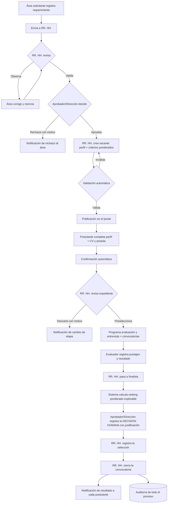

# Capítulo 3. Procesos de negocio

> **Diagramas BPMN.** El repositorio **no contiene** los diagramas BPMN AS-IS ni TO-BE (entregables previos del equipo). Tampoco se encontraron en la carpeta del curso: ver [evidence-index.md](evidence-index.md).
>
> Por eso este capítulo:
> - describe los procesos en forma textual;
> - incluye un **diagrama de flujo derivado de la implementación**, que **no** sustituye al BPMN;
> - deja el BPMN como anexo pendiente.
>
> Varias reglas se definieron explícitamente como supuestos por no disponer del BPMN TO-BE (A-05, A-13 y A-16 en `docs/assumptions.md`).

## 3.1 Proceso AS-IS (preliminar, pendiente de validación)

Macroproceso de reclutamiento y selección, descrito a nivel de actividades. No se afirman herramientas ni formatos concretos.

| # | Actividad (AS-IS preliminar) | Responsable | Problema asociado |
|---|---|---|---|
| 1 | Detectar la necesidad de personal y comunicarla | Área solicitante | P1, P2 |
| 2 | Revisar y aprobar la necesidad | RR. HH. / Dirección | P2 |
| 3 | Definir el perfil del puesto y difundir la convocatoria | RR. HH. | P1 |
| 4 | Recibir las postulaciones y los CV | RR. HH. | P1, P4 |
| 5 | Revisar y preseleccionar candidatos | RR. HH. | P2 |
| 6 | Coordinar evaluaciones y entrevistas | RR. HH. / Evaluadores | P3, P4 |
| 7 | Consolidar resultados y comparar candidatos | RR. HH. | P3, P5 |
| 8 | Decidir y comunicar el resultado | Dirección / RR. HH. | P4, P5 |

Validación pendiente: tiempos, canales, formatos y responsables reales de cada actividad deben confirmarse con RR. HH./Administración del colegio.

## 3.2 Problemas del proceso

La descripción detallada está en el [capítulo 2](02-contexto-problema.md), sección 2.2 (P1 a P5).

## 3.3 Proceso TO-BE propuesto

El TO-BE es un diseño del proyecto; su aplicación en la institución no está validada. Se organiza en cinco subprocesos, cada uno con un actor responsable y soportado por la plataforma.

| Subproceso | Actividades TO-BE | Actor | RF |
|---|---|---|---|
| A. Requerimiento de personal | Registrar → enviar a RR. HH. → validar u observar (con corrección y reenvío) → aprobar o rechazar con motivo | Área solicitante, RR. HH., Aprobador/Dirección | RF-01 a RF-04 |
| B. Convocatoria | Crear la vacante desde un requerimiento aprobado → registrar perfil y criterios ponderados → validación automática → publicar | RR. HH. | RF-05 a RF-07, RF-20 |
| C. Postulación | Crear cuenta → completar perfil y CV → postular → recibir confirmación | Postulante | RF-08 a RF-11 |
| D. Evaluación | Revisar expediente → preseleccionar o descartar → programar evaluación y entrevista (con convocatoria) → registrar puntajes y resultado → pasar a finalista | RR. HH., Evaluador | RF-12 a RF-20 |
| E. Selección y cierre | Calcular ranking y comparar → **decisión final humana con justificación** → registrar selección → cerrar la convocatoria → notificar resultados → auditar | Sistema (cálculo), Aprobador/Dirección, RR. HH. | RF-21 a RF-27 |

### Flujo TO-BE tal como quedó implementado

Diagrama derivado de los servicios y máquinas de estado del código. Es un diagrama de flujo, no BPMN.

**Reglas del TO-BE implementado** (supuestos aprobados):
- El ranking **no** cambia estados ni elige a nadie (A-23 a A-27).
- La decisión puede recaer en un candidato que no sea el primero del ranking y exige confirmación humana y justificación (A-27).
- Tras la decisión no se permiten cambios manuales de etapa (A-28).
- La convocatoria solo se cierra **con selección**; el cierre sin selección no está implementado (A-30).
- El resultado final se notifica únicamente al cerrar (A-31).

## 3.4 Automatizaciones propuestas e implementadas

| Automatización | Estado | Evidencia |
|---|---|---|
| Estados e historial del requerimiento y la postulación | Implementada | `JobRequestWorkflow`, `ApplicationStageService`, historiales |
| Validación de la vacante antes de publicar (ponderaciones, rangos, fechas y criterios) | Implementada | `VacancyValidator`, `WeightingValidator` |
| Validación de puntajes dentro del rango de cada criterio | Implementada | `ScoreSheetValidator` |
| Cálculo de ranking ponderado, empates y candidatos incompletos | Implementada (apoyo, no decide) | `RankingService` |
| Notificaciones de recepción, cambio de etapa, convocatoria, rechazo y resultado | Implementadas (base de datos y correo con *driver* `log`) | `app/Notifications/*` |
| Registro de auditoría de acciones críticas | Implementada (solo inserción) | `AuditLogger`, trigger PostgreSQL |
| Selección automática del candidato | **No se implementa, por diseño** (regla crítica) | `RankingComparisonTest::test_rf23_calculating_the_ranking_never_selects_a_candidate` |
| Indicadores de gestión del proceso (tiempos, embudo) | No implementada (recomendación) | — |
| Envío real de correo o mensajería | No implementado (el correo usa el *driver* `log`) | `MAIL_MAILER=log` |

## 3.5 Relación TO-BE → software

| Elemento TO-BE | Implementación |
|---|---|
| Estados del requerimiento (A-05) | `JobRequestStatus`: `borrador → enviado → (observado → enviado) → validado → aprobado \| rechazado` |
| Etapas de la postulación (A-13) | `ApplicationStatus`: `postulado → preseleccionado → en_evaluacion → en_entrevista → finalista → seleccionado \| no_seleccionado`; `descartado` desde las etapas activas |
| Estados de la vacante | `VacancyStatus`: `borrador → publicada → cerrada` |
| Decisión humana (RF-23) | `FinalDecisionService` (solo Aprobador/Dirección; confirmación + justificación) |
| Selección y cierre (RF-24, RF-25) | `SelectionRegistrationService`, `VacancyClosureService` (RR. HH.) |
| Auditoría (RF-27) | `audit_logs` (solo inserción) + vista `audit/index` para Dirección |

Detalle de cada RF: [capítulo 4](04-requerimientos.md) y [traceability-master.md](traceability-master.md).
