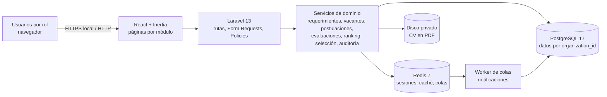
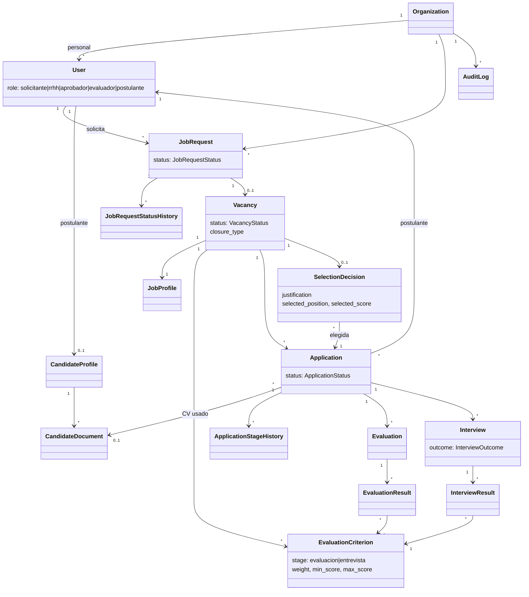
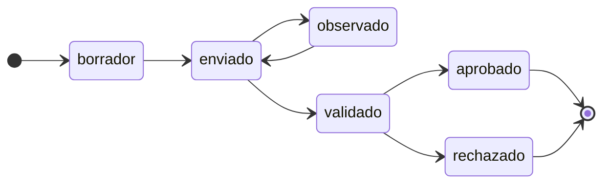
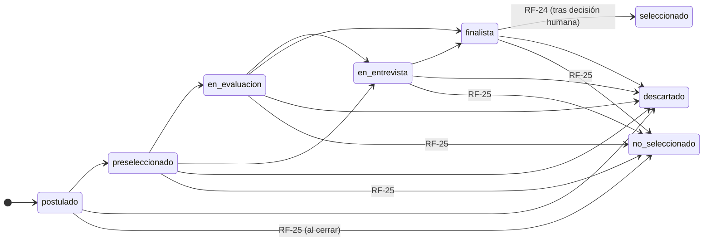
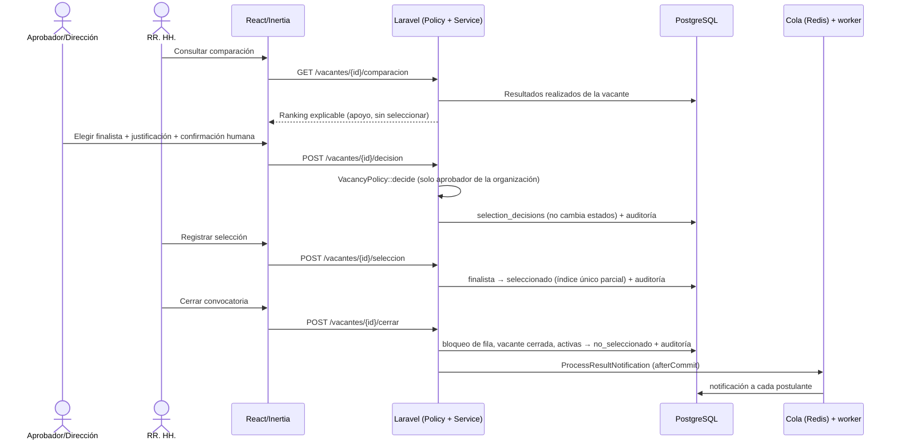
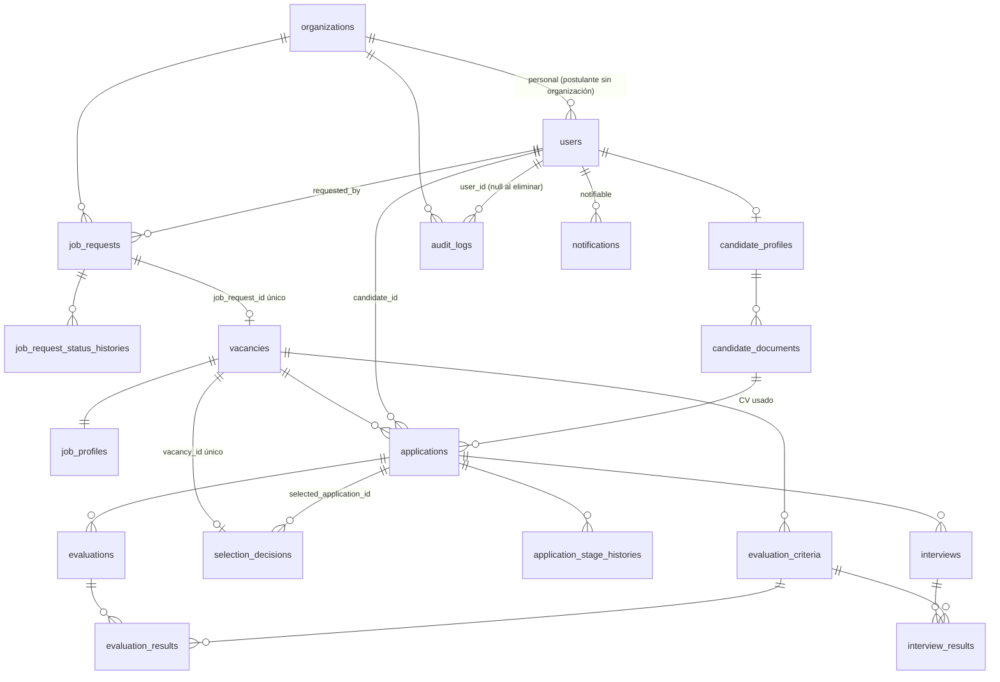

# Capítulo 6. Diseño del sistema

## 6.1 Arquitectura conceptual

Monolito modular SaaS multiempresa. El detalle tecnológico está en el [capítulo 7](07-arquitectura-tecnologica.md).

## 6.2 Casos de uso

El catálogo CU-01 a CU-13 y su relación con los RF están en el [capítulo 4, sección 4.4](04-requerimientos.md#44-casos-de-uso).

## 6.3 Modelo de dominio (clases)

Modelos Eloquent reales (`app/Models`). Los que tienen `organization_id` usan el *trait* `BelongsToOrganization`.

Servicios de dominio principales:
- `JobRequestWorkflow`
- `VacancyService` y `VacancyValidator`
- `CandidateProfileService`
- `ApplicationService` y `ApplicationStageService`
- `AssessmentScheduler`, `AssessmentResultRecorder` y `ScoreSheetValidator`
- `WeightingValidator`
- `RankingService` (puro) y `VacancyRankingBuilder`
- `FinalDecisionService`, `SelectionRegistrationService` y `VacancyClosureService`
- `AuditLogger`

## 6.4 Estados principales

*Requerimiento de personal (`JobRequestStatus`, A-05).*

*Postulación (`ApplicationStatus`, A-13 y A-30). `seleccionado` y `no_seleccionado` no pueden asignarse manualmente.*

## 6.5 Secuencias principales

### Diagramas UML disponibles y correspondencia con la implementación

Los diagramas del equipo están fuera del repositorio, en la carpeta del curso: `Diagramas/PD/*.oom` (PowerDesigner). Se revisaron frente al código final.

| Diagrama | Contenido | Correspondencia con la implementación |
|---|---|---|
| `SaaS Reclutamiento - Diagramas UML.oom` | Secuencia de postulación: Postulante → React → Laravel 13/Inertia 3 → Policy → PostgreSQL (consultar vacante, validar permisos, consultar estado de la vacante, verificar postulación existente, registrar, confirmar) | **Coincide** con `ApplyController` + `ApplicationService::apply` (RF-10, RF-11) |
| `secuencioaEvaluacion.oom` | Secuencia de evaluación: el evaluador registra puntajes y observaciones, la Policy valida el permiso y se guarda el resultado | **Coincide en lo esencial** con `EvaluationController`/`InterviewController` + `AssessmentResultRecorder` (RF-19). La implementación separa evaluación y entrevista y valida rangos (`ScoreSheetValidator`). |
| `seleccionl_3.oom` | Secuencia de selección: **RR. HH.** consulta el ranking, confirma la selección, se registra el seleccionado, se actualiza la postulación, se cierra la convocatoria y se audita, **en un único paso** | **Difiere**. La implementación final separa: (1) la **decisión humana del Aprobador/Dirección** (RF-23), (2) el registro de la selección por RR. HH. (RF-24) y (3) el cierre por RR. HH. (RF-25), seguido de las notificaciones (RF-26). Se recomienda actualizar el diagrama. |
| `deploydiagrama.oom` | Despliegue: Cliente → Internet/HTTPS → Servidor Web/Aplicación → PostgreSQL, Redis, **S3**, Queue Worker | **Difiere parcialmente.** No hay S3: los CV se guardan en disco local privado. HTTPS no está configurado en el entorno local de Docker. El despliegue real está en el [capítulo 10](10-dockerizacion.md). |

### Secuencia implementada: decisión humana, selección y cierre

## 6.6 Interfaz de usuario

Páginas Inertia/React reales (`resources/js/pages`), agrupadas por rol:

| Rol | Páginas |
|---|---|
| Público | `welcome`, `jobs/index`, `jobs/show`, `auth/login`, `auth/register` |
| Área solicitante | `dashboard`, `job-requests/index`, `create`, `edit`, `show` |
| RR. HH. | `job-requests/*`, `vacancies/index`, `create`, `edit`, `show`, `applications/index`, `show` (con evaluaciones y entrevistas), `selection/comparison` |
| Aprobador / Dirección | `job-requests/show` (decisión), `vacancies/*`, `selection/comparison` (decisión final), `audit/index` |
| Evaluador | `assessments/index`, `assessments/show` (hoja de puntajes) |
| Postulante | `candidate/profile`, `candidate/applications/index`, `show` (etapas y convocatorias), `jobs/show` (postular) |
| Todos | `notifications/index`, `settings/*` |

Comunes: interfaz en español (`es-PE`), menú lateral según el rol, insignias de estado, `data-cy` estables para E2E y diseño adaptable. La validación visual está en `docs/manual-smoke-test.md`.

## 6.7 Modelo de datos

17 migraciones; esquema PostgreSQL 17. Tablas del dominio:

**Integridad aplicada en la base de datos:**
- `CHECK` de estados válidos en requerimientos, vacantes, postulaciones, evaluaciones y entrevistas.
- Coherencia rol ↔ organización en `users`.
- Plazas ≥ 1, fechas coherentes, rangos y ponderaciones de criterios, puntajes no negativos.
- Duración de sesiones entre 15 y 480 minutos.
- Coherencia del cierre, de la finalización de sesiones y del registro de la selección.
- Postulación única por vacante y postulante.
- Una decisión por vacante.
- Índice único parcial `applications_one_selected_per_vacancy`.
- *Trigger* `audit_logs_append_only`.

Tablas de apoyo del framework: `cache`, `jobs`, `sessions`, `password_reset_tokens` y `passkeys` (*starter kit*).
