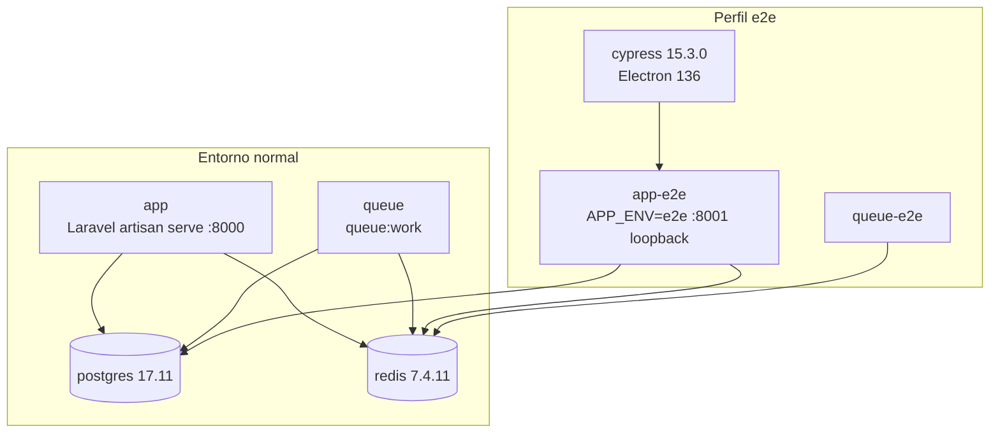

# Capítulo 10. Dockerización

La guía operativa completa está en **`docs/docker.md`**. Este capítulo resume la solución y los resultados reales de la Fase 10.

## 10.1 Objetivo

Que otra persona pueda clonar el proyecto, configurar `.env`, levantar Docker, instalar dependencias, migrar, cargar datos demo y ejecutar la aplicación, PHPUnit y Cypress **sin** XAMPP, Apache, MySQL, PHP, PostgreSQL ni Redis instalados en la PC, y sin rutas absolutas del equipo de desarrollo.

## 10.2 Arquitectura de contenedores



| Servicio | Imagen | Función | Healthcheck |
|---|---|---|---|
| `app` | `reclutamiento-php:dev` | Aplicación (instala dependencias si faltan, compila assets y migra) | `GET /health` responde 200 si la base de datos y Redis están disponibles |
| `queue` | `reclutamiento-php:dev` | Worker de notificaciones | Proceso `queue:work` vivo + `queue:monitor` contra Redis |
| `postgres` | `postgres:17.11-alpine` | Bases `reclutamiento`, `reclutamiento_testing` y `reclutamiento_e2e` | `pg_isready` |
| `redis` | `redis:7.4.11-alpine` | Sesiones, caché y colas | `redis-cli ping` |
| `app-e2e`, `queue-e2e` | `reclutamiento-php:dev` | Entorno aislado para Cypress | Iguales a `app` y `queue` |
| `cypress` | `cypress/included:15.3.0` | Suite E2E | — |

Orden de arranque:
- `postgres` y `redis` (healthy) → `app` (healthy) → `queue`.
- Con el perfil E2E: `app` → `app-e2e` → `queue-e2e` → `cypress`.

Otros detalles:
- `restart: unless-stopped` en los servicios de larga duración.
- Volúmenes con nombre: `pgdata`, `redisdata`, `vendor` y `node_modules`.

## 10.3 Versiones fijadas

PHP 8.4.25 · Composer 2.10.3 · Node 22.23.2 (npm 10.9.8) · phpredis 6.3.0 · PostgreSQL 17.11-alpine · Redis 7.4.11-alpine · Cypress 15.3.0.

Las versiones son `ARG` del `Dockerfile` (`docker/php/Dockerfile`); antes de fijarlas se verificó que cada tag existe.

## 10.4 Entorno normal vs perfil E2E

| Aspecto | Normal | E2E |
|---|---|---|
| Archivo de entorno | `.env` (se crea desde `.env.example`) | `.env.e2e` (lo genera `npm run e2e:setup` con `APP_KEY` y token aleatorios) |
| Base de datos | `reclutamiento` | `reclutamiento_e2e` |
| Redis | DB 0 y 1 | DB 2 y 3, con prefijos propios |
| Endpoints `/__e2e/*` | Inertes (404) | Activos con token |
| Reset destructivo | Rechazado | Solo si la base activa es `E2E_DATABASE` (DEF-13) |

## 10.5 Seguridad del entorno

- `.env` y `.env.e2e` están fuera de Git y de la imagen (`.gitignore`, `.dockerignore`).
- PostgreSQL, Redis y `app-e2e` solo se publican en `127.0.0.1`.
- `.gitattributes` fuerza LF, por lo que los scripts funcionan en clones hechos en Windows.
- La imagen es de desarrollo y demostración (`artisan serve`, `root`, `APP_DEBUG=true`); no es de producción (A-36).

## 10.6 Instalación desde cero

```powershell
copy .env.example .env                                              # opcional
docker compose up -d --build --wait
docker compose exec app php artisan migrate:fresh --seed --force
# http://localhost:8000 · usuarios: docs/demo-users.md
```

## 10.7 Resultados reales de validación (Fase 10)

**Instalación limpia.** Se hizo un `git clone` en una carpeta temporal, sin `.env`, `vendor` ni `node_modules`, como proyecto Compose separado con volúmenes nuevos. Al terminar se eliminó.

| Paso | Resultado |
|---|---|
| `up -d --build --wait` | Exit 0 en **87 s**; 4 servicios healthy |
| `.env` | Creado por el *entrypoint* |
| Migraciones | 17 ejecutadas, 0 pendientes |
| *Seed* | 2 organizaciones, 16 usuarios, 11 requerimientos, 5 vacantes, 10 postulaciones, 110 registros de auditoría |
| *Smoke* | `/health` 200, `/login` 200, `/empleos` 200; `/__e2e/reset` 404 |
| PHPUnit | 244 pruebas: 236 passed, 8 skipped, 0 failed |
| Cypress | 14 specs, 43/43 (03:26) |
| Aislamiento | La base de desarrollo conservó el *seed* intacto tras la suite |

**Entorno principal.**
- PHPUnit: **244 pruebas: 236 passed, 8 skipped, 0 failed (1074 assertions)**.
- `npm run build` correcto y `npx tsc --noEmit` sin errores.
- Cypress **14 specs, 43/43 (03:34)**.
- Aislamiento: la base de desarrollo tenía 12 requerimientos, 6 vacantes y 16 usuarios antes de la suite y los mismos valores después.

**Verificación en la Fase 11.** Tras integrar la Fase 10 en `develop`, PHPUnit dio de nuevo 244 pruebas: Unit 62 passed y Feature 174 passed + 8 skipped.

## 10.8 Limitaciones

- El HMR de Vite no está configurado en Docker; se recompila con `npm run build`.
- En volúmenes de PostgreSQL anteriores a la Fase 10, `reclutamiento_e2e` se crea una vez a mano (documentado en `docs/docker.md`).
- Los CV de E2E comparten `storage/app/private` con el entorno normal (A-35).
